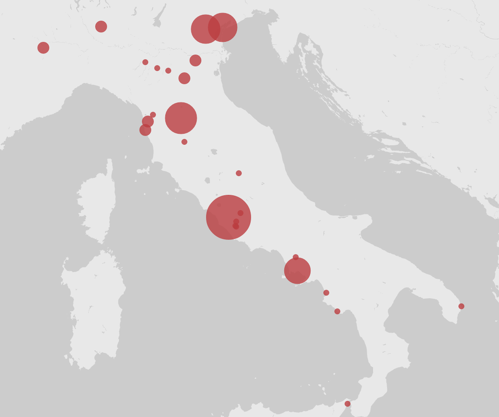

<figure>

<figcaption id="cap1">

<b>“Classical Scholars” on the Grand Tour</b> Brennan Megregian investigated the tours of travelers labeled as “classical scholars” to see whether they revealed anything unexpected about their collective interests. After using the <i>Grand Tour Explorer</i> to extract the travel data for those tourists identified in the “Employers and Identifiers” field as “classical scholars,” she then used Palladio to map their trips.

</figcaption>

</figure>

    

        

            <a><i class="material-icons">close</i></a>
        

        
        
    

    

        

        

            

                <i class="material-icons link-cite" aria-label="Cite this image" data-balloon-pos="left">format_quote</i>
                <i class="material-icons link-copy" aria-label="Copy link to this image" data-balloon-pos="left">link</i>
                <i class="material-icons" aria-label="Download" data-balloon-pos="left">arrow_downward</i>
            

        

    

