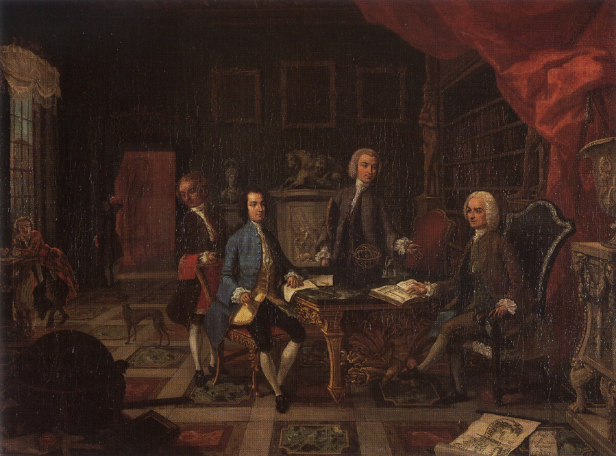

The Grand Tour was critical to establishing the demand for many of the resources and phenomena that we associate with modern cultural tourism, such as maps, guidebooks, itineraries, souvenirs, and tour guides. On his visit to Rome in 1644, the British writer John Evelyn toured with one of the latter, “who get their living onely by leading strangers about to see the Citty.”[^1] Scant information survives on seventeenth-century guides, but the call for their services continued as the popularity of travel grew. Known in the eighteenth century as *ciceroni* or cicerones, guides explicated the great antiquities, artworks, buildings, and sights of Italy to visitors who came from all over Europe to see them.[^2] Tourists, especially young men for whom travel was intended to be educational, may also have been escorted by “bear leaders,” tutors, or governors, but these were chaperones rather than guides and sometimes accompanied their charges on tours with *ciceroni*.[^3] This essay will examine the work of *ciceroni* and the experiences of their clients on the Grand Tour.

[^1]: John Evelyn, *The Diary of John Evelyn*, edited by Esmond Samuel de Beer, 6 vols. (Oxford: Clarendon Press, 2000), 2: 214, and note 2, where de Beer states that there had long been guides in Rome and identifies one of the best known of the early seventeenth century, Hans Gross, alias Giovanni Alto.
[^2]: The term *cicerone* (singular) derives from the name of the great ancient orator, Cicero; see Manlio Cortelazzo and Paolo Zolli, *Dizionario etimologico della lingua italiana* (Bologna: Nicola Zanichelli S.p.A. Editore, 1979), 1: 236.
[^3]: Bear leaders, tutors, and governors traveled with their charges and also may have set up educational programs with teachers, but they usually weren’t teachers themselves; see María Dolores Sánchez-Jáuregui, “Educating the Travelers: The Tutors,” in *The English Prize: The Capture of the Westmorland, An Episode of the Grand Tour*, edited by María Dolores Sánchez-Jáuregui and Scott Wilcox (New Haven and London: Yale Univ. Press, 2012), 88-97.

Although there have been a few studies of individual *ciceroni*, they have not been considered systematically as a group. Relatively few *ciceroni* are known to us, most of them British, along with some Italians and at least one German. The fundamental published source for many of these figures is John Ingamells’ *A Dictionary of British and Irish Travellers in Italy*, compiled from the Brinsley Ford archive, but it is not indexed, so information can be difficult to find in its entries.[^4] The *Grand Tour Explorer*’s digital transformation of the *Dictionary* allowed me to begin a more thorough study of the subject. 

The terms *cicerone* (singular) and *ciceroni* (plural) do not appear among the *Explorer*’s “Employments and Identifiers,” which are descriptors that in the *Dictionary* follow the names of around 15% of the travelers. Related terms do appear, however, including “antiquarian,” and “antiquary.” Using the *Explorer*'s free word search is another way in, as searches for “cicerone” and “ciceroni” bring up forty-seven entries. Through a combination of the “Employments and Identifiers” filter and the use of free searches for terms including “antiquarian,” “antiquary,” *cicerone*, *ciceroni*, and “tour guide,” I was able to compile a list of fifteen *ciceroni* ([Figure 1](#figure-1)).

[^4]: John Ingamells, *A Dictionary of British and Irish Travellers in Italy 1701-1800* (New Haven and London: Yale Univ. Press, 1997).

*Cicerone* | Clients identified (hover cursor to see names) | Number of clients identified
-|-|-
Francesco de’ Ficoroni (1664-1747) | [●](https://grandtourexplorer.wc.reclaim.cloud/#/entries/29 "Joseph Addison"){:target="\_blank"} [●](https://grandtourexplorer.wc.reclaim.cloud/#/entries/292 "Hon. Benjamin Bathurst"){:target="\_blank"} [●](https://grandtourexplorer.wc.reclaim.cloud/#/entries/368 "Hon. Willem Bentinck"){:target="\_blank"} [●](https://grandtourexplorer.wc.reclaim.cloud/#/entries/389 "Moses Bernege"){:target="\_blank"} [●](https://grandtourexplorer.wc.reclaim.cloud/#/entries/917 "Humphrey Chetham"){:target="\_blank"} [●](https://grandtourexplorer.wc.reclaim.cloud/#/entries/2321 "Dr. James Hay"){:target="\_blank"} [●](https://grandtourexplorer.wc.reclaim.cloud/#/entries/2751 "Rev. Basil Kennett"){:target="\_blank"} [●](https://grandtourexplorer.wc.reclaim.cloud/#/entries/3310 "Conyers Middleton"){:target="\_blank"} [●](https://grandtourexplorer.wc.reclaim.cloud/#/entries/3588 "Thomas Howard, 8th Duke of Norfolk"){:target="\_blank"} [●](https://grandtourexplorer.wc.reclaim.cloud/#/entries/3813 "Sir John Perceval, 5th Baronet of Burton"){:target="\_blank"} [●](https://grandtourexplorer.wc.reclaim.cloud/#/entries/4350 "Charles Talbot, 1st Duke of Shrewsbury"){:target="\_blank"} [●](https://grandtourexplorer.wc.reclaim.cloud/#/entries/4469 "Joseph Spence"){:target="\_blank"} [●](https://grandtourexplorer.wc.reclaim.cloud/#/entries/4768 "Richard Tighe"){:target="\_blank"} [○](## "Anton Ulrich, Prince of Saxe-Meiningen") [○](## "Count Ferdinand Anton Danneskiold-Laurvig") [○](## "Giovanni Carlo Ebner-Eschenbach") [○](## "Giulio Brunetto de’Rancy") [○](## "Peter Vanschoonhoven") [○](## "Signore Cristiano de Voscamp") | 19
Mark Parker (c. 1698-1747) | [●](https://grandtourexplorer.wc.reclaim.cloud/#/entries/1302 "Sir Francis Dashwood, 2nd Baronet of West Wycombe"){:target="\_blank"} [●](https://grandtourexplorer.wc.reclaim.cloud/#/entries/2386 "Hon. George William, Baron Hervey"){:target="\_blank"} [●](https://grandtourexplorer.wc.reclaim.cloud/#/entries/3552 "Sir Roger Newdigate, 5th Baronet of Arbury Hall"){:target="\_blank"} [●](https://grandtourexplorer.wc.reclaim.cloud/#/entries/3919.1 "Henrietta Louisa Jeffreys Fermor, Countess of Pomfret"){:target="\_blank"} [●](https://grandtourexplorer.wc.reclaim.cloud/#/entries/4037 "Sir John Rawdon, 4th Baronet of Rawdon Hall"){:target="\_blank"} | 5
Ridolfino Venuti (1705-1763) | |
Abbé Peter Grant (1708-1784) | |
Johann Joachim Winckelmann (1717-1768) | [●](https://grandtourexplorer.wc.reclaim.cloud/#/entries/214 "Frederick Calvert, 6th Baron Baltimore"){:target="\_blank"} [●](https://grandtourexplorer.wc.reclaim.cloud/#/entries/2003 "Alexander Gordon, 4th Duke of Gordon"){:target="\_blank"} [●](https://grandtourexplorer.wc.reclaim.cloud/#/entries/2502 "Charles Hope, Lord Hope"){:target="\_blank"} [●](https://grandtourexplorer.wc.reclaim.cloud/#/entries/4166 "John Ker, 3rd Duke of Roxburghe"){:target="\_blank"} [●](https://grandtourexplorer.wc.reclaim.cloud/#/entries/4524 "Mr. Stephenson"){:target="\_blank"} [●](https://grandtourexplorer.wc.reclaim.cloud/#/entries/4528 "Rev. Laurence Sterne"){:target="\_blank"} [●](https://grandtourexplorer.wc.reclaim.cloud/#/entries/5119 "John Wilkes"){:target="\_blank"} [●](https://grandtourexplorer.wc.reclaim.cloud/#/entries/5277 "Edward Augustus, Duke of York"){:target="\_blank"} [○](## "Charles Wortley Montagu") [○](## ""Johann Jakob Volkmann"") [○](## "Karl Wilhelm Ferdinand, Prince of Braunschweig-Wolfenbüttel") [○](## "Leopold III, Prince of Anhalt-Dessau") [○](## "Prince Georg August of Mecklenburg-Strelitz") [○](## "Princess Augusta Frederica of Great Britain") | 14
John Parker (fl. 1740, d. 1765) | |
James Russel (1720-1763) | [●](https://grandtourexplorer.wc.reclaim.cloud/#/entries/1300 "William Legge, 2nd Earl of Dartmouth"){:target="_blank"} [●](https://grandtourexplorer.wc.reclaim.cloud/#/entries/1740 "Mr. Fitzhugh"){:target="_blank"} [●](https://grandtourexplorer.wc.reclaim.cloud/#/entries/1985 "Christopher (Kit) Golding"){:target="_blank"} [●](https://grandtourexplorer.wc.reclaim.cloud/#/entries/2484 "Rowland Holt"){:target="_blank"} [●](https://grandtourexplorer.wc.reclaim.cloud/#/entries/2878 "William Lee"){:target="_blank"} [●](https://grandtourexplorer.wc.reclaim.cloud/#/entries/3596 "Frederick North, Lord North"){:target="_blank"} [●](https://grandtourexplorer.wc.reclaim.cloud/#/entries/4138 "Rev. Edward Rolle"){:target="_blank"} [●](https://grandtourexplorer.wc.reclaim.cloud/#/entries/4985 "John Walter"){:target="_blank"} [○](## "Mr. Clark") [○](## "Mr. Cochrane") [○](## "William Hodges Sneyd") | 11
Andrew Lumisden (1720-1801) | |
Thomas Jenkins (1722-1798) | [●](https://grandtourexplorer.wc.reclaim.cloud/#/entries/324 "Elizabeth Berkeley, Duchess of Beaufort"){:target="_blank"} [●](https://grandtourexplorer.wc.reclaim.cloud/#/entries/1968 "William Henry, Duke of Gloucester"){:target="_blank"} | 2
Colin Morison (1732-1810) | [●](https://grandtourexplorer.wc.reclaim.cloud/#/entries/322 "Topham Beauclerk"){:target="_blank"} [●](https://grandtourexplorer.wc.reclaim.cloud/#/entries/509 "James Boswell"){:target="_blank"} [●](https://grandtourexplorer.wc.reclaim.cloud/#/entries/1159 "George Kien Hayward Coussmaker"){:target="_blank"} [●](https://grandtourexplorer.wc.reclaim.cloud/#/entries/1475 "William Drake"){:target="_blank"} [●](https://grandtourexplorer.wc.reclaim.cloud/#/entries/1718 "James Ogilvy, 7th and 4th Earl of Findlater and Seafield"){:target="_blank"} [●](https://grandtourexplorer.wc.reclaim.cloud/#/entries/1804 "Kenneth Mackenzie, Lord Fortrose"){:target="_blank"} [●](https://grandtourexplorer.wc.reclaim.cloud/#/entries/2445 "Richard Colt Hoare"){:target="_blank"} [●](https://grandtourexplorer.wc.reclaim.cloud/#/entries/2695 "Richard Paul Jodrell"){:target="_blank"} [●](https://grandtourexplorer.wc.reclaim.cloud/#/entries/3258 "Sir John Meade, 4th Baronet"){:target="_blank"} [●](https://grandtourexplorer.wc.reclaim.cloud/#/entries/3472 "John Stuart, Viscount Mountstuart"){:target="_blank"} [●](https://grandtourexplorer.wc.reclaim.cloud/#/entries/3717 "Henry Temple, 2nd Viscount Palmerston"){:target="_blank"} [●](https://grandtourexplorer.wc.reclaim.cloud/#/entries/3717.1 "Mary Mee Temple, Lady Palmerston"){:target="_blank"} [●](https://grandtourexplorer.wc.reclaim.cloud/#/entries/3935 "Thomas Chinnal Porter"){:target="_blank"} [●](https://grandtourexplorer.wc.reclaim.cloud/#/entries/4163 "Captain Rowley"){:target="_blank"} [●](https://grandtourexplorer.wc.reclaim.cloud/#/entries/4705 "Taylor"){:target="_blank"} [●](https://grandtourexplorer.wc.reclaim.cloud/#/entries/4705.1 "Unidentifiable tourist"){:target="_blank"} [●](https://grandtourexplorer.wc.reclaim.cloud/#/entries/4900 "John Fitzpatrick, 2nd Earl of Upper Ossory"){:target="_blank"} [●](https://grandtourexplorer.wc.reclaim.cloud/#/entries/5043 "Elizabeth Webster, Lady Webster"){:target="_blank"} | 18
James Byres (1734-1817) | [●](https://grandtourexplorer.wc.reclaim.cloud/#/entries/100 "John Apthorp"){:target="_blank"} [●](https://grandtourexplorer.wc.reclaim.cloud/#/entries/324 "Elizabeth Berkeley, Duchess of Beaufort"){:target="_blank"} [●](https://grandtourexplorer.wc.reclaim.cloud/#/entries/332 "Peter Beckford"){:target="_blank"} [●](https://grandtourexplorer.wc.reclaim.cloud/#/entries/375 "Charles Berington"){:target="_blank"} [●](https://grandtourexplorer.wc.reclaim.cloud/#/entries/556 "Rev. Thomas Brand"){:target="_blank"} [●](https://grandtourexplorer.wc.reclaim.cloud/#/entries/611 "Jonas Langford Brooke"){:target="_blank"} [●](https://grandtourexplorer.wc.reclaim.cloud/#/entries/615.1 "Mr. Brooke"){:target="_blank"} [●](https://grandtourexplorer.wc.reclaim.cloud/#/entries/811 "Sir David Carnegie, 4th Baronet of Southesk"){:target="_blank"} [●](https://grandtourexplorer.wc.reclaim.cloud/#/entries/963 "Thomas Clarke"){:target="_blank"} [●](https://grandtourexplorer.wc.reclaim.cloud/#/entries/1004 "James Clitherow"){:target="_blank"} [●](https://grandtourexplorer.wc.reclaim.cloud/#/entries/1086 "William Constable"){:target="_blank"} [●](https://grandtourexplorer.wc.reclaim.cloud/#/entries/1272 "John Dalrymple, Viscount Dalrymple"){:target="_blank"} [●](https://grandtourexplorer.wc.reclaim.cloud/#/entries/1377 "William Cavendish, 5th Duke of Devonshire"){:target="_blank"} [●](https://grandtourexplorer.wc.reclaim.cloud/#/entries/1802 "Mr. Fortescue"){:target="_blank"} [●](https://grandtourexplorer.wc.reclaim.cloud/#/entries/1823 "Vincent Foxley"){:target="_blank"} [●](https://grandtourexplorer.wc.reclaim.cloud/#/entries/1914 "Sir Thomas Gascoigne, 8th Baronet of Parlington"){:target="_blank"} [●](https://grandtourexplorer.wc.reclaim.cloud/#/entries/1932 "Elizabeth Gibbes"){:target="_blank"} [●](https://grandtourexplorer.wc.reclaim.cloud/#/entries/1932.1 "Agnes Gibbes"){:target="_blank"} [●](https://grandtourexplorer.wc.reclaim.cloud/#/entries/1932.2 "Lady Agnes Osborne Gibbes"){:target="_blank"} [●](https://grandtourexplorer.wc.reclaim.cloud/#/entries/1933 "Sir Philip Gibbes, 1st Baronet of Springhead, Barbados"){:target="_blank"} [●](https://grandtourexplorer.wc.reclaim.cloud/#/entries/1935 "Edward Gibbon"){:target="_blank"} [●](https://grandtourexplorer.wc.reclaim.cloud/#/entries/1949 "Thomas Giffard"){:target="_blank"} [●](https://grandtourexplorer.wc.reclaim.cloud/#/entries/2045 "Sir James Graham, 1st Baronet"){:target="_blank"} [●](https://grandtourexplorer.wc.reclaim.cloud/#/entries/2110 "Hon. Charles Francis Greville"){:target="_blank"} [●](https://grandtourexplorer.wc.reclaim.cloud/#/entries/2121 "Thomas Egerton, Baron Grey de Wilton"){:target="_blank"} [●](https://grandtourexplorer.wc.reclaim.cloud/#/entries/2149 "William Guise"){:target="_blank"} [●](https://grandtourexplorer.wc.reclaim.cloud/#/entries/2188 "Sir James, 4th Baronet Hall"){:target="_blank"} [●](https://grandtourexplorer.wc.reclaim.cloud/#/entries/2390 "Col. Hon. William Hervey"){:target="_blank"} [●](https://grandtourexplorer.wc.reclaim.cloud/#/entries/2694 ""Robert Jocelyn, Viscount Jocelyn""){:target="_blank"} [●](https://grandtourexplorer.wc.reclaim.cloud/#/entries/2849 "Mr. Lascelles"){:target="_blank"} [●](https://grandtourexplorer.wc.reclaim.cloud/#/entries/3013 "Charles Long"){:target="_blank"} [●](https://grandtourexplorer.wc.reclaim.cloud/#/entries/3429 "Dr, John Morgan"){:target="_blank"} [●](https://grandtourexplorer.wc.reclaim.cloud/#/entries/3509 "Musgrave"){:target="_blank"} [●](https://grandtourexplorer.wc.reclaim.cloud/#/entries/3545 "Richard Neville"){:target="_blank"} [●](https://grandtourexplorer.wc.reclaim.cloud/#/entries/3668 "Thomas Orde"){:target="_blank"} [●](https://grandtourexplorer.wc.reclaim.cloud/#/entries/3714 "Thomas Palmer"){:target="_blank"} [●](https://grandtourexplorer.wc.reclaim.cloud/#/entries/3741 "Dr. John Parkinson"){:target="_blank"} [●](https://grandtourexplorer.wc.reclaim.cloud/#/entries/3769 "William Patoun"){:target="_blank"} [●](https://grandtourexplorer.wc.reclaim.cloud/#/entries/3793 "Hon. Thomas Pelham"){:target="_blank"} [●](https://grandtourexplorer.wc.reclaim.cloud/#/entries/3795 "Lord John Pelham Clinton"){:target="_blank"} [●](https://grandtourexplorer.wc.reclaim.cloud/#/entries/3925 "William Brabazon Ponsonby"){:target="_blank"} [●](https://grandtourexplorer.wc.reclaim.cloud/#/entries/3953 "Samuel Powel"){:target="_blank"} [●](https://grandtourexplorer.wc.reclaim.cloud/#/entries/3957 "George Herbert, 2nd Earl of Powis"){:target="_blank"} [●](https://grandtourexplorer.wc.reclaim.cloud/#/entries/4200 "George Ashburnham, Viscount St. Asaph"){:target="_blank"} [●](https://grandtourexplorer.wc.reclaim.cloud/#/entries/4509 "John Staples"){:target="_blank"} [●](https://grandtourexplorer.wc.reclaim.cloud/#/entries/4655 "Henry Swinburne"){:target="_blank"} [●](https://grandtourexplorer.wc.reclaim.cloud/#/entries/5089 "Rev. Robert Wharton"){:target="_blank"} [●](https://grandtourexplorer.wc.reclaim.cloud/#/entries/5261 "Sir Watkin Williams Wynn"){:target="_blank"} [●](https://grandtourexplorer.wc.reclaim.cloud/#/entries/5279 "Philip Yorke"){:target="_blank"} | 49
Christopher Norton (c. 1740-1799) | [●](https://grandtourexplorer.wc.reclaim.cloud/#/entries/2121 "Thomas Egerton, Baron Grey de Wilton"){:target="_blank"} | 1
William Patoun (fl. 1761, d. 1783) | |
James Clark (c. 1745-1800) | [●](https://grandtourexplorer.wc.reclaim.cloud/#/entries/0 "Charles Abbot"){:target="_blank"} [●](https://grandtourexplorer.wc.reclaim.cloud/#/entries/611 "Jonas Langford Brooke"){:target="_blank"} [●](https://grandtourexplorer.wc.reclaim.cloud/#/entries/1004 "James Clitherow"){:target="_blank"} [●](https://grandtourexplorer.wc.reclaim.cloud/#/entries/1777 "Sir William Forbes, 6th Baronet of Pitsligo"){:target="_blank"} [●](https://grandtourexplorer.wc.reclaim.cloud/#/entries/1777.1 "Lady Elizabeth Hay Forbes"){:target="_blank"} [●](https://grandtourexplorer.wc.reclaim.cloud/#/entries/1777.2 "Forbes daughter"){:target="_blank"} [●](https://grandtourexplorer.wc.reclaim.cloud/#/entries/1823 "Vincent Foxley"){:target="_blank"} [●](https://grandtourexplorer.wc.reclaim.cloud/#/entries/2062 "James Grant"){:target="_blank"} [●](https://grandtourexplorer.wc.reclaim.cloud/#/entries/2121 "Thomas Egerton, Baron Grey de Wilton"){:target="_blank"} [●](https://grandtourexplorer.wc.reclaim.cloud/#/entries/2363 "George Augustus Herbert, Lord Herbert"){:target="_blank"} [●](https://grandtourexplorer.wc.reclaim.cloud/#/entries/2849 "Mr. Lascelles"){:target="_blank"} [●](https://grandtourexplorer.wc.reclaim.cloud/#/entries/2947 "Hugh Leycester"){:target="_blank"} [●](https://grandtourexplorer.wc.reclaim.cloud/#/entries/3741 "Dr. John Parkinson"){:target="_blank"} [●](https://grandtourexplorer.wc.reclaim.cloud/#/entries/3935 "Thomas Chinnal Porter"){:target="_blank"} [●](https://grandtourexplorer.wc.reclaim.cloud/#/entries/4027 "Allan Ramsay"){:target="_blank"} [●](https://grandtourexplorer.wc.reclaim.cloud/#/entries/4029 "John Ramsay"){:target="_blank"} [●](https://grandtourexplorer.wc.reclaim.cloud/#/entries/4163 "Captain Rowley"){:target="_blank"} | 17
Patrick Moir (1769-1810) | [●](https://grandtourexplorer.wc.reclaim.cloud/#/entries/1777 "Sir William Forbes, 6th Baronet of Pitsligo"){:target="_blank"} [●](https://grandtourexplorer.wc.reclaim.cloud/#/entries/1777.1 "Lady Elizabeth Hay Forbes"){:target="_blank"} [●](https://grandtourexplorer.wc.reclaim.cloud/#/entries/1777.2 "Forbes daughter"){:target="_blank"} [●](https://grandtourexplorer.wc.reclaim.cloud/#/entries/4476 "Viscountess Margaret Georgiana Spencer"){:target="_blank"} [●](https://grandtourexplorer.wc.reclaim.cloud/#/entries/4762 "John Courtenay Throckmorton, 5th Baronet Throckmorton"){:target="_blank"} [●](https://grandtourexplorer.wc.reclaim.cloud/#/entries/4762.1 "Lady Maria Catherine Giffard Throckmorton"){:target="_blank"} | 6

<figure>

<figcaption><b>Fig. 1:</b> <i>Ciceroni</i> of the Grand Tour and their clients. Where possible, <i>ciceroni</i> are listed in birth order. Hover over any circle in the second column to see the name of the client. A filled circle indicates that the client has an entry in the <i>Explorer</i>; click on the circle to be taken to the entry. An open circle indicate that the client was identified using a different source. In total, 142 clients were identified, of whom 126 have entries in the <i>Explorer</i>. As discussed in the essay, seven clients toured with two different ciceroni and therefore appear twice in the table (and are counted twice in the total). The total number of distinct individuals identified is ??.</figcaption>

</figure>

In addition to identifying *ciceroni*, I sought, through the biographies in the *Dictionary* and other sources, to understand how their profession evolved, how those who practiced it defined themselves professionally, how they were remunerated, and the nature of their tours and services. Searching within the *Explorer* for entries related to each *cicerone*, I compiled a list of clients who toured with specific guides ([Appendix](https://docs.google.com/spreadsheets/d/1sYLwFqOfIlRu3bfxCbbYMZhVo_wGiiLdQ_BUEjwnrPw/edit#gid=1805869645){:target="\_blank"}). For each client I collected various sorts of information to see what---if any---patterns emerged pertaining to class, gender, occupation, education, and religion ([Figure 2](#figure-2)). My aim also was to learn why tourists hired guides and why specific ones and how they experienced and thought about their time with them.

| | Ficoroni | Parker | Winckelmann | Russel | Jenkins | Morison | Byres | Norton | Clark | Moir | Total
-|-|-|-|-|-|-|-|-|-|-|-
**Clerics** | 2 |  | 1 | 2 |  |  | 3 |  |  |  | 8
**Writers/Scholars** | 3 |  | 2 |  |  | 3 | 3 |  | 2 | 1 | 14
**Military Officers** |  | 1 | 2 |  | 1 | 2 | 4 |  | 3 |  | 13
**Tutors** | 2 |  |  | 1 |  |  | 4 |  | 1 |  | 8
**Artists** |  | 1 |  |  |  |  | 1 |  | 1 |  | 3
**Physicians/Scientists** | 1 |  |  |  |  |  | 2 |  |  |  | 3
**Statesmen** | 4 | 3 | 3 | 3 |  | 3 | 19 | 1 | 4 |  | 40
**Merchants** | 2 |  |  |  |  |  |  |  |  |  | 2
**Bankers** |  |  |  |  |  |  |  |  | 1 | 1 | 2
**Eton** |  | 1 | 3 | 1 |  | 1 | 7 |  | 1 |  | 14
**Westminster** | 1 | 1 |  |  |  | 2 | 5 | 1 | 3 |  | 13
**Oxford** | 5 | 1 |  | 6 |  | 5 | 11 | 1 | 5 |  | 34
**Cambridge** | 1 |  | 1 | 1 |  | 2 | 10 |  | 1 |  | 16
**Groups** | 5 | 1 | 2 | 4? |  | 5? | 12 |  | 7 | 1 | 37?
**Women** |  | 1 | 1 |  | 1 | 2 | 4 |  | 2 | 4 | 15
**Families** |  |  | 1 | 1 |  | 1 | 1 |  | 2 | 2 | 8
**Titled/Royals** | 7 | 5 | 9 | 2 | 2 | 8 | 18 | 1 | 4 | 5 | 61
**Catholics** | 1 |  |  |  |  |  | 5 |  |  |  | 6
**British/Irish** | 13 | 5 | 10 | 11 | 2 | 17 | 49 | 1 | 17 | 6 | 131
**German** | 2 |  | 4 |  |  |  |  |  |  |  | 6
**French** | 1 |  |  |  |  |  |  |  |  |  | 1
**Other** | 3 |  |  |  |  |  |  |  |  |  | 3
**Dilettanti** |  | 2 | 1 |  |  | 4 | 2 |  | 1 | 1 | 11
**Other Societies** | 1 | 3 | 2 | 1 | 1 | 5 | 14 |  |  |  | 27

<figure>

<figcaption><b>Fig. 2:</b> </figcaption>

</figure>

**The *Ciceroni***

All but one of the *ciceroni* on my list worked in Rome, the exception being [James Clark](https://grandtourexplorer.wc.reclaim.cloud/#/entries/952){:target="\_blank"} (c. 1754-1800, travel years 1768-1800), who was a guide in Naples. With its unique abundance of monuments, Rome was a place where tours were especially desirable. As the seat of the Jacobite court in exile, it was home to many British Catholics; a number of the *ciceroni* on my list were Scottish Jacobites or sympathizers. British guides usually had travelled to Rome to study painting, less often sculpture or architecture, but may not have been so successful in those professions and at any rate developed a great interest in antiquities and cultivated their knowledge of them. 
  
The first known *cicerone* of the eighteenth century appears to have been an Italian, Francesco de’ Ficoroni (1664-1747). A native of Lazio, Ficoroni was the most sought-after antiquarian in Rome from 1690 to 1745. In addition to working as a *cicerone*, overseeing excavations, and publishing his scholarship, he collected and dealt in antiquities, as did many antiquarians, connoisseurs, scholars, and tour guides. As Tamara Griggs has demonstrated, Ficoroni’s contribution to guiding was to adapt the Roman tradition of antiquarianism to the interests of Grand Tourists.[^5]

[^5]: For Ficoroni, see Tamara Griggs, “The Local Antiquary in Eighteenth-Century Rome,” in *The Rebirth of Antiquity: Numismatics, Archaeology, and Classical Studies*, edited by Alan M. Stahl (Princeton: Princeton Univ. Press, 2009). There is a cursory entry on him in the appendix of supplementary biographies in Ingamells, *Dictionary*, 1055.

In his *Osservazioni di Francesco de’Ficoroni sopra l’antichità di Roma* of 1709, Ficoroni listed an array of aristocratic clients whom he had led around Rome, particularly the catacombs, evidence that the services of *ciceroni* were already popular at the beginning of the eighteenth century.[^6] His clients hailed not only from Britain, but also from France, Sweden, Denmark, Flanders, Holland, and Germany. Did Ficoroni speak to them in Italian? In the seventeenth century Italian was an international language of diplomacy and music; travelers may have had some knowledge of it, but how many could have fully understood it and conversed in it? This factor may partly account for the popularity of British *ciceroni* among a tourist population dominated by Britons. Nonetheless, Ficoroni’s first recorded client was the well-known British politician and writer [Joseph Addison](https://grandtourexplorer.wc.reclaim.cloud/#/entries/29){:target="\_blank"} (1672-1719, travel years 1700-1701), who is documented to have been the first to use the term *ciceroni* in 1726.[^7]

[^6]: Francesco de’ Ficoroni, *Osservazioni di Francesco de’Ficoroni sopra l’antichità di Roma; descritte nel Diario italico publicato in Parigi l'anno 1702. dal m. rev. padre D. Bernardo de Montfaucon nel fine delle quali s’aggiungono molte cose antiche singolari scoperte ultimamente tra le rovine dell’antichità* (Rome: A. de Rossi, 1709), 24.
[^7]: See Cortelazzo and Zolli, *Dizionario etimologico*, 1: 236.

A later Italian *cicerone* was Ridolfino Venuti (1705-1763), a highly respected scholar who was appointed *Commissario delle Antichità* (Prefect of Papal Antiquities) in 1744.[^8] One of the duties of the papal antiquarian was to guide important visitors around Rome, but according to Venuti’s famous successor in the post, Johann Joachim Winckelmann, Venuti was unable to live on his salary of 180 *scudi* per annum and took on other wealthy travelers as clients to supplement his income, a practice which apparently proved quite lucrative. Winckelmann succeeded Venuti in 1763, the only non-Italian to ever hold the position, an indication of the esteem in which the German antiquarian was held.[^9] He did not share his predecessor’s interest in escorting travelers around Rome, especially the British and the French, whom he respectively regarded as humorless and frivolous. He was, of course, more tolerant of Germans, especially Prince Leopold III of Anhalt-Dessau, whom he described as a “German Achilles.” Winckelmann’s tours, as we will see, reflected his idiosyncratic perspective on ancient art.

[^8]: Ronald T. Ridley, “To Protect the Monuments: The Papal Antiquarian (1534-1870),” *Xenia antiqua* 1 (1992): 138-41.
[^9]: Ridley, “To Protect the Monuments,” 141-43. The literature on Winckelmann is extensive, but for his activity as a *cicerone* see Adelheid Müller, “Reisende der Grand Tour in den Sammlungen Roms—Winckelmann als Cicerone,” in *Römische Antikensammlungen im 18. Jahrhundert*, edited by Max Kunze (Mainz am Rhein: Verlag Philipp von Zabern, 1998), 155-63. There is a cursory entry on him in the appendix of supplementary biographies in Ingamells, *Dictionary*, 1059.

Venuti also supplemented his income by writing guidebooks. He wrote two about Rome, one published in 1763 and the other in 1766, the first on antiquities and the second on modern sights, including collections of antiquities.[^10] Venuti’s guidebooks are detailed and scholarly, catering to a broader audience of Grand Tourists; in 1762 he also had published a well-illustrated book on the most beautiful *vedute* (views or prospects) in Italy, written simultaneously in English, French, and Italian.[^11]

[^10]: Ridolfino Venuti, *Accurata, e succinta descrizione topografica delle antichità di Roma*, 2 vols. (Rome: Presso Pietro Paolo Montagnani-Mirabili, 1803; repr., Rome: Multigrafica Editrice, 1977); *Accurata, e succinta descrizione topografica e istorica di Roma moderna*, 2 vols. (Rome: Presso Carlo Barbiellini, 1766; repr., Rome: Multigrafica Editrice, 1977).
[^11]: Ridolfino Venuti, *A collection of some of the finest prospects in Italy, with short remarks on them, by Abbate R. Venuti Antiquarian to the Pope and Fellow of the Royal Society of London. Engraved by various celebrated Engravers at Rome*, vol. 1 (London: J. Nourse, 1762).

The first known British *cicerone* of the eighteenth century, [Mark Parker](https://grandtourexplorer.wc.reclaim.cloud/#/entries/3734){:target="\_blank"} (c. 1698-1775, travel years from birth to 1749), was born in Florence to a British father and a German mother and raised a Catholic. He entered the service of the Pope as captain of the papal galleys, but was also well known among British tourists as an antiquarian in Rome. Eventually denounced by the Jacobites as a Hanoverian spy, Parker was banished by the Inquisition in 1749 and ultimately settled in Paris. [John Parker](https://grandtourexplorer.wc.reclaim.cloud/#/entries/3732){:target="\_blank"} (fl. 1740-d. 1765, travel years 1740?-c. 1762), an unsuccessful  history painter unrelated to Mark, attempted to succeed him as a *cicerone* but failed, no doubt partly due to his quarrelsome nature. It was [James Russel](https://grandtourexplorer.wc.reclaim.cloud/#/entries/4179){:target="\_blank"} (c. 1720-63, travel years in Italy 1740-1763), who, despite being exposed as a Jacobite by John Parker, his rival for the succession, eventually followed Mark Parker as *cicerone* to the British.[^12] Russel was indeed a Jacobite, from a family staunchly of that persuasion, and was rigorously educated in the classics, which nourished the growth of his antiquarian interests in Rome. He went there to study painting, which he did at the French Academy, and achieved moderate success as an artist, mostly in copying famous works for tourists. He also served as an agent for other artists. His best-known painting is a so-called “conversation piece”, set in a Roman interior, in which he pictured himself with tourists who were fellow Jacobites, wearing a tartan coat to show his sympathy for the Stuart cause.[^13]

[^12]: For [Russel](https://grandtourexplorer.wc.reclaim.cloud/#/entries/4179){:target="\_blank"}, see the excellent study by Jason M. Kelly, “Letters from a Young Painter Abroad: James Russel in Rome, 1740-63,” *Walpole Society* 74 (2012): 61-164.
[^13]: See Kelly, “Letters from a Young Painter,” 68-69; and Andrew Wilton and Ilaria Bignamini, eds., *Grand Tour: The Lure of Italy in the Eighteenth Centur*y, exh. cat. (London: Tate Gallery Publications, 1996), 89. The figures in the painting are identified differently in each publication; I have used Kelly’s identifications for the caption to fig. 3.

The major Roman *ciceroni* of the later eighteenth century were [Colin Morison](https://grandtourexplorer.wc.reclaim.cloud/#/entries/3436){:target="\_blank"} (1732-1810, travel years 1754-1810), and [James Byres](https://grandtourexplorer.wc.reclaim.cloud/#/entries/747){:target="\_blank"} (1734-1817, travel years 1758-1790). Both from Scotland, they studied in Rome with the famed neoclassical painter, Anton Raphael Mengs. Morison, highly regarded as an antiquarian, also worked as a dealer, excavator, and artist.[^14] Byres, a Catholic and the son of committed Jacobites, was most active as a *cicerone*, but was a knowledgeable antiquarian as well and worked as an architect and dealer, particularly of modern paintings, small figures, and decorative furnishings.[^15] Byres and Morison were both collectors, and although they were in a sense rivals and were each described at times as temperamental, they seem to have lodged together amicably near the Piazza di Spagna between 1762 and 1765. Byres returned to his family estates in Scotland in 1790, but Morison lived in Rome until his death in 1810.

[^14]: In addition to the *Explorer*, for [Morison](https://grandtourexplorer.wc.reclaim.cloud/#/entries/3436){:target="\_blank"} see Ilaria Bignamini and Clare Hornsby, *Digging and Dealing in Eighteenth-Century Rome*, 2 vols. (New Haven and London: Yale Univ. Press, 2010), 1: 302-04; Elisabetta Giffi Ponzi, *Colin Morison (1734-1809): antiquaria, storiografia e collezionismo tra Roma e Aberdeen* (Rome: Artemide, 2016).
[^15]: In addition to the *Explorer*, for [Byres](https://grandtourexplorer.wc.reclaim.cloud/#/entries/747){:target="\_blank"} see Brinsley Ford, “James Byres: Principal Antiquarian for the English Visitors to Rome, *Apollo* 99 (1974): 446-61; Bignamini and Hornsby, *Digging and Dealing*, 1: 246-49.

<figure>

<figcaption id="cap3">

<b>Fig. 3:</b> James Russel, <i>Conversation Piece</i>, c. 1744-47, oil on canvas, 45.7 x 61 cm. (18 x 24 in.), Tyrwhitt-Drake Collection. From left to right are Russel, Thomas Townson, William Drake, James Dawkins, and Edward Holdsworth.

</figcaption>

</figure>

[Christopher Norton](https://grandtourexplorer.wc.reclaim.cloud/#/entries/3610){:target="\_blank"} (c. 1740-1799, travel years 1760-1790), an engraver and antiquarian, began working as a *cicerone* under [Byres](https://grandtourexplorer.wc.reclaim.cloud/#/entries/747){:target="\_blank"}.[^16] According to Thomas Egerton, [Baron Grey de Wilton](https://grandtourexplorer.wc.reclaim.cloud/#/entries/2121){:target="\_blank"} (1749-1814, travel years 1785, 1788), who toured with Byres in 1785, Norton stood in for Byres when the former was not well. Norton solidified the association by marrying Byres’ niece, [Janet Moir](https://grandtourexplorer.wc.reclaim.cloud/#/entries/3748.1){:target="\_blank"}, in 1792. By that time Byres’ nephew and Janet’s cousin, [Patrick Moir](https://grandtourexplorer.wc.reclaim.cloud/#/entries/3364){:target="\_blank"} (1769-1810, travel years 1785-1805), himself a respected antiquarian who had already been living with his uncle, took over Byres’ business as a *cicerone* and dealer.[^17] Norton lived until 1799 and Moir stayed in Rome until 1805, both carrying on in the tradition of Byres.

[^16]: In addition to the Explorer, for [Norton](https://grandtourexplorer.wc.reclaim.cloud/#/entries/3610){:target="\_blank"} see Bignamini and Hornsby, *Digging and Dealing*, 1: 307-08.
[^17]: In addition to the Explorer, for [Moir](https://grandtourexplorer.wc.reclaim.cloud/#/entries/3364){:target="\_blank"} see Bignamini and Hornsby, *Digging and Dealing*, 1: 300-01.

As these examples show, leading tours was one of a constellation of activities in which antiquarians and connoisseurs, many of whom were also artists, participated in Rome. Only some of the *ciceroni* cited here---those who were able to establish a large and steady clientele---may have considered guiding tours a primary career and source of income. [Russel](https://grandtourexplorer.wc.reclaim.cloud/#/entries/4179){:target="\_blank"}, for instance, worked both as an artist and led tours. In a letter of 1753 to a fellow client of Russel, the scholar [Joseph Spence](https://grandtourexplorer.wc.reclaim.cloud/#/entries/4469){:target="\_blank"} (1699-1768, travel years 1731-1733, 1739-1741) wrote that, “There are so many rivals in Painting, that if our friend Russel can get the English at Rome as sole *cicerone*, it may possibly prove the more beneficial profession.”[^18] Indeed, Russel’s work as a tour guide ultimately took precedence over his artistic pursuits.

[^18]: Quoted in Kelly, “Letters from a Young Painter,” 73, from a letter by [Spence](https://grandtourexplorer.wc.reclaim.cloud/#/entries/4469){:target="\_blank"} to William Burrell Massingberd dated June 28, 1753, Beinecke Library, Yale University, Osborne MS c455/23.

Sometimes *ciceroni* traveled with their clients, but they might have found it more lucrative to remain at the site of business. [Morison](https://grandtourexplorer.wc.reclaim.cloud/#/entries/3436){:target="\_blank"}, for example, accompanied [James Ogilvy, 7th and 4th Earl of Findlater and Seafield](https://grandtourexplorer.wc.reclaim.cloud/#/entries/1718){:target="\_blank"} (1750-1811, travel years 1771-1773), in Europe and northern Italy but charged him £600 to make up for income he forfeited by leaving Rome. Roman *ciceroni* did, however, lead tours in nearby towns with popular sights: for instance, in 1777 [James Byres](https://grandtourexplorer.wc.reclaim.cloud/#/entries/747){:target="\_blank"} guided a party of three in Tivoli, Albani, and Frascati (see [Appendix](https://docs.google.com/spreadsheets/d/1sYLwFqOfIlRu3bfxCbbYMZhVo_wGiiLdQ_BUEjwnrPw/edit#gid=1805869645){:target="\_blank"}). Other kinds of work that *ciceroni* did, such as writing guidebooks, making copies, and collecting and dealing, including procuring export licenses, also participated in the economy of the Grand Tour.[^19]

[^19]: See Carole Paul, “The Art World of the European Grand Tour,” in *Eighteenth-Century Art Worlds: Global and Local Geographies of Art*, edited by Stacey Sloboda and Michael Yonan (New York and London: Bloomsbury Visual Arts, 2019), 191-208.

Travelers, for their part, came to expect these services, while guides profited, sometimes shamelessly, through duplicitous or shady practices. [Thomas Jenkins](https://grandtourexplorer.wc.reclaim.cloud/#/entries/2680){:target="\_blank"} (1722-1798, travel 1751-1798), for example, would overcharge unwitting clients and pass off modern objects made under his supervision, such as cameos, as antiques.[^20] Others bought artworks, either ancient or modern, and arranged for them to be exported without procuring the requisite licenses from the papal antiquarian, who controlled their issuance.[^21] [Byres](https://grandtourexplorer.wc.reclaim.cloud/#/entries/747){:target="\_blank"}, for instance, secretly negotiated for the Boccapaduli family to sell their coveted series of paintings of the seven sacraments by the great seventeenth-century French artist Nicolas Poussin to the Duke of Rutland.[^22] These celebrated pictures were such a tourist attraction, however, that they were replaced with copies, which Byres then passed off as the originals. Similarly, Ficoroni failed to inform the papal antiquarian of a work he had acquired through an excavation, an antique head of porphyry that he had bought “from certain masons who had found it in a dig,” and was put on trial and fined.[^23]

[^20]: In addition to the *Explorer*, for [Jenkins](https://grandtourexplorer.wc.reclaim.cloud/#/entries/2680){:target="\_blank"} see Bignamini and Hornsby, *Digging and Dealing*, 1: 209-21; 288-94.
[^21]: See Ridley, “To Protect the Monuments,” 118-19, for the duties of the papal antiquarian.
[^22]: Bignamini and Hornsby, *Digging and Dealing*, 1: 247. The paintings were made between 1637 and 1640.
[^23]: Quoted in Griggs, “The Local Antiquary,” 88, from Francesco Valesio, *Diario di Roma*, edited by Gaetano Scano, 6 vols. (Milan: Longanesi, 1977), 5: 148.

**The Clients**

The *Explorer* was essential to identifying the clients of *ciceroni*: as many as 118 of the 134 in my list appear in the *Explorer* (see [Figure 1](#figure-1)). The remaining sixteen I identified through other sources. Other travelers who toured with *ciceroni* were identified in the *Explorer*, but because their guides were not named they don’t appear on the client list. As would be expected, the information in the *Explorer* was most complete for British clients. However, no clients were found for Venuti, [John Parker](https://grandtourexplorer.wc.reclaim.cloud/#/entries/3732){:target="\_blank"}, [Andrew Lumisden](https://grandtourexplorer.wc.reclaim.cloud/#/entries/3049){:target="\_blank"} (1720-1801, travel years 1749-1769), [William Patoun](https://grandtourexplorer.wc.reclaim.cloud/#/entries/3769){:target="\_blank"} (fl. 1761-d. 1783, travel years 1761-1763, 1763-1764, 1768-1769, 1773-1774, 1775-1776), or [Abbé Peter Grant](https://grandtourexplorer.wc.reclaim.cloud/#/entries/2065){:target="\_blank"} (1708-1784, travel years 1726-1735, 1737-1784), even though the last, a Jesuit priest and antiquarian, was regarded as “something of an institution” among Grand Tourists. Patoun seems to have worked more as a bear leader than a *cicerone*; a few of his charges appear in the *Explorer*. In 1775 he accompanied one of them, [George Herbert, 2nd Earl of Powis](https://grandtourexplorer.wc.reclaim.cloud/#/entries/3957){:target="\_blank"}, on a tour conducted by [James Byres](https://grandtourexplorer.wc.reclaim.cloud/#/entries/747){:target="\_blank"}.[^24] It is hard---maybe impossible---to know how many more travelers than those I identified were guided by *ciceroni*, which should be kept in mind in considering the information presented here.

[^24]: See [Appendix](https://docs.google.com/spreadsheets/d/1sYLwFqOfIlRu3bfxCbbYMZhVo_wGiiLdQ_BUEjwnrPw/edit#gid=1805869645){:target="\_blank"}.

Most of Ficoroni’s clients, whom he listed in his own publication, appear in the *Explorer*. Thus, although there is no entry for the Italian *cicerone* himself, his importance as a guide and antiquarian emerges from the *Explorer*.[^25] Among his British clients were [Addison](https://grandtourexplorer.wc.reclaim.cloud/#/entries/29){:target="\_blank"}, [Spence](https://grandtourexplorer.wc.reclaim.cloud/#/entries/4469){:target="\_blank"}, and the well-known bear leader [Dr. James Hay](https://grandtourexplorer.wc.reclaim.cloud/#/entries/2321){:target="\_blank"} (d. 1746, travel years 1704-1706, 1707-1709, 1711-1712, 1715, 1718-1719, 1720, 1722-1723, 1729-1734), who toured with his charge, [Benjamin Bathurst](https://grandtourexplorer.wc.reclaim.cloud/#/entries/291){:target="\_blank"} (c. 1691-1767, travel years 1711-1712). Unlike most later *ciceroni*, Ficoroni also had clients from various other European countries.[^26] The *Explorer* was similarly helpful in identifying clients for Winckelmann, who does not have an entry either.[^27] In addition to aristocratic Britons, Winckelmann’s clientele included the politician [John Wilkes](https://grandtourexplorer.wc.reclaim.cloud/#/entries/5119){:target="\_blank"} (1725-1797, travel year 1765), the writer [Laurence Sterne](https://grandtourexplorer.wc.reclaim.cloud/#/entries/4528){:target="\_blank"} (1713-1768, travel years 1765-1766), and some of his own countrymen, such as the Duke of Braunschweig.[^28]

[^25]: See note 5.
[^26]: Ficoroni, *Osservazioni*, 24.
[^27]: See note 9.
[^28]: For Winckelmann’s clients, see also Müller, “Reisende der Grand Tour.” The Duke of Braunschweig traveled to Italy with his wife, Princess Augusta Frederica of Great Britain, but it is not clear if she also toured with Winckelmann.

The first three clients listed for [Mark Parker](https://grandtourexplorer.wc.reclaim.cloud/#/entries/3734){:target="\_blank"}, all British noblemen, toured as a group with him in 1740. One of them, [Francis Dashwood](https://grandtourexplorer.wc.reclaim.cloud/#/entries/1302){:target="\_blank"} (1708-1781, travel years 1730-1731, 1739-1740), was a founding member of the Society of Dilettanti, which another, [John Rawdon](https://grandtourexplorer.wc.reclaim.cloud/#/entries/4037){:target="\_blank"} (1720-1793, travel years 1739-1740), joined in 1741. The aristocratic British writer [Horace Walpole](https://grandtourexplorer.wc.reclaim.cloud/#/entries/4974){:target="\_blank"} (1717-1797, travel years 1739-1741) famously described the Dilettanti as “...a club, for which the nominal qualification is having been in Italy and the real one being drunk; the two chiefs are [Lord Middlesex](https://grandtourexplorer.wc.reclaim.cloud/#/entries/3305){:target="\_blank"} and Sir Francis Dashwood, who were seldom sober the whole time they were in Italy.”[^29] Nonetheless, the Dilettanti made significant cultural contributions later in the century.[^30] Touring with Dashwood and Rawdon was [Roger Newdigate](https://grandtourexplorer.wc.reclaim.cloud/#/entries/3552){:target="\_blank"} (1719-1806, travel years 1739-1740, 1774-1775), a draughtsman and amateur architect who wrote an important account of the Uffizi Gallery in Florence during his travels.[^31] Among Mark Parker’s clients was also [Henrietta Louisa Fermor, Countess of Pomfret](https://grandtourexplorer.wc.reclaim.cloud/#/entries/3919.1){:target="\_blank"} (c. 1700-1761, travel years 1739-1741), the first woman we know to have toured with a *cicerone*.

[^29]: [Walpole](https://grandtourexplorer.wc.reclaim.cloud/#/entries/4974){:target="\_blank"} to Horace Mann, 14 April 1743, *The Yale Edition of Horace Walpole’s Correspondence*, 48 vols. in 49, edited by Wilmarth Sheldon Lewis (New Haven: Yale Univ. Press, 1937-83), 18:211.
[^30]: See Jason Kelly, *The Society of Dilettanti: Archaeology and Identity in the British Enlightenment* (New Haven and London: Yale University Press, 2009).
[^31]: See Valentina Conticelli, “Il taccuino di Sir Roger Newdigate: gli Uffizi e la Tribuna nelle carte di un viaggiatore del Grand Tour (1739/1774),” *Mitteilungen des Kunsthistorischen Institutes in Florenz* 57 (2015): 90-127.

A number of [Russel](https://grandtourexplorer.wc.reclaim.cloud/#/entries/4179){:target="\_blank"}’s clients appear in the *Explorer*, too, as well as the brothers [Lord George Augustus Cavendish](https://grandtourexplorer.wc.reclaim.cloud/#/entries/859){:target="\_blank"} (c. 1727-1794, travel years 1749-1750) and [Lord Frederick Cavendish](https://grandtourexplorer.wc.reclaim.cloud/#/entries/858){:target="\_blank"} (1729-1803, travel years 1749-1750), who were forced to cancel their tour at the last minute after the tutor accompanying them, [Dr. Robert Lowth](https://grandtourexplorer.wc.reclaim.cloud/#/entries/3033){:target="\_blank"} (1710-1787, travel years 1749-1750), spilled scalding water on his leg and was incapacitated for six weeks. The *Explorer* also reveals that [Clark](https://grandtourexplorer.wc.reclaim.cloud/#/entries/952){:target="\_blank"}, the major *cicerone* of Naples, sometimes served as a guide for the same clients led by [Morison](https://grandtourexplorer.wc.reclaim.cloud/#/entries/3436){:target="\_blank"} ([Porter](https://grandtourexplorer.wc.reclaim.cloud/#/entries/3935){:target="\_blank"} and [Rowley](https://grandtourexplorer.wc.reclaim.cloud/#/entries/4163){:target="\_blank"}) or [Byres](https://grandtourexplorer.wc.reclaim.cloud/#/entries/747){:target="\_blank"} ([Brooke](https://grandtourexplorer.wc.reclaim.cloud/#/entries/611){:target="\_blank"} and [Parkinson](https://grandtourexplorer.wc.reclaim.cloud/#/entries/3741){:target="\_blank"}, [Egerton](https://grandtourexplorer.wc.reclaim.cloud/#/entries/2121){:target="\_blank"} and [Foxley](https://grandtourexplorer.wc.reclaim.cloud/#/entries/1823){:target="\_blank"}) in Rome, supporting the notion that *ciceroni* tended to establish their businesses in particular cities and stay there. However, I found only one traveler who toured with two different *ciceroni* in the same city: in Rome, [Elizabeth Berkeley, Duchess of Beaufort](https://grandtourexplorer.wc.reclaim.cloud/#/entries/324){:target="\_blank"} (1719-1799, travel years 1771-1774), visited the Colonna Palace with [Jenkins](https://grandtourexplorer.wc.reclaim.cloud/#/entries/2680){:target="\_blank"} in 1773 and St. Peter’s Basilica with Byres in 1774.

The *Explorer* confirms that [Morison](https://grandtourexplorer.wc.reclaim.cloud/#/entries/3436){:target="\_blank"} and [Byres](https://grandtourexplorer.wc.reclaim.cloud/#/entries/747){:target="\_blank"} were two of the most popular guides of their day. Nonetheless, one [Thomas Brand](https://grandtourexplorer.wc.reclaim.cloud/#/entries/553){:target="\_blank"} (c. 1717-1770, travel years 1738-1739, 1754-1755) commented that Morison and his client, [George Coussmaker](https://grandtourexplorer.wc.reclaim.cloud/#/entries/1159){:target="\_blank"} (1759-1802, travel years 1783-1784), “were like ‘a hen with a single chicken,’ while James Byres escorted a party of seven at the same time.” Indeed, Byres had by far the most clients on my list---forty-nine, including a party of seven in 1784---while Morison is most well known as the *cicerone* of [James Boswell](https://grandtourexplorer.wc.reclaim.cloud/#/entries/509){:target="\_blank"} (1740-1795, travel year 1765), biographer of the writer Samuel Johnson. Capitalizing on their positions, Morison and Byres sometimes acted as agents or dealers for those they guided, Morison for [Richard Colt Hoare](https://grandtourexplorer.wc.reclaim.cloud/#/entries/2445){:target="\_blank"} (1758-1838, travel years 1785-1787, 1788-1791) and Byres for [Philip Yorke](https://grandtourexplorer.wc.reclaim.cloud/#/entries/5279){:target="\_blank"} (1757-1834, travel years 1778-1779), but clients of one *cicerone* sometimes used another for that purpose, too. 

What can be gleaned from the biographical information for clients derived from the *Explorer* (see [Figure 2](#figure-2))? To begin with professions, including future careers, we can see that statesmen top the list by more than thirty, with writers and scholars together and military officers second and third. As for university, the largest number of clients went to Oxford, then to Cambridge by little more than half the amount, with Eton and Westminster the most popular schools. My survey of groups, women, and families indicates that a number of clients toured together. Clients toured with traveling companions, bear leaders, tutors, governors, their families, and were occasionally paired with strangers. I was not surprised to find that a large number of clients were titled or royal, though less than half of all, but did expect there to be more Catholics, the church and its art and architecture being one of the major attractions of travel to Italy. 

I was a bit surprised that so few of the clients I tracked became members of learned societies, especially the Dilettanti, the existence of which was predicated on the Grand Tour. Nor did many clients become important patrons of the arts like [Charles Long](https://grandtourexplorer.wc.reclaim.cloud/#/entries/3013){:target="\_blank"} (1760-1838, travel years 1786-1788), who was a trustee of both the British Museum and the National Gallery, or [Lady Pomfret](https://grandtourexplorer.wc.reclaim.cloud/#/entries/3919.1){:target="\_blank"}, who donated a collection of ancient sculpture to the Ashmolean Museum at Oxford.[^32] However, some American colonists guided by [Byres](https://grandtourexplorer.wc.reclaim.cloud/#/entries/747){:target="\_blank"} returned to play significant roles in their fledgling country.[^33] Two were prominent Philadelphians and two were from Boston; on their tour in 1764 they probably would have considered themselves to be Britons. Three proved loyal to the colonies; only one, [Thomas Palmer](https://grandtourexplorer.wc.reclaim.cloud/#/entries/3714){:target="\_blank"} (1743-1820, travel year 1764), left America in 1776. [Dr. John Morgan](https://grandtourexplorer.wc.reclaim.cloud/#/entries/3429){:target="\_blank"} (1735-1789, travel year 1764), a prominent physician, returned to Philadelphia to found the American Philosophical Society and [Samuel Powel](https://grandtourexplorer.wc.reclaim.cloud/#/entries/3953){:target="\_blank"} (d. 1793, travel year 1764), both the last colonial and the first post-colonial mayor of Philadelphia, joined the society.

[^32]: In 1755 [Lady Pomfret](https://grandtourexplorer.wc.reclaim.cloud/#/entries/3919.1){:target="\_blank"} donated the “Pomfret marbles,” which had originally been part of the Arundel collection that included ancient inscriptions already at the Ashmolean Museum; see Michael Vickers, *The Arundel and Pomfret Marbles in Oxford* (Oxford: Ashmolean Museum, 2006), 12.
[^33]: See Jules David Prown, “A Course of Antiquities in Rome, 1764,” *Eighteenth-Century Studies* 31, no. 1 (1997): 90-100.

My client list mentions a few travelers who guided their companions, but were not themselves professional *ciceroni*, such as [John Coxe Hippisley](https://grandtourexplorer.wc.reclaim.cloud/#/entries/2437){:target="\_blank"} (1747-1825, travel years 1799-1780, 1793-1795, 1818), later a baronet, who guided [George Augustus Herbert, Lord Herbert](https://grandtourexplorer.wc.reclaim.cloud/#/entries/2363){:target="\_blank"} (1759-1827, travel years 1779-1780), in Rome in 1779, though Herbert had engaged [Clark](https://grandtourexplorer.wc.reclaim.cloud/#/entries/952){:target="\_blank"} in Naples. Some artists and scholars took visitors sightseeing on occasion. The painter and antiquarian [Gavin Hamilton](https://grandtourexplorer.wc.reclaim.cloud/#/entries/2207){:target="\_blank"} (1723-1798, travel years 1748-1750, 1756-1798), for example, led a party of tourists to see his excavations at the site of the ancient city of Gabii, outside of Rome.[^34] Similarly, the great German writer Johann Wolfgang Goethe noted in his Grand Tour journal that his countryman, Johann Friedrich Reiffenstein, an antiquarian and artist who lived in Rome, sometimes showed visitors around the city and planned activities for them.[^35]

[^34]: Bignamini and Hornsby, *Digging and Dealing*, 1: 199; for [Hamilton](https://grandtourexplorer.wc.reclaim.cloud/#/entries/2207){:target="\_blank"} see also 1: 195-207, 271-81.
[^35]: Johann Wolfgang Goethe, *Italian Journey [1786-1788]*, translated by W. H. Auden and Elizabeth Mayer (Harmondsworth, Middlesex, England: Penguin Books Ltd., 1982), 393.

The *Explorer* also references *ciceroni* other than those on my list, but most are otherwise unknown, even if named. Among those named are Britons and a few Italians, some of whom worked in cities other than Rome and Naples: a Pietro Paolo Pizoli in Bologna and an Abbé Pilori in Florence. Clients’ comments make clear that elite *ciceroni* were in competition with shady or less qualified ones. [Herbert](https://grandtourexplorer.wc.reclaim.cloud/#/entries/2363){:target="\_blank"} noted that one Raphaeli, a *cicerone* in Naples, stole things. According to Johann Jakob Volkmann, a well-educated German who toured with Winckelmann, “Most of these antiquaries are abbots [abate was an honorific title for a cassock-clad layman] who work in the field as manual laborers. Without possessing science or taste, they learn their routine by heart...baptize the statues according to their will, and give false names to the pictures. Most of the pieces are called *cose stupende* [stupendous things] with no discrimination, but they can very seldom conduct the art lover to true beauty and to the building of his taste,” which was Winckelmann’s goal.[^36] Similarly, [George Edward Ayscough](https://grandtourexplorer.wc.reclaim.cloud/#/entries/167){:target="\_blank"} (d. 1779, travel year 1770), a soldier and dramatist, described the *ciceroni* of Rome as “a set of scurvy abbati’s to whom foreigners pay a settled salary, and give constant place at their table, to be led about like bears by these learned [his italics] gentlemen...whose interest it is never to let him leave Rome while he can show him a broken pillar, a mutilated statue, or a single classical vestige of any kind whatever.”

[^36]: Cited in Müller, “Reisende der Grand Tour,” 162; translated in Claudia Mattos, “The Torchlight Visit: Guiding the Eye through Late Eighteenth- and Early Nineteenth-Century Antique Sculpture Galleries,” *RES: Anthropology and Aesthetics No. 49/50* (Spring-Autumn 2006): 146, note 48.

**The Tours**

What were the tours led by elite *ciceroni* like and what were their clients’ experiences? By the late eighteenth century these tours must have been fairly standardized, though my research confirmed that they could vary in length, the sights that were seen, and the amount of time spent touring each day. [John Moore](https://grandtourexplorer.wc.reclaim.cloud/#/entries/3413){:target="\_blank"} (1729-1802, travel years 1775-1776), a physician and writer who visited Rome in 1775-76 in the company of [Douglas Hamilton, the 8th Duke of Hamilton](https://grandtourexplorer.wc.reclaim.cloud/#/entries/2203){:target="\_blank"} (1756-1799, travel years 1775-1776), described his tour in the account he wrote of his travels. “What is called a regular course with an Antiquarian, generally takes up about six weeks; employing three hours a day, you may, in that time, visit all the churches, palaces, villas, and ruins worth seeing, in or near Rome....[T]here are about thirty palaces in Rome, as full of pictures as the walls can bear...There are also ten or twelve villas in the neighborhood of this city, which are usually visited by strangers.”[^37]  Winckelmann’s excursions reportedly lasted more than three hours a day, extending from nine in the morning until three or four in the afternoon.[^38]

[^37]: John Moore, *A View of Society and Manners in Italy*, 2 vols. (London: A. Strahan and T. Cadell, 1787), 1: 489-93. The *View* was first published in 1781; for [Moore](https://grandtourexplorer.wc.reclaim.cloud/#/entries/3413){:target="\_blank"} and [Hamilton](https://grandtourexplorer.wc.reclaim.cloud/#/entries/2203){:target="\_blank"}, see 446-47, 674. Some travelers did take six-week courses, such as [Byres](https://grandtourexplorer.wc.reclaim.cloud/#/entries/747){:target="\_blank"}’ clients James Clitherow and Mr. Lascelles, who toured together (see [Appendix](https://docs.google.com/spreadsheets/d/1sYLwFqOfIlRu3bfxCbbYMZhVo_wGiiLdQ_BUEjwnrPw/edit#gid=1805869645){:target="\_blank"}).
[^38]: Müller, “Reisende der Grand Tour,” 160.

[Byres](https://grandtourexplorer.wc.reclaim.cloud/#/entries/747){:target="\_blank"} and [Morison](https://grandtourexplorer.wc.reclaim.cloud/#/entries/3436){:target="\_blank"} expected twenty sequins (*zecchini*) for a course, “and thirty if two companions.”[^39] When Byres’ handed his business over to Moir, however, the uncle advised his nephew to charge £50 or £100 per person, and recommended that parties should comprise “five or not more than seven.” He further noted that select travelers should be entertained with “a Hansom Breakfast, Dinner or Supper.” According to [Patoun](https://grandtourexplorer.wc.reclaim.cloud/#/entries/3769){:target="\_blank"}, *ciceroni*, not their clients, should also pay “the servants who shew the palaces.”[^40] He suggested three pauls for a small palace, five for a larger one, and half a sequin for the Colonna and Barberini palaces. Who were the servants to whom Patoun was referring? Did they give tours of the palaces or merely provide access? One possibility is that they were high-ranking servants who cared for the household property of elites, some of whom acted as advisers, agents, or curators for their employers’ collections.[^41]

[^39]: Courses with other, probably less elite, *ciceroni* could be cheaper: [William Blackett](https://grandtourexplorer.wc.reclaim.cloud/#/entries/443){:target="\_blank"} took a six-week course with an unnamed guide for only one sequin per week.
[^40]: For [Patoun](https://grandtourexplorer.wc.reclaim.cloud/#/entries/3769){:target="\_blank"}’s “Advice on Travel” of c. 1766, see Ingamells, *Dictionary*, xxxix-lii. It was written for a noble correspondent, possibly Lord Brownlow, and is printed from a manuscript in the Exeter Archives at Burghley House, Stamford, Lincolnshire.
[^41]: See Natalia Gozzano, *Lo specchio della corte. Il maestro di casa. Gentiluomini al servizio del collezionismo a Roma nel Seicento* (Rome: Campisano Editore, 2015). These servants might have been court artists or have held various positions, such as *guardaroba*, *maestro di casa*, or *maggiordomo*.

In preparation for touring, [Patoun](https://grandtourexplorer.wc.reclaim.cloud/#/entries/3769){:target="\_blank"} advised travelers to read Venuti’s guidebook to Roman antiquities, recommending “the Night before the Chapter...that describes the quarter or particular Piece of Antiquity which you are to see with your Antiquarian the day following. By this means you will go informed to a great degree, and of course perceive clearer Ideas, and be more able to make proper questions, when any doubt arises.”[^42] Similarly, Winckelmann noted that tourists were ill prepared for sightseeing and planned to write a guidebook for Germans to read before departing their homeland.[^43]

[^42]: Ingamells, *Dictionary*, xlv; for Venuti’s guidebook, see note 10.
[^43]: See Müller, “Reisende der Grand Tour.”

The quality of the tour would have depended of course upon the quality of the guide. As has been suggested, many tours were probably not like those given by the elite *ciceroni* on my list. Moreover, there is not a great deal of information on the more elite tours and the relative merits of their guides, and some of it is contradictory. [Patoun](https://grandtourexplorer.wc.reclaim.cloud/#/entries/3769){:target="\_blank"} said that “[Morisson](https://grandtourexplorer.wc.reclaim.cloud/#/entries/3436){:target="\_blank"} is esteemed the best Medallist & Classic Scholar, [Byres](https://grandtourexplorer.wc.reclaim.cloud/#/entries/747){:target="\_blank"} the most agreable & communicative....They are both Originally Painters, and of course know the Pictures as well as the Antiquities,” which was an important qualification. “Having a regard for both, I cannot recommend one in preference to the other.”[^44] However, clients complained that both these *ciceroni* were given to moodiness and pedantry.[^45]

[^44]: Ingamells, *Dictionary*, xlv.
[^45]: For example, [Thomas Clarke](https://grandtourexplorer.wc.reclaim.cloud/#/entries/963){:target="\_blank"}, who was part of a group guided by [Byres](https://grandtourexplorer.wc.reclaim.cloud/#/entries/747){:target="\_blank"} in 1781, remarked that he was “rather sick” of his *cicerone*’s detailed lessons on antiquities, and “Venuti’s book and a valet de place” would have done just as well. Ingamells, *Dictionary*, 212.

More seems to be known about [Byres](https://grandtourexplorer.wc.reclaim.cloud/#/entries/747){:target="\_blank"}’ tours than those of others, thanks to the survival of descriptions by clients. Apparently Byres had no fixed itinerary, but determined his course by the weather, “antiquities and ruins when fine, statues and palaces when wet,” and pictures on clear but unpleasantly windy days. Two of his clients mentioned above, [Powel](https://grandtourexplorer.wc.reclaim.cloud/#/entries/3953){:target="\_blank"} and [Morgan](https://grandtourexplorer.wc.reclaim.cloud/#/entries/3429){:target="\_blank"}, took a three-week course with Byres in the spring of 1764 (the recommended season) and kept notes on what they saw in Rome.[^46] Most such courses began with a visit to the Capitoline Hill, as did [Boswell](https://grandtourexplorer.wc.reclaim.cloud/#/entries/509){:target="\_blank"}’s tour with [Morison](https://grandtourexplorer.wc.reclaim.cloud/#/entries/3436){:target="\_blank"}; there the *cicerone* would point out the seven hills and principal sights of antiquity.[^47] Powel and Morgan, however, started with the Vatican Palace and St. Peter’s Basilica, spending four days there in all. During the rest of the week they visited the Villa Farnesina and the Palazzo Farnese as well as other palaces. They also heard a papal mass at the Oratorian church of S. Maria in Vallicella, called the Chiesa Nuova (new church).

[^46]: See Prown, “A Course of Antiquities.”
[^47]: [James Boswell](https://grandtourexplorer.wc.reclaim.cloud/#/entries/509){:target="\_blank"}, *Boswell on the Grand Tour: Italy, Corsica, and France, 1765-66*, ed. Frank Brady and Frederick A. Pottle (New York: McGraw-Hill, 1955), 60.

In the second week of their tour, [Powel](https://grandtourexplorer.wc.reclaim.cloud/#/entries/3953){:target="\_blank"} and [Morgan](https://grandtourexplorer.wc.reclaim.cloud/#/entries/3429){:target="\_blank"} focused on seeing collections in palaces and stopped in various churches along their way. On the weekend they visited the Capitoline Hill and its buildings, including the museum, the basilica of S. Paolo Fuori le Mura (St. Paul Outside the Walls), and the Villa Albani. The final week of Powel and Morgan’s tour began with a trip to the Colosseum and included the Baths of Titus and Trajan, more palaces, and the Villa Borghese. On the last day they were “presented to His Holiness.” This course seems to have been somewhat light on the antiquities---they didn’t go to the forum, for instance---which may have reflected the weather conditions or the preferences of the clients, as their tour was rather short. 

In educating his charges, [Byres](https://grandtourexplorer.wc.reclaim.cloud/#/entries/747){:target="\_blank"} displayed his antiquarian and connoisseurial skills, explaining the historical and literary contexts of ancient monuments and sites and appraising the quality of both antiquities and early modern paintings, as was appropriate to the understanding of these works in the eighteenth century. Although his courses were sometimes described as dry or dull, he would interject amusing anecdotes. For example, Byres told [Powel](https://grandtourexplorer.wc.reclaim.cloud/#/entries/3953){:target="\_blank"} and [Morgan](https://grandtourexplorer.wc.reclaim.cloud/#/entries/3429){:target="\_blank"} that the bare-shouldered figure of “Justice” (actually *Truth*) on Gianlorenzo Bernini’s tomb of Alexander the VII in St. Peter’s was “so admirable that it caused a Workman to attempt to enjoy her, after which the Pope caused a Drapery of Brass to be put over the Body.”[^48] The story is apocryphal, of course, but it points up Byres’ classicizing taste and demonstrates how *cicerone* could mediate their clients’ experiences through their own preferences. If Byres disliked Bernini’s unrestrained baroque style, he might have objected even more to Caravaggio’s unidealized naturalism, for he didn’t even show his clients the artist’s great paintings of St. Matthew in the Contarelli chapel when they visited the church of S. Luigi dei Francesi.[^49] Byres’ taste may have been influenced by that of Mengs, his teacher, but even Mengs was less rigid; the *cicerone*’s preferences rather harken back to the strict standards espoused by the antiquarian and critic Giovanni Pietro Bellori in the later seventeenth century.[^50]

[^48]: Prown, “A Course of Antiquities,” 93; the tomb is dated 1671-78.
[^49]: Caravaggio’s paintings in the Contarelli Chapel are *The Calling of St. Matthew*, *The Martyrdom of St. Matthew* (both dated 1599-1600), and *St. Matthew Writing His Gospel* (1602).
[^50]: See Giovanni Pietro Bellori, *The Lives of the Modern Painters, Sculptors and Architects*, edited by Hellmut Wohl (Cambridge: Cambridge Univ. Press, 2005); *Le vite de’ pittori, scultori e architetti moderni*, edited by Evelina Borea (Turin: G. Einaudi, 1976).

Winckelmann shared [Byres](https://grandtourexplorer.wc.reclaim.cloud/#/entries/747){:target="\_blank"}’ neoclassical taste, though his tours were reportedly livelier. Volkmann, who visited the Vatican Palace with Winckelmann, described the reaction to his *cicerone*’s enthusiastic commentaries: “The papal guards stood there with open mouths completely astonished and maybe thought that malaria had disturbed his brains.”[^51] Winckelmann had been reading to Volkmann from his manuscripts on some of the antiquities, such as the *Apollo Belvedere*. His comments must been like the rhapsodic passage on that statue in one of his later publications: “My chest seems to expand with veneration and to heave like those I have seen swollen as if by the spirit of prophecy, and I feel myself transported to Delos and to the Lycian groves, places Apollo honored with his presence.”[^52]

[^51]: Cited in Müller, “Reisende der Grand Tour,” 158; translated in Mattos, “The Torchlight Visit,” 146.
[^52]: This passage is from Winckelmann’s *Geschichte der Kunst der Altertums* (1764), as quoted in Johann Joachim Winckelmann, *History of the Art of Antiquity*, translated by Harry Francis Mallgrave (Los Angeles: Getty Research Institute, 2006), 334. The *Apollo Belvedere* was located in the Antiquario delle Statue or Cortile delle Statue, a courtyard in the villa adjoining the Vatican Palace that later became part of the Vatican’s Museo Pio-Clementino.

Winckelmann’s dramatic responses to ancient statuary, which he hoped to cultivate in others, seem to have remained unique among *ciceroni* but not tourists. Roman antiquities had sparked the imaginations of travelers long before the eighteenth century; the reactions of Grand Tourists, especially Britons, are particularly distinguished by their excited visualizations of the distant past. Educated in the classics, many of these travelers were routinely prompted by the material remains of antiquity to imagine the ancient world, enthusiastically reconstructing it in their minds through historical and literary association.[^53] Indeed, [Lumisden](https://grandtourexplorer.wc.reclaim.cloud/#/entries/3049){:target="\_blank"} noted in the guide he wrote to Rome that, “...on the spot we read them [the classics] with an additional enthusiasm,...”[^54] Thus the historian [Edward Gibbon](https://grandtourexplorer.wc.reclaim.cloud/#/entries/1935){:target="\_blank"} (1737-1794, travel years 1764-1765) recalled the beginning of his Roman tour with [Byres](https://grandtourexplorer.wc.reclaim.cloud/#/entries/747){:target="\_blank"}, which inspired him to write his famous history of Rome:

<blockquote>My temper is not very susceptible of enthusiasm, and the enthusiasm which I do not feel I have ever scorned to affect. But at the distance of twenty-five years, I can neither forget nor express the strong emotions which agitated my mind as I first approached and entered the <i>eternal City</i>. After a sleepless night, I trod, with a lofty step, the ruins of the Forum; each memorable spot where Romulus <i>stood</i>, or Tully spoke, or Caesar fell, was at once present to my eye; and several days of intoxication were lost or enjoyed before I could descend to a cool and minute investigation.[^55]</blockquote>

Similarly, when [Boswell](https://grandtourexplorer.wc.reclaim.cloud/#/entries/509){:target="\_blank"} visited the Palatine hill with [Morison](https://grandtourexplorer.wc.reclaim.cloud/#/entries/3436){:target="\_blank"}:

<blockquote>We walked to where the house of Cicero had stood. A statue there resembles him a great deal. Struck by these famous places, I was seized with enthusiasm. I began to speak Latin. Mr. Morison replied. He laughed a bit at the beginning. But we made a resolution to speak Latin continually during this course of antiquities. We have persisted, and every day we speak with greater facility, so that we have harangued on Roman antiquities in the language of the Romans themselves.[^56]</blockquote>

Despite its playfulness, this episode illustrates the imaginative depth of the experience possible for tourists, even if [Boswell](https://grandtourexplorer.wc.reclaim.cloud/#/entries/509){:target="\_blank"} had to lead his *cicerone*. Nonetheless, the professional guide---however changed since the eighteenth century---has become a fixture of modern travel, and that is the undeniable legacy of the *ciceroni* of the Grand Tour.

[^53]: For a fuller discussion of this issue, see Carole Paul, *The Borghese Collections and the Display of Art in the Age of the Grand Tour* (Aldershot: Ashgate, 2008; paperback ed., London and New York: Routledge, 2016), 35-42.
[^54]: Andrew Lumisden, *Remarks on the Antiquities of Rome and its Environs* (London: W. Bulmer and Co., 1797), 11. For Lumisden, see Michael McCarthy, “Andrew Lumisden and Giovanni Battista Piranesi,” in Clare Hornsby, ed., *The Impact of Italy: The Grand Tour and Beyond* (London: The British School at Rome, 2000), 65-81.
[^55]: [Edward Gibbon](https://grandtourexplorer.wc.reclaim.cloud/#/entries/1935){:target="\_blank"}, *The Autobiographies of Edward Gibbon*, edited by John Murray (London: John Murray, 1896), 267; *The History of the Decline and Fall of the Roman Empire*, 6 vols. (London: W. Strahan and T. Cadell, 1776-88).
[^56]: [Boswell](https://grandtourexplorer.wc.reclaim.cloud/#/entries/509){:target="\_blank"}, *Boswell on the Grand Tour*, 62.

**[Download and explore the data behind this essay.](https://docs.google.com/spreadsheets/d/1sYLwFqOfIlRu3bfxCbbYMZhVo_wGiiLdQ_BUEjwnrPw/edit#gid=1805869645){:target="\_blank"}**

<h3>References</h3>

    

        

            <a><i class="material-icons">close</i></a>
        

        
        
    

    

        

        

            

                <i class="material-icons link-cite" aria-label="Cite this image" data-balloon-pos="left">format_quote</i>
                <i class="material-icons link-copy" aria-label="Copy link to this image" data-balloon-pos="left">link</i>
                <i class="material-icons" aria-label="Download" data-balloon-pos="left">arrow_downward</i>
            

        

    

