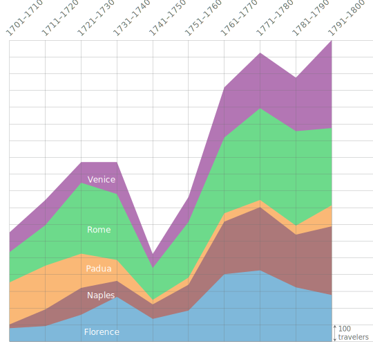

This document details further adaptations to make Markdown files appear
properly on the website.

# General

A major downside to the current implementation is the use of "/gt-book"
in the links... ideally, baseurl would replace these. This is a
temporary workaround so that the local and Github Pages environment are
compatible.

For most questions, see the Sweet article for an example.

# Abstract, References, and About

Each .md file needs an "abstract" section at the top.

Near the end of article.html is a section involving page.references and
page.about. I've decided to instead edit each .md file individually. For
references, just add a

<h3>

before the footnotes of the .md file. The about should be filled in
later by editing the .md's about section at the top. See Sweet article
for example.

# Figures, Tables, and Links

Links inside figure \> figcaption don't work for some reason. Just use
<a href> instead. Neither does bolding as in **Fig. 1** or Italics as in
*Explorer*. Use <b> and <i>.

Figures are originally encoded like: {figure-1} This is replaced with
something like: 

Tables as .md files are pasted in directly OUTSIDE of the

<figure>

tag. Requires columns to have three hyphens, possibly add colons for
alignment. Also requires blank line above heading. See sweet essay for
example. Note: Copied table style from online, can be edited in
\_layout.scss

It is imperative that these tables are immediately preceded with an <a>
tag as in <a name="figure-5a">. This is so links-script.html numbers
paragraphs properly.

External links (Explorer and Book, but not figure links) need to open in
a new tab. Use this format: [text that appears in
body](link/to/book/or/explorer){:target="\_blank"}. Be sure to do this
for links inside

<figcaption>

s as well!

Recall that Explorer links should only link the name of the traveler,
and not the parentheticals. NOT like this: [Robert Harvey's (1753-1820,
travel year 1773, GTE
2294)](http://grand-tour-explorer-2017.herokuapp.com/#/entries/2294){:target="\_blank"}
<!-- WRONG --> but instead like this: [Robert
Harvey](http://grand-tour-explorer-2017.herokuapp.com/#/entries/2294){:target="\_blank"}'s
(1753-1820, travel year 1773, GTE 2294) <!-- RIGHT -->

See the Sweet file for figure zoom functionality.

# Misc

Common UTF-8 Encoding Problems
(<https://www.i18nqa.com/debug/utf8-debug.html>):

‘ -\> ' (open) ’ -\> ' (closed) “ -\> " (open) †-\> " (closed)
â€" -\> --- (em dash) á -\> á í -\> à, í
