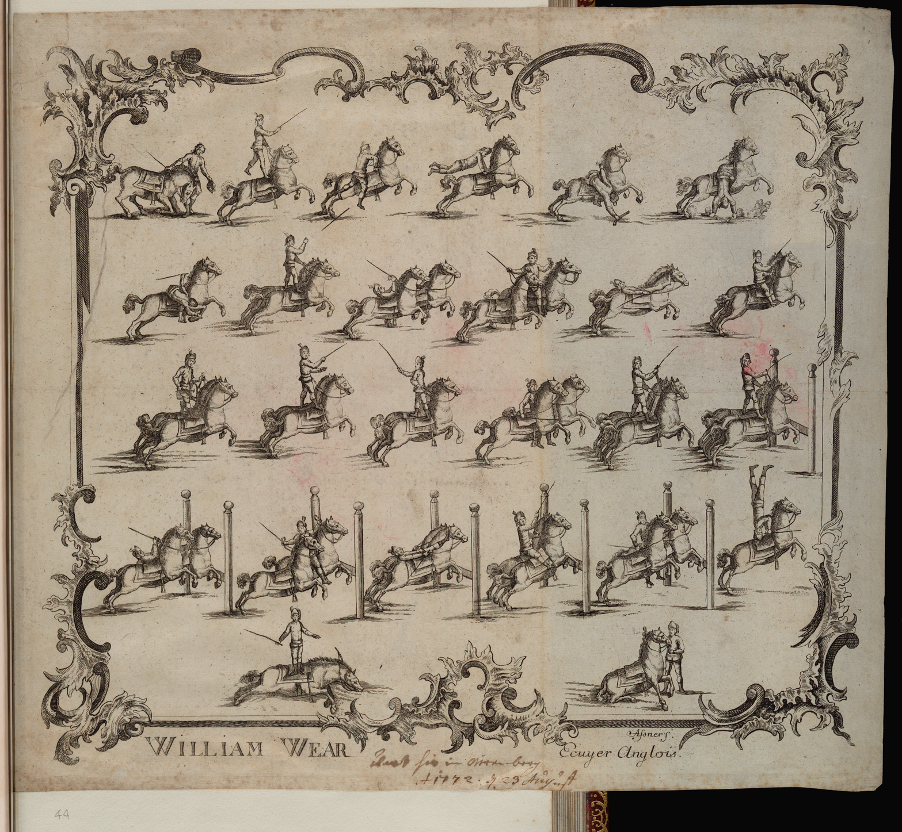

*Yesterday and today I saw a marvelous [operator] of horses; who performs singular feats mounted on horses; such as that if I had not seen them with my own eyes I would not have believed. […] I will write them down here meticulously because they are things that will never be seen again. The man is of the English nation, not very young, but of an amazing gracefulness.*[^1]

One of the gaudier British cultural exports of the later eighteenth century was a distinctive form of traveling circus. Numerous performer-impresarios crossed the Channel to tour throughout Europe and beyond offering spectacles geared around audacious equestrian displays. The vogue reached Italy around 1770, when the description above was written by the astounded Vicenza diarist Arnaldo Arnaldi Tornieri. The showman seen by Tornieri was probably [William Wear](http://grand-tour-explorer-2017.herokuapp.com/#/entries/5031){:target="\_blank"} (travel year 1770), whose extensive Italian tour that year is widely documented.[^2] Writing to the city authorities in Rome that summer, Wear introduced himself as a master horseman (*cavallerizzo*) wishing to show the public his *virtù* in this genre.[^3] Wear’s spectacular performances involved musical accompaniments, ambitious staging, and a range of publicity materials.[^4] At some point during his continental travels he had flyers printed illustrating his daring showmanship ([Figure 1](#figure-1)).

[^1]:
[^2]:
[^3]:
[^4]:

<figure>

<a name="figure-1">  </a>

<figcaption id="cap1">

<b>Fig. 1:</b> Asner, *William Wear ecuyer anglois*, etching, n. d. (with manuscript annotation dated 1772), 335 x 375 mm. Waddesdon, The Rothschild Collection (The National Trust), acc. no. 3686.4.25.44. (Image: © The National Trust, Waddeson Manor).

</figcaption>

</figure>

These depict him undertaking impressive acrobatic feats with multiple horses: in one vignette he performs a handstand on a prancing horse, in other frames he rides astride three moving horses, performs pistol tricks in the saddle or jumps high hurdles. And [Wear](http://grand-tour-explorer-2017.herokuapp.com/#/entries/5031){:target="\_blank"} was just one operator in a cutthroat field. Another such troupe was led by [Peter Price](http://grand-tour-explorer-2017.herokuapp.com/#/entries/3976){:target="\_blank"} along with his [wife](http://grand-tour-explorer-2017.herokuapp.com/#/entries/3976.1){:target="\_blank"} (travel year 1782). When Price and his companions sought permission to perform in Rome, they boasted of previous performances before courtly audiences in Britain, France, Sardinia, Prussia, Poland and Russia. Describing their presence in Rome as part of a voyage which would ultimately take them to Constantinople, they asked for leave “to show in this Mother City the exercises of the *Knights of the English School*.”[^5]

[^5]:

[Wear](http://grand-tour-explorer-2017.herokuapp.com/#/entries/5031){:target="\_blank"}, [Price](http://grand-tour-explorer-2017.herokuapp.com/#/entries/3976){:target="\_blank"} and the several other British *cavallerizzi* troupes who performed in Italy around this period have not yet received substantive historical study.[^6] But, as this essay will propose, these Italian journeys are of interest both in their own right and also as a basis for posing larger historical questions. Touring eighteenth-century Italian cities while seeking *virtù* and gallantry tends to be associated with a very different---and much more abundantly studied---type of travel, namely the Grand Tour and its participants, a practice bound up with elite self-fashioning and the performance of socio-cultural distinction.[^7] For relatively plebeian commercial traveling performers to draw on such elevating language was to posit themselves as *virtuoso* knights engaged on their own kind of Grand Tour.

[^6]:
[^7]:

This essay takes the idea of a parallel, juxtaposition or overlap between these very different social categories of traveler as a cue to explore questions about the actual social range of foreign visitors to Italy around this juncture. More specifically, it takes the case of these *cavallerizzi* as a vantage point for examining the prosopography of over 6,000 British and Irish travelers to Italy during the eighteenth century offered by the *Grand Tour Explorer*. The *Explorer* allows a novel point of access to the mass of valuable research material presented in *A Dictionary of British and Irish Travellers in Italy*, compiled from the Brinsley Ford Archive by John Ingamells (1997). Appraising the social range and representativeness of the *Dictionary*’s prosopography through the interface of the *Explorer* necessitates an understanding of the original book’s scope and its underlying sources. Reviewed in this light, the *cavallerizzi* are discussed here as a case study of the many possibilities---as well as some of the limitations---of prosopographical enquiry into the wider social field of British and Irish travelers to Italy. 

<a name="figure-2"></a>

| Name | Entry in <i>Dictionary</i> | Entry in <i>GTE<i> | Sources |
|:--------|------------------:|
| Wear    |                 3 |
| Peter Price |                15 |
| Wife of Peter Price |                16 |
| Parry |                35 |
| Greenwood |                14 |
| Potts |                30 |
| Charles Hughes |                21 |
| James Wolton |                19 |
| Elizabeth Page (d. 1770) |                13 |
| Thomas Hammond (b. 1748) |                11 |
| Peter, surname unknown (“an English lad call’d Peter”) |                 3 |
| 1786-90 |                 4 |

<figure>

<figcaption><b>Fig. 2:</b> Table of <i>cavallerizzi</i> mentioned that appear within and outside of the <i>Explorer</i>.</figcaption>

</figure>

The equestrian trick-riders offer a revealing starting point for approaching these questions, as they are poised on the tentative cusp between inclusion and absence in the Dictionary’s coverage. My own encounter with Wear and Price began in an archive in Rome, but led to the Dictionary in order further to trace their careers. I then turned to the Explorer—and especially to the word search feature it offers, which greatly facilitates access to the Dictionary text—in order to seek further such cases beyond those I had chanced upon during my initial archival research, before finally exploring further in additional sources. Happily, both Wear and Price do in fact have biographical entries in the Dictionary. Several of their competitors also feature.
Parry and Greenwood (travel year 1770), a two-man team, were in Florence in 1770, hot on Wear’s heels. A trick-rider named Potts (travel year 1772) performed in Venice in 1772: his “feats of Horsemanship” were noted by one British tourist, Philip Francis (travel year 1772), as the only diversion then available in the city.  Another such performer, Charles Hughes (travel year 1775), is recorded in Florence and Rome a few years later; a poster also survives advertising his performances in Venice.  

In many ways, then, the cavallerizzi showcase the extensiveness of the research underpinning the Dictionary’s composition. On the other hand, the entries in question comprise only a sentence or two, and, as will be seen below, not every British trick-rider who toured Italy maszde it into the text. This mixed coverage relates, in part, to the history of the Dictionary itself, of which the animating focus—and greatest strength in practice—is the Grand Tour milieu, rather than a complete prosopography of all British and Irish travelers in eighteenth-century Italy. New research by Giovanna Ceserani has helped establish how the Dictionary was greatly transformed over the long period of its development. As launched by Ford in the decades after the Second World War, the venture was initially envisioned within relatively confined art historical or antiquarian limits, and as a contribution to the history of taste and collecting. Over time, however, the scope of research expanded, and with it the remit of the ultimate publication. 

Elements of the Dictionary’s larger intellectual genealogy and context may also be suggested. First, the question of prosopography was, during the period of the project’s gestation, becoming highly topical among historians. This was especially the case in relation to the study of the eighteenth-century British political elite, notably in the wake of the influential work of Sir Lewis Namier.  Second, the project developed against the backdrop of what Peter Mandler has termed ‘sales of virtù,’ that is, changes in ownership, over the late nineteenth and twentieth centuries, of many of the private papers and collections which had been accrued during the eighteenth-century heyday of the Grand Tour.  The dispersal of such material traces of the Grand Tour ultimately promoted wide-ranging efforts to record and study the eighteenth-century milieu involved in their initial fabrication, with the Dictionary offering a case in point.
 
When the editorial decision was taken to produce a work which would no longer be delimited to a study of British artistic or Grand Tour-related engagement with eighteenth-century Italy, but rather an open-ended biographical dictionary attempting to document all travelers from Britain and Ireland to Italy during the period, this shift entailed drawing upon a larger constellation of sources, then tapping them more systematically. In particular, expanding the venture’s ambition in this manner meant that, besides focusing on sources produced by travelers themselves, research for the Dictionary would also involve the dedicated exploration of multiple Italian archival records. Indeed, one of the signal virtues of the published Dictionary is that it encompasses serious study of sources relating to the monitoring, administration, or ‘policing,’ broadly understood, of foreigners in eighteenth-century Italy. Notably, for certain cities such as Venice, relatively thorough bureaucratic records survive describing arrivals and departures by given foreigners. And these kinds of administrative sources—names on lists and registers—form a low-profile but invaluable bedrock for the Dictionary’s prosopography, and help reveal a cast of historical actors far wider than the socio-cultural elite alone. 

In a schematic way, then, the eighteenth-century sources underpinning the Dictionary may be considered under two main headings. First, the book described British and Irish travelers from material largely stemming from their own records, collections and artistic productions. Second, it drew on documentation regarding such travelers and trajectories in Italian bureaucratic or policing archives. If the first set of sources are more qualitative—and indeed furnished much of the completed Dictionary’s word count and anecdotal color—then it might appear natural to consider the second as broadly quantitative. And yet, at least for the question of the social variety of travelers, this would be somewhat misleading. For not every foreigner was accorded even the basic official attention of having their arrival at a given Italian locale noted. In the Venetian registers for example—perhaps the single most extensive source of this kind used in the Dictionary—often only the nominal head, usually male, of a given traveling party is explicitly named; other family members and servants frequently went unlisted, unnamed, or otherwise under-described. More fundamentally, efforts by eighteenth-century bureaucracies to map people in movement were never a perfect dragnet.  Lists and registers produced by eighteenth-century Italian administrators represented a partially realized aspiration, and sometimes a deceptive simulacrum of all-encompassing surveillance and control, rather than a reality of full coverage. The idea of total or encyclopedic coverage is itself a historical artifact, an ambition—or rather an illusion—which fascinated Enlightenment-era administrators, reformers and police. The Dictionary, and indeed the very idea of a ‘dictionary,’ partly reproduces this illusion. 

The Explorer gives the Dictionary’s sources, showing on which of these, and in what quantity, the entries in the text rely. Some sources on British and Irish travelers in Italy during the eighteenth century eluded the compilers of the Dictionary. That various private papers and other surviving miscellaneous records about individual trajectories were unavailable or missed in the book’s preparation is unsurprising, and does not in itself constitute a profound heuristic handicap. A vast amount of such material would be required to effect a drastic quantitative revision to the Dictionary’s prosopography as published in 1997. Even if this were achieved, it seems implausible that this would produce a dramatically different qualitative picture to the existing Grand Tour-centered one. Far more significant an omission, however, was that the Dictionary overlooked a major set of official records which are of considerable and distinctive prosopographical value, namely the registers of the British Protestant chapel at Livorno.  Held at the National Archives in London, the Livorno chapel records have to date received almost no scholarly attention.  During the ninety-year period between the commencement of the chapel registers in 1707, until the temporary withdrawal of the British factory of merchants from Livorno in the late 1790s, more than 800 burials are listed, around 400 baptisms, and somewhat fewer marriages. On the face of it, these are significant figures to set against the approximately 6,000 traveling individuals that the Explorer has identified in its digital parsing of the entries from the Dictionary. Some of the names in the Livorno registers do already appear in the Dictionary, having been encountered via other sources. And indeed the compilers drew on one proximate source which has partial overlap with the Livorno chapel registers, namely a list of inscriptions in the British cemetery at Livorno—a work which is cited in approximately 130 entries in the Dictionary.  Others names from the registers would have been irrelevant for the Dictionary’s purposes, since not everyone featuring therein is British or Irish (and this is in fact part of their interest as a source). All told, had the Livorno chapel records been incorporated into the Dictionary, the result might well have been several hundred additional names. While representing a significant boost, this would not would have radically transformed the size of the Dictionary’s coverage. This additional material would, however, have principally related to, and helped to further reveal, the mercantile face of British–Irish engagement with eighteenth-century Italy, instead of the more familiar Grand Tour ambit: this focus was presumably one reason why the Livorno registers went unnoticed in the first place. These remarks about the Livorno registers notwithstanding, the Dictionary does nonetheless feature many merchants, and the Explorer’s digital transformation of the Dictionary, allowing the aggregation of travelers that appear as merchants, both grants them more visibility and has been the basis for Reinert’s analysis of this component of the Grand Tour world. 

This review of sources animating the Dictionary’s prosopography might end there, were it not that, in the particular case of the cavallerizzi, one extraordinary additional document has recently come to light. This is a manuscript memoir which centers exactly around what its author dubs the ‘Break-neck Jockeyship’ milieu.  The author in question, Thomas Hammond, worked as a servant for a trick-rider named James Wolton during an extensive continental tour which included a season spent crossing Italy in 1770. Hammond’s account reveals a host of fascinating specifics about the trick-riders’ multifarious—and skulduggery-filled—business arrangements. Above all it supplies the author’s own remarkable voice, opening a window onto his lived experiences and personal dramas. The production and survival of such a text, at this social level, is highly unusual. Set against the existing prosopography of the Dictionary, Hammond’s memoirs flesh out individuals and a milieu which otherwise would remain largely irrecoverable. 

Hammond’s picaresque narrative can only be briefly presented here. He introduces the other members of Wolton’s rackety operation, a young woman named Elizabeth Page—whom Wolton falsely presented as his wife—and “an English Lad call’d Peter, who spoke Italian.”  Hammond also describes encounters with competing British cavallerizzi, including a number of the figures noted at the start of this essay. Thus, before crossing the Alps, Wolton’s company met “Mr. Price the famous rider.” He sought to discourage them from touring Italy, declaring “that it would not answer for we should only spend our Money and get Nothing.” But it subsequently transpired that Price’s comments about Italy “were lies that he forged to detain us from going there where he had never been, but where he intended to go.” The two parties crossed paths again in Turin, pragmatically agreeing to take different Italian itineraries so that “we may not be a hindrance to each other.”  A subsequent encounter with another equestrian performer, our own Wear, occurred just as Wolton was finalizing arrangements to perform in Venice. Such cases of crossing ways while abroad were also characteristic of the travels of more typical Grand Tourists, but this meeting occasioned a distinct outcome. Rather than seek to out-compete one another, Wolton and Wear entered into an uneasy provisional partnership. Hammond vividly described the spectacle as the audience arrived for their opening performance at ‘this water-built city,’ held at a former riding school on the Giudecca:

… the great channel from St. Mark’s Square was Covered with Gondoloes full of Gentlemen & Ladies all Mask’d, who being seated in the Ride, look’d like so Many specters, for their Masks were all white; and their coming over in those black Gondoloes looked as if they had been a troop of Ghosts that Mercury had conducted to the borders of the River Styx to be wafted over by the inexorable Charon into the Elysian fields, or Mansions of the Dead. However—Ugly as they were they brought us money, and we performed there twelve times[.] 

All of Wolton’s group, Hammond included, are conspicuously absent in the Dictionary. To this extent, Hammond’s memoirs attest to the imperfection of the Dictionary’s coverage, as discussed above.  Yet they also substantiate its broader heuristic value, since the Dictionary in many ways helps make sense of an account such as Hammond’s, especially if it is digitally searchable as in the Explorer. Seen in this light, the Explorer can best be treated as an opportunity—as an invitation to take advantage of what this material does show us—rather than lamented for incompleteness where ‘completeness’ was never possible. The Dictionary as it stands, and therefore the Explorer, represents a far-reaching compilation of surviving sources, including of the relevant Italian archival material. Notwithstanding its elite focus, the Dictionary also contains many sidelights on ‘lesser’ travelers. While inviting reflections about the social range of travelers, the Dictionary also helps to elucidate the extent to which different social groups related to—or stood apart from—one another. 

Looking beyond the trick-riders, it is possible to discover at least glimpses of other more workaday or plebeian lives in the Dictionary, which is made easier by scrolling through ‘Employment and Identifiers’ in the Explorer. In most cases, non-elite individuals appear therein because of client relationships with elite patrons, notably through work in service. One striking example from the world of court patronage is William Joy (1675-1734, travel years c.1702-33=), who was “Strong Man to the Great Duke of Tuscany” over the early decades of the century. Many such individuals feature only fortuitously, often accorded brief entries because of some quixotic incident. Richard Noakes, a clockmaker, recorded in Rome in 1757 as having absconded with valuables entrusted to his care; John Burton (1730-1782, travel years 1775-1776 and 1782), a harpsichordist who died of fever in Naples in 1782, while in the employment of William Beckford of Fonthill (1759-1844, travel years 1780-81, 1782 and 1792); and Mrs. Mary Cadogan (d. 1810, travel years 1786-1800), the daughter of a Welsh shepherd, and more famous for being the mother of Emma Hamilton (1765-1815, travel years 1786-1800). Like the trick-riders, in many ways it is impressive that such figures appear at all in the Dictionary, yet all the aforementioned are simultaneously absent in the sense that their entries are relatively sparse or vacant.  Furthermore, the Dictionary’s construction tends to obscure numerous other non-elite individuals. For example, it frequently clusters references to whole traveling parties in a single entry for one dominant individual, thereby reproducing eighteenth-century social hierarchies. It is notable as well that the Dictionary has no entries under the name ‘Anonymous.’ One advantage of the Explorer is to render more visible all manner of individuals—named and unnamed—either with the creation of new entries when the digital parsing has identified these travelers, or by searching the text for given keywords, such as ‘servant’ or ‘maid.’ Other keyword search results, however, are more salutary in obliging us to recall quite what a pale reflection the Dictionary can provide of the true proportions of non-elite travel. Thus, only one sailor, a certain Thomas Gardener (travel year 1747), appears to have received a dedicated entry: yet presumably the number of British and Irish mariners to have made port in Italy over the course of the century would have easily exceeded the total number of entries in the Dictionary.  

Equally, while the discussion here has focused on the challenges of exploring the social range of British and Irish travelers to eighteenth-century Italy through the Dictionary, many of the same considerations apply for additional, and sometimes overlapping, occluded groups and categories. At all social levels, women seem to be underrepresented in the Dictionary by comparison to their male fellow travelers. The Explorer’s digital transformation of the Dictionary has sought to correct this underrepresentation, at least by creating new entries for travelers (largely women) previously subsumed in others’ entries, as in the case of Price’s wife. Sweet’s essay in the present collection has used this new data for innovative analysis, while certainly it remains true that more women traveled than we can ever recover by what the surviving sources record. Searching the Explorer for keywords relating to British colonial worlds produces far more references to individuals enriched by the spoils of empire than to subaltern lives, albeit that there are a handful of exceptions to this. For example, the entry for an “English Catholic from Barbados” named Allen (travel years 1728-30) states that “one of his black slaves became a Christian” in Rome in 1729; the Explorer created a new entry for this slave, but the question persists of how many others remain unmentioned and forgotten.  Furthermore, as the example of the cavallerizzi suggests, the Explorer can be used to trace terms relating to non-human actors and travelers, notably horses but also other animals. For instance, one contemporary account describes Martin Folkes (1690-1754, travel years 1733-35) going to Rome in 1733 “with his wife and daughters, dog, cat, parrot and monkey.” 

This essay began by highlighting how elements of the trick-riders’ self-presentation echoed the Grand Tour model. Evaluating this parallel illumines the equivocal profile that the cavallerizzi came to receive in the historical record—and in the Dictionary—but also points to what made them prosopographically distinctive. Much of their interest, indeed, relates to how they upend traditional Grand Tour frameworks. They came to Italy not to spend money, consume culture, or acquire virtù—nor were they part of the baggage train of Grand Tourism and its associated trades, arts and services. Rather, they were already virtuosi in their field, and were in Italy to make instant money from their own ephemeral productions: their displays were voguish lowbrow entertainment rather than higher-brow fare indebted to classical or artistic canons. This British engagement with Italy was more a matter of export than of import, and more an epiphenomenon of eighteenth-century ‘Anglomania’—in this case centered around horse husbandry and sporting spectacle—than of fascination with Italy’s cultural capital.  Indeed, some of the trick-riders scarcely wished to be there, and were touring abroad simply as a contingency after having been shouldered out of the hyper-competitive ‘Harlequin Horsemanship’ market in Britain itself. 

Nevertheless, one reason we are able to reconstruct these trajectories in any detail is precisely because they also had notable points of proximity and even overlap with the Grand Tour. Newspaper reports advertising cavallerizzi performances shared column space with reports of foreign grandees’ comings and goings. Their displays were often enacted on terrain best-known for Grand Tourism and for antiquarian interests. It was partly the presence of foreign tourists with money to spend which made Italian cities such conspicuous centers for elite consumption, including furnishing a key public for the kinds of crowd-pleasing spectacles that the cavallerizzi were in the business of selling. Horsemanship was itself a characteristic which could bring together diverse social categories: the art of riding was an attribute both of circus performers and of grandees.  The cavallerizzi serve, too, as a reminder that social status was not fixed, and that the purpose of a sojourn in Italy was—at all social levels—performative, competitive and even transformative. The servant Thomas Hammond provides a remarkable example of this. Not only did Hammond transcend societal expectations by writing up his memoirs, so immortalizing his life and career, but one of his text’s delights is its shifting linguistic registers—including, as we have seen, describing scenes he observed in Venice by invoking analogies with classical mythology (“those black Gondoloes looked as if they had been a troop of Ghosts that Mercury had conducted to the borders of the River Styx to be wafted over by the inexorable Charon into the Elysian fields”), thus further announcing his autodidactic virtuosity.

Finally, if some of the considerations discussed here highlight the need, when using the Explorer, to recognize the various layers of source production, survival, selection and interpretation which have structured its contents, they also help provide an intellectual genealogy for the project itself. The ‘art of travel’ as constructed during the early modern period was entangled with observation, recording, and collecting.  But so, too, were host governments anxious to register and measure the movements and activities of foreigners in their midst. One of the points of interest of the Dictionary is precisely that, in its ambitious and innovative source base, it brings together these two documentary impulses. In terms of social coverage, the results are, if not straightforwardly quantitatively representative, nevertheless of often impressive variety. The Explorer gives us new ways of approaching this material, and indeed of reading the Dictionary against the grain of its original intentions. The Dictionary was presented as having been primarily designed to answer questions, “were they in Italy?” and if so, ‘when and where.’  The Explorer, however, permits us not only to revisit such questions, but to frame new ones. As this essay has sought to show, approaching this material by searching not for a named or notable individual, but instead for wider socio-cultural categories and careers, can help reveal a host of more eclectic and obscure personal trajectories, with potentially kaleidoscopic results.

*Acknowledgements**
Research behind this essay was funded by a Rome Scholarship at the British School at Rome (2010–11), and a Max Weber Fellowship at the European University Institute, Florence (2015–16). For comments and other generous assistance, the author is greatly indebted to Giovanna Ceserani, Rachel Midura, Melissa Calaresu, and all the participants at the two ‘Grand Tour Explorer’ workshops held at Stanford in March 2016 and September 2017.

<h3>References</h3>

::: {#popup .overlay style="display:flex; flex-direction:column; flex-wrap: wrap; background: #f7f6f3"}
    <div id="imgs" style="height:80%">
        <div class="overlay-close">
            <a><i class="material-icons">close</i></a>
        </div>
        
        
    </div>
    <div id="capWrapper" style="height:20%">
        <p id="cap" style="float:left; max-width:80%; position:relative; left:120px; display:inline-block"></p>
        <div style="display:inline-block; float: right">
            <div style="display:flex; flex-direction:column; position:relative; right:100px">
                <i class="material-icons link-cite" aria-label="Cite this image" data-balloon-pos="left">format_quote</i>
                <i class="material-icons link-copy" aria-label="Copy link to this image" data-balloon-pos="left">link</i>
                <i class="material-icons" aria-label="Download" data-balloon-pos="left">arrow_downward</i>
            </div>
        </div>
    </div>
:::

```{=html}
<script>
function zoom(obj, obj2, caption) {
    var popup = document.getElementById("popup");
    popup.style.maxHeight = "80%";
    popup.style.height = "80%"
    var image = document.getElementById("img");
    var image2 = document.getElementById("img2");
        
    image.src = obj.src;
    image.style.display = "block";
    image.style.marginLeft = "auto";
    image.style.marginRight = "auto";
    image.style.left = "0";
    image.style.right = "0";
    image.style.width = "100%";
    image.style.height = "100%";

    image2.style.display = "none"; // hide in case Fig 1 or 2 were clicked
    document.getElementById("capWrapper").style.width = image.offsetWidth;

    if (obj2 != undefined && obj2 != null) { // Figure 1 & 2 are paired
        image.style.float = "left";
        image.style.width = "50%";

        image2.src = obj2.src;
        
        image2.style.display = "block";
        image2.style.marginLeft = "auto";
        image2.style.marginRight = "auto";
        image2.style.left = "0";
        image2.style.right = "0";
        image2.style.float = "left";
        image2.style.width = "50%";
        image2.style.height = "100%";

        document.getElementById("capWrapper").style.width = image.offsetWidth + image2.offsetWidth; 
    }
    var cap = document.getElementById("cap");
    if (caption != undefined && caption != null) {
        cap.innerHTML = caption.innerHTML;
        cap.style.display = "block";
    } else {
        cap.style.display = "none";
    }
    var overlays = document.getElementsByClassName("overlay");
      for (overlay of overlays) {
        overlay.classList.remove("visible");
      }
    popup.classList.add("visible"); 
}    
</script>
```