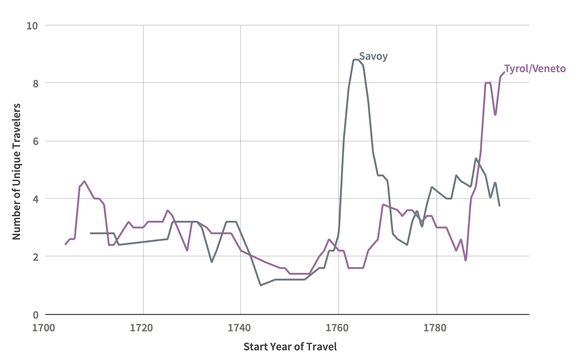

By the seventeenth century, British travelers had already caught the travel bug. They expressed sentiments strikingly similar to those of modern globetrotters. An early “Grand Tour” account, *Coryat’s Crudities* (1611), satirized how even the hint of foreign climes could infect an armchair traveler: 

<blockquote>A Dutch Post doth ravish him. The mere superscription of a letter from Zurich sets him up like a top: Basil or Heidelberg makes him spinne. And at seeing the word Frankford, or Venice, though but on the title of a Booke, he is readie to breake doublet, cracke elbowes, and overflowe the roome with his murmure…[^1]</blockquote> 

This was wanderlust as mania, brought on by an increasingly interconnected world. Adventurers were tempted by the Dutch packets, Swiss letters, and Italian books that had made their way North as far as Oxford and London. Thomas Coryate and many of his compatriots answered their siren calls, setting forth from their armchairs into the wider world.

[^1]: Thomas Coryate, *Coryats Crudities: Hastily Gobled Up in Five Months Travells in France, Savoy, Italy, Rhetia Commonly Called the Grisons Country, Helvetia Alias Switzerland, Some Parts of High Germany and the Netherlands* … (London: Printed by W.S. Stanby, 1611), 122.

Coryate would later claim to have walked much of his journey from France to Italy and the Netherlands. His book begins with several poems referencing his shoes, which hung for many years at his local church in Somerset. But Coryate did not always walk: even at the outset of his journey, he described his wanderlust in terms of how ardently he desired “having trussed up his necessaries, and packed up his fardels, to draw on his bootes, put his riding hat upon his head, raise himselfe upon his wings, hoise sailes, and mount on horsbacke (according to the proverbe) and post the neerest way to forraine and remote Nations.”[^2] Sentences like these hint at the variety of travel modes available in seventeenth-century Europe. Coryate’s reference to the ravishing “Dutch Post” as a noun parallels the modern use of “post” as a synonym for “mail.” Both the noun and verb, “to post,” had only recently entered the British lexicon, from the Italian term for a staging post, or waystations that enabled riders to travel in relay.[^3] When Coryate used “post” as a verb instead and synonym for travel (to “post the nearest way”) he used even newer slang. The proliferation of “to post,” “go by post,” or travel “post-haste” demonstrated that the import of European travel modes to Britain was intertwined with the arrival of British tourists in Europe.[^4]

[^2]: Emphasis added. Ibid., 11.
[^3]: The Oxford English Dictionary marks the first appearance to describe a packet of letters in 1506. “post.” OED Online. September 2019. Oxford University Press. https://www.oed.com/view/Entry/148384?rskey=moo4NA&result=3&isAdvanced=false (accessed October 29, 2019).
[^4]: I discuss the interconnectedness of European postal development in greater depth in my forthcoming book.

When it works well, travel infrastructure is virtually invisible. Instead, we often find mentions of its perceived failures. Take, for example, free word searching in the *Grand Tour Explorer* for “postilion” (a guide hired from the post): [George Lewis Langton](http://grand-tour-explorer-2017.herokuapp.com/#/entries/2843){:target="\_blank"} (c.1716-1738, travel years 1737-1738) was “much harrassed by postillions, inn-keepers and coaching accidents,” while [Tobias Smollet](http://grand-tour-explorer-2017.herokuapp.com/#/entries/4434){:target="\_blank"} (1721-1771, travel years 1764-1771) wrote that “the hostlers, postilions, and other fellows hanging about the post-houses in Italy, are the most greedy, impertinent, and provoking.” The Hon. [Benedict Leonard Calvert](http://grand-tour-explorer-2017.herokuapp.com/#/entries/766){:target="\_blank"} (c.1701-1732, travel years 1724-1725) had good reason to complain when his postilion drove into a ditch, breaking the chase and forcing him to return to Rome rather than journey onwards to Naples. Travelers complained at length about the behavior of postilions, poor condition of paved roads, and inadequacy of travel inns. Coryate’s work and hundreds of other British travel narratives are often analyzed for the sensory or philosophical experience of travel.[^5] Such sources do provide vivid details of exceptional experiences, but more mundane infrastructure frequently escapes notice.

[^5]: Chloe Chard and Helen Langdon, ed.s, *Transports: Travel, Pleasure, and Imaginative Geography, 1600-1830 (New Haven and London: Yale University Press, 1996); Chloe Chard, Pleasure and Guilt on the Grand Tour: Travel Writing and Imaginative Geography, 1600-1830* (Manchester: Manchester University Press, 1999).

It is worth considering instead that such complaints reveal high expectations.[^6] By the beginning of the seventeenth century, British tourists expected a great deal of a comprehensive travel infrastructure that had simply not existed in past centuries. The history of travel necessitates quantitative, in addition to qualitative, evidence. The *Grand Tour Explorer* offers a unique opportunity to study travel patterns across space, time, and political boundaries. With this broader perspective, we can determine how representative the most famous and widely published travelers were. This essay will set out to do so with an experience common to all Grand Tourists: their arrival in Italy. British travelers faced an arduous journey before ever reaching Italian soil. The compilers of the *Dictionary of British and Irish Travellers in Italy* were not preoccupied with that journey, yet as the *Explorer* reveals, the entries preserve many traces. Around 150 locations outside of Italy appear in the tour information, constituting 34.3% of all locations recorded, the majority of which lie North of the Alps.[^7] 

[^6]: For many other such complaints, see Jeremy Black, Ch. 6 “Accommodation” and Ch. 8 “Transport,” *Italy and the Grand Tour* (New Haven: Yale University Press, 2003), 68-74, 81-93.
[^7]: The exact number is 148 as of the current writing, which also encompass trips taken from Italy into Greece and other parts of the Ottoman Empire.

To date, Mont Cenis has traditionally been identified at the preferred Alpine Pass of the Grand Tour. Jeremy Black wrote that “the most common route into Italy was from Lyons through the Duchy of Savoy, over the Mt. Cenis pass to Susa, and thence to Turin.”[^8] Christopher Hibbert similarly saw most Grand Tourists as venturing first to France, before choosing “to cross the Alps either through Grenoble, Briancon, and Cesana, or through Geneva and Switzerland,” while “the most usual route was by way of Lanslebourg and Susa over Mont Cenis.”[^9] Recent authors are more equivocal, but the Savoyard route continues to receive the most scholarly attention.[^10] Other essays in this volume use free word searches to great effect, but the approach offers little guidance in this instance. Searches of the entry text and locations for famous Alpine passes (see Fig. 1) turn up very little information: Mont Cenis returns the greatest number of results with 44 matching entries, while searching for the Brenner pass produces only five entries, the St. Gotthard only two, and the St. Bernard passes do not appear at all.[^11] Instead, this essay will seek to read across the geography of the tour data to infer regions of entry into Italy and the modes of travel being used. Inferring the Alpine pass of entry into Italy from the *Explorer* data reveals that traveler choices were more varied than typically assumed and often tied to travel infrastructure.

[^8]: Black, *Italy*, 13.
[^9]: Christopher Hibbert, *The Grand Tour* (New York: G.P. Putnam’s Sons, 1969), 72, 90.
[^10]: Rosemary Sweet writes only that the Grand Tour “generally started in France or the Low Countries from where travelers made their way south, either passing over the Alps into northern Italy or making their way down to the Mediterranean and crossing over to the Ligurian coast via the Gulf of Spazzia.” Rosemary Sweet, *Cities and the Grand Tour: The British in Italy, c.1690-1820*. (Cambridge: Cambridge University Press, 2012), 2. For more on the British-Savoyard connection, see Paola Bianchi and Karin Wolfe, ed.s, *Turin and the British in the Age of the Grand Tour* (Cambridge: Cambridge University Press, 2017).
[^11]: Brinsely Ford and John Ingamells, eds., *A Dictionary of British and Irish Travellers in Italy, 1701-1800* (New Haven: Paul Mellon Centre for Studies in British Art by Yale University Press, 1997).

This essay also seeks to elucidate the British arrival to Italy as an overall historical phenomenon. The *Dictionary* bisects the history of travel with a largely arbitrary date of 1700. By putting study of the *Explorer* in dialogue with earlier sources—including Thomas Coryate, among many others—we may better understand the *longue durée* of the Grand Tour, as well as its significance as a reflection of improving travel infrastructure.[^12] Postal routes and waystations marked improvements in “soft infrastructure” that predated many road engineering projects. Alpine passes were fundamentally limited in number in the early modern world, and very little construction to add new routes took place between the thirteenth and nineteenth centuries.[^13] The travel of eighteenth-century British Grand Tourists can be fruitfully compared to earlier centuries as a reflection of the shifting preferences and conditions for, rather than geographical possibilities of, transalpine travel. 

[^12]: Edward Chaney and Timothy Wilks, *The Jacobean Grand Tour: Early Stuart Travellers in Europe* (London; New York: I.B. Tauris, 2014).
[^13]: 1225 had seen the bridging of the Schöllenen Gorge of the St. Gotthard pass. Until the nineteenth century, the most notable shift was the 1707 construction of the Umerloch tunnel through Kilchberg, which substituted for an impassable bridge. Klaus Beyrer, “Alpenübergange” in Friedrich Jaeger, ed., *Enzyklopädie der Neuzeit* (Stuttgart: J.B. Metzler, 2005), v. 1.

<figure>

   

<figcaption id="cap1">

<b>Fig. 1:</b> Map of Alpine passes and “indicator” cities, which have been used to infer probable routes of entry into Italy. Cities have been grouped into “entry regions” and color-coded accordingly. Entry regions do not necessarily correspond to political units. Each of the labeled cities appears in the curated subset of travelers used in this article.
    
</figcaption>

</figure>

**The *Longue Durée* of the Grand Tour: Structural factors for arrival into Italy**

Grand Tourists were familiar with the long history of Italy’s Roman roads, employing Latin names and mapping their travels onto those described by classical authors. The Roman Empire established an early pattern of travel infrastructure radiating outwards from Italy into other parts of Europe. The Via Julia Augusta (c. 13 B.C.E.) followed the coast of Liguria, linking Genoa to Marseille, while the Via Claudia Augusta (c. 46/47 C.E.) linked the Veneto region to the Tyrol and beyond, by way of the Brenner pass. Archaeological evidence indicates additional Roman roads in the region of the Simplon pass in the first centuries of the new millennium, likely related to the campaigns of Septimius Severus I (193-211 C.E.).[^14] Grand Tourists primarily remembered exceptional Alpine crossings, from Hannibal’s legendary elephants (218 C.E.) to Charlemagne (800 C.E.) and Frederick Barbarossa’s imperial armies (c. 1154-1175 C.E.).

[^14]: Uwe A. Oster, ed., Wege über die Alpen (Darmstadt: Primus Verlag, 2006), 35. See also Gudrun Schnekenburger, ed., Über die Alpen: Menschen, Wege, Wären (Stuttgart: Archäologisches Landesmuseum, 2002).

While Roman infrastructure fell into disrepair, smaller-scale mobility continued throughout the Middle Ages. Transalpine trade linked the hubs of Northern Italy with France, particularly the trade fairs in the region of Champagne. The closure of these fairs in the early fourteenth century saw a rise in traffic across the eastern Alpine passes, as merchants sought new transalpine connections between Bologna, Venice, Nuremberg, and Augsburg. Some merchants even took basic road building into their own hands: Bozen merchant Heinrich Kunter sponsored the building of a mule road through the Eisack gorge along the Brenner pass in 1314.[^15] In the sixteenth century, the Fugger family of merchant-bankers paid to revitalize parts of the Via Claudia Augusta, referred to as the *Römerstrasse*.[^16] 

[^15]: Ibid., 48-49.
[^16]: Oster, 83.

Transalpine regions had been the birthplace for much of early modern travel and communication infrastructure. The Tassis family—whose ancestral home in Camerata Cornello was located along the medieval Via Mercatorum—were one of several families contracted to build and manage routes for early modern states. Better known by their later title of Thurn und Taxis, this communications dynasty played a crucial role in the Venetian, Papal, Spanish, and Austrian Habsburg systems from the fifteenth century onward.[^17] Responding to news-hungry patrons, from princes to bankers, they established postal routes dotted with waystations with horses kept ready for riding in relay. Many of these waystations were themselves inns, where the innkeeper might rent out horses to travelers when they were not otherwise in use. The Tassis established such waystations along historical routes from Milan to the Netherlands through Chur in 1496, and from Milan to Innsbruck in 1517.[^18]
To travel “by the post” encompassed several modes by as early as the sixteenth century. The first was to rent a “post horse,” then travel with or without a guide (a “postilion,” or *postiglione*) along the postal road, paying a fee for the return of the horse to its owner at the end of the journey. The second was to travel by one’s own means along the postal road, taking advantage of the stops. The British adopted the Italian *ordinari*, which usually referred to couriers traveling on a set timetable, to refer instead to the “ordinaries,” or postal inns. By the early seventeenth century, the third option was often to travel via a public postal coach, often referred to as the “post-chaise” (from the French) or “diligence” (from the German).[^19]

[^17]: Rachel Midura “Masters of the Post: Northern Italy and the European Postal Network, 1530-1730,” Ph.D. Dissertation, Stanford University, 2020, and forthcoming book. See also Wolfgang Behringer, *Thurn und Taxis: die Geschichte ihrer Post und ihrer Unternehmen* (München: Piper, 1990); Bruno Caizzi, *Dalla posta dei re alla posta di tutti: territorio e comunicazioni in Italia dal XVI secolo all’Unità* (Milano: Franco Angeli, 1993); Clemente Fedele and Mario Gallenga, ed.s, *Per servizio di Nostro Signore: strade, corrieri e poste dei papi dal medioevo al 1870* (Modena: Mucchi, 1988).
[^18]: Behringer, *Thurn und Taxis*.
[^19]: Midura, “Masters of the Post.”

By the mid-seventeenth century, the British were frequently as steeped in the culture of postal transport as their Continental counterparts—despite the relatively late advent of their own state-run service.[^20] The language of the post percolated from Italy across Europe in the sixteenth century: *posta*, *ordinario*, *procaccio* (a single route carrier), *vetturino* and *nolesino* (referring to coaches for hire). The term “post-haste” made a notable appearance in Shakespeare’s plays.[^21] British translators made postal itinerary books available to English audiences with Richard Verstegan’s *The Posts of the World* (1576), John Wadsworth’s *The European Mercury* (1641), and Edmund Warcupp’s *Italy in its Original Glory* (1660).[^22]

[^20]: While individual posts were active by the Tudor period, the establishment of a comprehensive state post is frequently dated to the 1650s or 1660s. Howard Robinson, *The British Post Office: A History* (Westport, Conn.: Greenwood Press, 1948).
[^21]: See for example “Olde Iohn of Gaunt. Hath sent post haste, To intreate your Maiestie to visite him” in William Shakespeare, *Richard II*, I.iv.54 and “The Duke requires your hast, post hast appearance, Even on the instant” in Shakespeare, *Othello*, I.ii.37.
[^22]: Richard Verstegan, *The Posts of the World* (London: Richard Rowlands, 1576); J. W. Gent [John Wadsworth] *The European Mercury* (London, H. Twyford, 1641); Edmund Warcupp, *Italy in its original Glory, Ruine, and Revival…* (London: H. Twyford, 1660). For more on postal publication, see Rachel Midura, “Itinerating Europe: Early Modern Spatial Networks in Printed Itineraries, 1545–1700” *Journal of Social History* 54, 4 (2021): 1023-1063.

The paths of British travelers were dispersed across a broad geography from their points of entry onto the Continent, but they were grouped together once more upon reaching the Alps. Liguria had several coastal routes, including the aforementioned Via Julia Augusta through Savona. Travelers coming from Geneva often crossed Savoy and traveled through the Mont Cenis and St. Bernard passes (known as the “Little,” and “Great,” respectively); meanwhile Lombardy channeled travelers from other parts of Switzerland through the Simplon, St. Gotthard and San Bernardino passes. Finally, the Venetian/Tyrolean region received tourists from southern Germany and Austria, most often via the Brenner pass.[^23]

[^23]: In traveler accounts, individual passes are relatively easy to distinguish. The consideration of travelers in aggregate is better represented by regions, for reason addressed in following paragraphs.

<figure>
    

    
<figcaption id="cap2">
 
<b>Fig. 2:</b> Wilhelm Rothe, according to drawings by Johann Gottfried Jentzsch. <i>Grande roûte au mont St. Gotthardt, en Suisse non loin de l'Hospice di Jentzsch</i>. c. 1790-1800. Colored engraving. 34 x 50 cm. <a href="https://www.europeana.eu/item/92070/BibliographicResource_1000126222695 " target="_blank">Austrian National Library </a>, Austria. Public Domain. The travelers wear black headscarves to avoid “snow blindness” caused by reflected rays of the sun. 
    
</figcaption>
    
</figure>
    
The Alps themselves posed a formidable obstacle (see Fig. 2), but British travelers became more accustomed to the passage over the seventeenth century. Most land routes had long portions that could only be passed on foot, on mule, or by sedan chair. Early seventeenth-century traveler Fynes Moryson preserves a particularly vivid image. He described pressing his face to his horse’s neck, fearing he would fall at any minute.[^24] Thomas Coryate recalled the storms during his summer passage of 1608 through Savoy as particularly horrible.[^25] In the later seventeenth century the Alps occasioned less fearful commentary. With the exception of his fear of the “rough way,” Lassels described his 1650s voyage through the Simplon Pass as “forward enough,” barring poor weather. He particularly endorsed the route through Mont Cenis, describing it as the Alps in “text hand,” comparing the topography to neat script, as opposed to areas that seemed “foule over” or “in a running hand.”[^26] François Misson offered one of the first proto-Romantic accounts of the Alps, writing that “their Snowy tops are mingled with the Clouds, and resemble very much the swelling and foaming Waves of a tempestuous and raging Sea.”[^27] The growing geological and scenographic attraction of the Alps for British travelers is a well-documented phenomenon.[^28]

[^24]: “sometimes (not without horror) ascended very steepe passages of Mountaines, lying with my face on my Horses necke, whose bridle I left free to him, holding my selfe with one hand on his maine, and the other on the saddle.” Fynes Moryson, *An Itinerary Written by Fynes Moryson* (London: John Beale, 1617): 55-57.
[^25]: Coryate, *Coryat’s Crudities* (1611), 74.
[^26]: Richard Lassels, *The Voyage of Italy, or, A compleat journey through Italy in two parts* (London: John Starkey, 1670), 66-67.
[^27]: François Misson, *A New Voyage to Italy…* (London: R. Bonwicke et al., 1714), 93-94.
[^28]: See for example, William Windham, *Two Letters from an English Gentleman giving an Account of... the Ice Alps in Savoy* (London: Peter Martell 1744), but particularly Johann Jakob Scheuchzer, *Itinera Alpina*, (London: Henrici Clements, 1708) which was dedicated to the Royal Society. “the eighteenth century witnessed the publication of more than a hundred accounts of journeys through the Alps, undertaken for the purpose of scientific observations, or as holidays.” Gavin de Beer, *Early Travellers in the Alps* (New York: October House, 1966), 150.

    
| Name | Travel Account | Travel Dates | Region(s) of Entry to Italy | Region(s) of Departure from Italy | 
|--------|--------|--------|--------|--------|
|Thomas William|<i>The Historie of Italie</i> (MS)|1540s|Naples|Lombardy|  
|Thomas Hoby|<i>A Book of the Travaile and Lief of Me Thomas Hoby</i> (MS)|1547-1564|Veneto/Tyrol|Veneto/Tyrol|
|Sir Edward Unton|Diary (MS)|1564|Veneto/Tyrol|Lombardy| 
|Sir Phillip Sidney|Letters (MS)|1575|Veneto/Tyrol|Veneto/Tyrol|
|Fynes Moryson|<i>An Itinerary.. Containing his Ten Yeeres Travel...</i>|1591-1601|Veneto/Tyrol|Lombardy, Veneto/Tyrol|
|Thomas Coryate|<i>Coryate’s Crudities</i>|1608|Savoy|Lombardy|
|William Lithgow|<i>A Most Delectable and True Discourse of Peregrination</i>|1609-1612|Savoy|Lombardy|
|John Evelyn|Diary (MS)|1643-1647|Liguria|Lombardy|
|John Ghent Raymond|<i>An Itinerary Contayning a Voyage, Made through Italy</i>|1646-1647|Liguria|Lombardy|
|Richard Lassels|<iThe Description of Italy, the Voyage of Italy</i>|1650-1654|Veneto/Tyrol,Savoy,Lombardy|Lombardy|
|Sir John Reresby|<i>Memoirs</i>|1656|Lombardy|Veneto/Tyrol|
|John Ray|<i>Travels through the Low Countries, Germany, Italy, and France</i>|1663-1666|Veneto/Tyrol|Lombardy|
|John Clenche|<i>A Tour in France & Italy</i>|1675|Savoy|Savoy|
|Gilbert Burnet|<i>Some Letters Containing What Seemed Most Remarkable in Switzerland, Italy, etc.</i>|1685-1687|Lombardy|Savoy|
|Macimillian Misson|<i>A New Voyage to Italy</i>|1687-1688|Tyrol|Savoy|
|William Bromley|<i>Several Years Travel</i>|1693|Liguria|Tyrol
    
<figure> 
    
<figcaption><b>Fig. 3:</b> A hand-curated set of British travelers to Italy across the seventeenth-century with regions of entry and exit identified from published accounts and ODNB data. Travelers such as Moryson and Lassels made multiple trips utilizing different passes.</figcaption>
    
</figure>    
    
While the *Explorer*, like the *Dictionary*, begins in 1700, we can compare it against the earlier travel accounts shown in Fig. 3. The seventeenth century lacks a published prosopography of the depth and scale of the *Dictionary*, leaving the researcher largely reliant on published accounts.[^29] We can infer three general trends from these accounts: first, they demonstrate that seventeenth-century travelers employed a variety of passes, with some preference overall for the Venetian/Tyrolean and Lombard routes— most likely the Brenner and Simplon passes. Protestants like Fynes Moryson professed fear of capture by Spanish troops and inquisitors, but it was hard to beat these regions for travel infrastructure in the seventeenth century.[^30] Venice and Milan were notable centers of early Tassis postal development with well-developed postal roads and travel modes for rent. A longstanding agreement between Milan and the merchant porters of Lindau in Bavaria became a more formalized postal route by the late seventeenth century.[^31] By 1710, four-span carriages traveled along the postal road between Innsbruck and Bolzano three to four times a week.[^32] Second, we see that many early travelers, like their later counterparts, preferred to exit Italy from a different region than they entered, likely motivated by a desire for travel breadth and variety. Finally, many of these examples confirm that travelers preferred the dangers of the Alps to the perils of the sea.[^33]

[^29]: An excellent dissertation and database does exist but is not available for public access: John Ghazvinian, “A certain tickling humour’: English Travellers, 1560-1660,” DPhil at Christ Church, Trinity College, 2003. For more on early British travelers in Italy, see also de Beer, *Early Travellers*, and Cesare de Seta, *L’Italia nello specchio del Grand Tour* (Milan: Rizzoli, 2014).
[^30]: Moryson, *Itinerary*.
[^31]: Post-courses were run across Splügen and St. Gotthard passes by Bernese landlord Beat Fischer von Reichenbach by 1681. Beyrer, ‘“Alpenübergänge’”; see also Behringer, *Thurn und Taxis*. 
[^32]: Oster, 116.
[^33]: De Seta, *L’Italia*, 43-45.

The analysis shown in Fig. 3 has distinct limitations. These are but a handful of travelers, and each identification requires consulting their accounts individually. We are left with little sense of how representative these journeys were, or of how trends evolved over time. By contrast, the *Grand Tour Explorer* allowed me to rapidly infer the regions of entry of eighteenth-century British travelers into Italy. This approach was made possible by both the constrained geography of alpine passes and the sequential records of locations provided in the *Explorer* entries. If an individual is first recorded in Turin and then Milan, for example, it is a reasonable inference that they entered Italy by way of a Savoyard alpine pass. Clues can be read alongside select traveler accounts as well as supplemented by a knowledge of contemporary travel infrastructure. While closer to Verona than Milan “as the crow flies,” Mantua had long been integrated into Habsburg transit infrastructure in northern Italy. It is reasonable to infer that a traveler who arrived in Mantua did so by way of the Lombard passes, especially when such an arrival was not preceded by any mention of cities in the Veneto or Tyrol regions.
It is important not to overdetermine the specificity of results from such a method. It would be misguided, for example, to infer a single route. Regional groups instead represent collections of routes, such as “Lombardy,” which encompasses the Simplon, St. Gotthard, or San Bernardino passes, among others. These regional groupings and their associated cities can be found listed in the legend and color-coded accordingly in Fig. 1. They are necessitated by both the ambiguities of real geography and that of travel modes. Arrival in a port city such as Venice or Genoa might indicate a journey by sea rather than over land. Definitively parsing all instances would require archival study outside of the *Explorer*. We can, however, see whether the trajectory of travel through the Tyrol/Veneto more closely parallels that of a region reached by port, such as Tuscany, or regions reached primarily by land, such as Lombardy.[^34] While imperfect, such an inferential methodology fills in for a noteworthy absence. Alpine passes rarely appear by name in entry texts, and even more rarely as explicit destinations.

[^34]: “Land” here including travel by waterways such as rivers and lakes.

The method is also not appropriate for use with all traveler entries. The following analysis uses a subset of 999 travelers from the *Explorer* for which a region of entry into Italy can be reasonably inferred, based on two criteria: first, each traveler has to be associated with at least three locations overall. Second, departure from the first location in Italy (regarded as the point of entry) must be followed by another location recorded within the month. This selection is intended to serve as a counterweight to sparse data. It is difficult to say whether a traveler recorded in only a single location entered Italy in that manner, or whether three locations visited over the course of several decades should constitute a sequence of travel. These strict criteria produce a small subset compared to the *Explorer*’s total of 6,005 travelers, but a large one by comparison to any hand-selected subset, such as that shown in Fig. 3. 

<figure>

<figcaption id="cap4">

<b>Fig. 4:</b> Line graph demonstrating the identified region of entry of 999 travelers prior to 1800. Travelers are graphed according to the year of travel associated with their first recorded visit to a city in Italy. Trend lines have been smoothed by a moving average of +5/-5 years.

</figcaption>

</figure>

Fig. 4 shows the results smoothed by a moving average across the five years preceding and following the apparent date of entry for travelers.[^35] While Savoy and Mont Cenis predominated as the region of entry among identified travelers between 1751 and 1770—the decades of a notable increase in overall travel—that was not the case earlier in the century. In fact, travelers appear to have preferred the Venetian/Tyrolean region through the first half of the eighteenth century. And while the Savoyard passes maintained a steady flow of travelers during periods of French-English warfare from 1771-1790, the Tyrolean/Venetian region boomed by comparison.[^36]
Many of the caveats that hold true for the original biographical dictionary still necessarily apply, and the *Explorer* introduces some additional ones. For example, the lifespan of certain sources certainly impacts recorded travelers. As explained in Ingamells’ original “Note on Method” and [mentioned by Rosemary Sweet](/gt-book/scholars-essays/midura-british-arrival){:target="\_blank"} and others, the University of Padua matriculation records were the source for a great number of the overall travels to the city recorded in the *Dictionary*.[^37] These records became less comprehensive over time. Additionally, the Explorer’s transformation of the Dictionary’s entries disaggregated some large groups of travelers, perhaps disproportionately affecting the data for my study. See, for example, the numerous family of [Rev. Edward Taylor](http://grand-tour-explorer-2017.herokuapp.com/#/entries/4692){:target="\_blank"} (1734-1798, travel years 1789-1792), many of whom accompanied him from Austria to Verona in 1789, and who constituted 10 of the 21 travelers recorded entering via the Tyrol/Veneto that year.[^38] 

[^35]: This method was chosen to better demonstrate general trends, as it was impossible to securely identify travelers for certain pass regions in many individual years. Note alternative methods of displaying the discrete data in [Rosemary Sweet’s article](/gt-book/scholars-essays/midura-british-arrival){:target="\_blank"}.
[^36]: The Tyrol/Veneto pass saw 45 travelers enter Italy between 1789-1792, out of a total 92 identified travelers in that period (49%). 
[^37]: Ingamells, p. XVI.
[^38]: The proportion of travelers in groups versus individually recorded travelers however was roughly equivalent across the data categories, with groups representing between 20-30%.

Even given these limitations, the data supports that travelers continued to prefer the Tyrolean/Venetian region as a pass of entry. While Grand Tour literature has tended to link British travels in Italy with travels in France, the data indicates the need for deeper consideration of Austria and Germany as pre-Italian destinations. These regions had their own appeal to travelers like [Sir James, the 4th Baronet Hall](http://grand-tour-explorer-2017.herokuapp.com/#/entries/2188){:target="\_blank"} (1761-1832, travel years 1784-1785), who spent a year in Central and Eastern Europe studying “mining, archaeological sites and volcanology.” Many travelers through the Tyrolean/Venetian region came from Vienna. Some were more traditionally elite tourists, such as [Douglas Hamilton, the 8th Duke of Hamilton](http://grand-tour-explorer-2017.herokuapp.com/#/entries/2203){:target="\_blank"} (1756-1799, travel years 1775-1776), who traveled with tutor [Dr. John Moore](http://grand-tour-explorer-2017.herokuapp.com/#/entries/3413){:target="\_blank"} (1729-1802, travel years 1775-1776), or [Lady Coke](http://grand-tour-explorer-2017.herokuapp.com/#/entries/1030){:target="\_blank"} (1726-1811, travel years 1773-1774), who greatly admired the Empress Theresa and reputedly displayed a “frenzy for royalty.” Yet a number of these travelers held military commissions and visited Vienna, then Venice, during the conflicts of the mid-1770s, perhaps during their military studies—see, for example, the [Hon. Robert Manners](http://grand-tour-explorer-2017.herokuapp.com/#/entries/3175){:target="\_blank"} (1758-1823, travel year 1779) and [Nathaniel William Wraxall](http://grand-tour-explorer-2017.herokuapp.com/#/entries/5229){:target="\_blank"} (1751-1831, travel year 1779).[^39]

[^39]: 16 travelers arrived in the Tyrol/Veneto region coming from Vienna.

The city of Venice was itself a popular draw for tourists, raising the issue of how closely entry through a given region can be associated with the popularity of its cities. If we look at the overall popularity of Venice as a destination across the *Grand Tour Explorer* data, we see that it does not map exactly onto the preference for the Tyrol/Veneto as a region of entry. The city of Venice experienced a surge of travelers from 1761-1770, when the Tyrolean/Venetian passes were at an overall low point in popularity.[^40] In fact, the popularity of a city may have had a greater impact on tourists’ choice to end, rather than begin, a journey in that region. A sea voyage from Venice would notably allow tourists to ship home art and other objects collected in the course of their journeys.

[^40]: We can also represent this in terms of a percentage of overall travelers to Venice. In 1710, 12 of 52 travelers to Venice appeared to be entering Italy via the region (23%), while in 1780, only 2 of 57 can be identified as such (4%).

The Imperial and Venetian posts were among the most advanced and comprehensive postal infrastructures of the early seventeenth century. It was possible to travel by Imperial post alone from the Netherlands to Innsbruck, where the passage to Venice by coaches for hire was run by a consortium of Augsburg merchants. Misson highlights the stage coaches that went from Augsburg to Venice as early as the 1680s.[^41] Despite the attempts by the Tassis (now Thurn und Taxis) postmasters to combat their competitors, there were a number of such regional postal systems that connected major trade centers in the Holy Roman Empire, and no doubt eased British travel.[^42] For travelers concerned by the practicalities of reaching Italy, the journey through Central Europe rather than France held a certain appeal.

[^41]: “To Augsburg (being two dayes iourney and a halfe) I hired of the City Carrier (in whose company I went) an Horse for two Dollors, as I remember. The Merchants of Nurnberg and Augsburg; giue pensions to eight of these Carriers, daily passing betweene those Cities, besides the profit they make of letters, and other things they carry by horse.” Misson, *A New Voyage to Italy*, 19.
[^42]: Behringer, *Thurn und Taxis*. 

<figure>

<figcaption id="cap5">

<b>Fig. 5:</b> Line graph demonstrating the shifting numbers of travelers entering via the Tyrol/Veneto and Savoy regions. Visualization smoothed by moving average of +5/-5 years. 

</figcaption>

</figure>

When was the turning point in favor of the Mont Cenis and St. Bernard passes, and Savoy as a region of entry? In 1720, Victor Amadeus II, the Duke of Savoy became the King of Sardinia, turning his court into a royal one. Travelers such as the [Rev. Thomas Brand](http://grand-tour-explorer-2017.herokuapp.com/#/entries/556){:target="\_blank"} (c.1751-1814, travel years 1782-1784, 1787, 1790-1795) delighted in court life, describing how “we go on in the old way playing snug rubbers at Whist at the Spanish Ambassadors & dressing ourselves two or three times a week to shew off our persons to advantage & captivate the hearts & Eyes of the great Circles.” Yet the *Explorer* data shows no immediate change, and few travelers entered through Savoy in the 1720s.[^43] A much more notable increase began in the 1750s, reaching a peak of 25 identified travelers in 1763 (24 of the 39 identified travelers for that year, or 62%). [John Spencer, the 1st Viscount Spencer](http://grand-tour-explorer-2017.herokuapp.com/#/entries/4756){:target="\_blank"} (1734-1783, travel years 1763-1764, 1769-1770), was the leader of a particularly large and well-documented entourage that year, however there was a general pattern of increasing traffic. Travelers tended to arrive in Savoy en route from Paris (23 travelers), Geneva (13 travelers), and Nice (11 travelers). In 1743, Savoy gained possession of the Val d’Ossola and Val Anzasca passes from Austrian Lombardy. A new agreement between Savoy and Bern the next year restructured and facilitated transit between the two regions. Yet in 1748, [David Hume](http://grand-tour-explorer-2017.herokuapp.com/#/entries/2575){:target="\_blank"} (1711-1776, travel year 1748) and his companions remained unimpressed by the bad roads of Turin, which caused delays from the “breaking of Wheels.”

[^43]: From 1721-1730, only 5 identified travelers entered via Savoy out of 88 total (6%). Compare this to 22 identified travelers entering via the Tyrol/Veneto (25%).

At the same time, the Austrian Habsburgs set out an ambitious program for infrastructural reform. From the middle of the eighteenth century, they controlled both the Lombard St. Gotthard and Venetian Brenner passes. In the 1750s and 1760s, Empress Maria Theresa seized control of the Tyrolean postal service and implemented renewal of both the system itself and the roads. The Imperial Post achieved a major coup in 1764 by successfully negotiating a mail coach to supplement the existing line across the Brenner pass. Even travelers who utilized private carriages benefited from the associated improvements. As overall British tourism increased, the Tyrolean/Venetian region saw a large proportion of visitors, notably outpacing Savoy once again by around 1774.

<figure>

<figcaption id="cap6">

<b>Fig. 6:</b> Line graph demonstrating the shifting numbers of travelers entering via Liguria and Tuscany. Visualization smoothed by moving average of +5/-5 years. 

</figcaption>

</figure>

While Grand Tour scholars like Jeremy Black have indicated that war caused little disruption in existing travel patterns, it does appear that soured Anglo-French relations may have made a significant difference.[^44] Bianchi notes that the Savoyard route was largely closed to British travelers in the 1740s as a result of the War of Austrian Succession (1740-1748).[^45] The period of the American and French Revolutions also saw a dip in overall travelers, reaching a particular low in 1781, when only 217 travelers are recorded in the *Explorer*. Only one of these has been identified as entering Italy via the given regions in this year: the [Hon. Gen. James Murray](http://grand-tour-explorer-2017.herokuapp.com/#/entries/3492){:target="\_blank"} (1719-1794, travel years 1781-1782), who fled the French siege of Minorca. The anomalous peak in travelers entering Italy via Liguria in 1778 (9 of 25 identified travelers that year, or 36%) was likely due to restricted options. The very next year saw the capture of the Westmoreland and plunder of many Grand Tourist souvenirs by Spanish ships.[^46] Occupations rather than tourism brought others to Italy, such as the surgeon [Thomas Gideon Caulet](http://grand-tour-explorer-2017.herokuapp.com/#/entries/855){:target="\_blank"} (travel years 1778-1779), or the musician [John Crosdill](http://grand-tour-explorer-2017.herokuapp.com/#/entries/1215){:target="\_blank"} (1755-1825, travel year 1778). 

[^44]: According to Black, during the War of Spanish Succession (1700-1714) more travelers opted to travel via the Netherlands and Germany, avoiding Lombardy and Turin. He saw minimal disruptions caused by the War of Polish Succession (1733-1735) and Spanish Conquest of Naples in 1734. Black, “Chapter 10: Hazards,” *Italy*, 104-117.
[^45]: Bianchi and Wolfe, *Turin*, 131.
[^46]: María Dolores Sánchez-Jáuregui Alpañés and Scott Wilcox, ed.s, *The English Prize: The Capture of the Westmorland, An Episode of the Grand Tour* (Yale: Yale University Press, 2012).

Do these shifts show a corresponding shift in preference for travel by sea or travel by land? If that were the case, we would expect to see Lombardy and Savoy (land routes) peak in periods when Liguria and “Other” (a category including most regions that could be reached only by sea) were at a low, and vice versa (see Fig. 4). We instead see a more complex picture: Liguria and Tuscany show an inverse relationship, particularly from 1778 forward (see Fig. 6). The rivalry of ports seems a more influential factor: as the popularity of the port of Leghorn grew, the popularity of the port of Genoa fell, at least with British Grand Tourists.[^47] 
Across the graph, we see several phases of regional preferences for entry into Italy. The overall increase in travelers over the course of 1720s and 1730s likely continued trends from the later seventeenth century. Early travelers appreciated the convenience and safety of continental postal routes, particularly the coaches run over the Brenner pass. From around 1730 forward, the number of travelers through this region dwindled, reaching a low around the beginning of the 1750s, just as the Savoyard passes increased in popularity. The timing suggests that infrastructural reform, rather than the new royal court, likely played a role. Subsequent decades saw important reforms by the Austrian Habsburgs, including consolidation and improvement of postal routes, particularly the advent of an official postal coach across the Alps. During the troubled decades of the 1770s and 1780s, most regions saw fewer travelers entering Italy, leaving Liguria briefly prominent among entry points. By the 1790s, tourism had recovered somewhat overall, but entry via Venice reached record numbers, and the Tuscan port of Leghorn showed steady growth, suggesting perhaps a new turn to travel by sea, even in the age of rising tourist interest in the Alps.

[^47]: This rivalry is addressed by Corey Tazzara, *The Free Port of Livorno and the Transformation of the Mediterranean World* (Oxford: Oxford University Press, 2017).

**Tastemakers and Mont Cenis: Traveler preferences for arrival into Italy**

| Titled Status|Liguria |Lombardy|Savoy|Tyrol/Veneto|Tuscany|Other|
|-----------|-----------|-----------|-----------|-----------|-----------|-----------|
|<b>All</b>|<b>12.9%</b>|<b>4.2%</b>|<b>22.5%</b>|<b>20.5%</b>|<b>15.5%</b>|<b>24.5%</b>|
|<b>Men (all)</b>|<b>11.9%</b>|<b>3.8%</b>|<b>21.9%</b>|<b>21.0%</b>|<b>15.6%</b>|<b>25.8%</b>|
|Untitled Men|10.8%|3.8%|22.2%|20.1%|15.9%|27.1%|
|Titled Men|16.6%|3.6%|20.7%|24.9%|14.2%|20.1%|
|<b>Women (all</b>)|<b>19.3%</b>|<b>6.6%</b>|<b>21.1%</b>|<b>19.3%</b>|<b>16.3%</b>|<b>17.5%</b>|
|Untitled Women|19.4%|8.5%|18.6%|20.2%|13.2%|20.2%|
|Titled Women|18.9%|0.0%|29.7%|16.2%|27.0%|8.1%|

<figure>

<figcaption><b>Fig. 7:</b> Table showing regional distribution by traveler gender and titled status (travelers of unknown gender not shown). Titled status was ascertained by a combination of regular expressions and hand verification. Despite the overall popularity of the Savoyard and Tyrol/Veneto regions, the data suggests ways in which demographics may have shaped traveler preferences.</figcaption>

</figure>

Scarcity of data challenges statistical analysis, but we might make some general observations to paint a better picture of the “typical” tourist and their choices, particularly by status and gender (see Fig. 7).[^48] The greatest number of identified travelers were males without noble titles. Some, like the composer [Charles Weichsell](http://grand-tour-explorer-2017.herokuapp.com/#/entries/5047){:target="\_blank"} (c.1766-1805, travel years 1794-1801), landed first in Naples.[^49] Untitled men arriving via the Alps seem most likely to have done so via Savoy.
The greatest overall difference between titled and untitled men was in fact the Ligurian route, which titled men were more likely to have utilized than their untitled counterparts. Many travelers came to Genoa from France, often taking a felucca, a type of rowboat, as Joseph Addison described in his published account: “we here took a little Boat to creep along the Sea-shore as far as Genoa; but at Savona, finding the Sea too rough, we were forced to make the best of our way by Land, over very rugged Mountains and Precipices: For this Road is much more difficult than that over Mount Cenis.”[^50] [Thomas Egerton, Baron Grey de Wilton](http://grand-tour-explorer-2017.herokuapp.com/#/entries/2121){:target="\_blank"} (1749-1814, travel years 1785, 1788), recorded his journey from Nice to Genoa by sea in 1784, staying at the *Hotel du Grand Cerf* in Nice before departing for Genoa on a felucca. Many tourists opted to enter Italy via Liguria while on their second tour, perhaps suggesting a desire for speed rather than sightseeing; this includes [Alexander Gordon, Marquess of Huntly](http://grand-tour-explorer-2017.herokuapp.com/#/entries/2592){:target="\_blank"} (c.1678-1728, travel years 1703-1704, 1717), in 1717 and [Thomas Fermor, the 1st Earl of Pomfret](http://grand-tour-explorer-2017.herokuapp.com/#/entries/3919){:target="\_blank"} (1698-1753, travel years 1718-1719, 1739-1742), in 1739. Among titled men, there appears to have been a slight preference for the Tyrol/Veneto passes, however among men of both statuses, the distribution between Savoy and Tyrol/Veneto was relatively even.

[^48]:Title has been inferred from names. Titles recognized here include male and female variants of Duke, Earl, Count, Viscount, Marquess, Baron, Baronet and Lord. 
[^49]: There are several cases of individuals who most likely arrived via southern Italy, but were not recorded until their arrival further north. The Explorer entry for [George Sinclair](http://grand-tour-explorer-2017.herokuapp.com/#/entries/4366){:target="\_blank"} (1714-1776, travel years 1737-1738), for example, notes that his journal begins midway through a description of Rome.
[^50]: Joseph Addison, *Remarks on Several Parts of Italy* (London: J. Tonson, 1718), 8.

The routes of female travelers—who often traveled with, or were recorded by, other male travelers—map onto male travel patterns with a few interesting exceptions. First, both titled and untitled women were more likely to arrive via Liguria than their male counterparts. Unlike the men, untitled women were even more likely than their titled counterparts to arrive by this route, with many entries describing that they traveled by sea. Examples include [Miss Mary Anne Cathcart](http://grand-tour-explorer-2017.herokuapp.com/#/entries/852){:target="\_blank"} [Mary Mainie] (1727-1774, travel years 1744-1746), who journeyed from Lisbon to Genoa in 1744, and [Laetitia Houblon](http://grand-tour-explorer-2017.herokuapp.com/#/entries/2533){:target="\_blank"} (1742-1828, travel years 1788-1789) and [Betsy Watson](http://grand-tour-explorer-2017.herokuapp.com/#/entries/5012){:target="\_blank"} (travel years 1788-1789), who came from Nice in 1788.
Second, titled women appear more likely to arrive via Tuscany than any other group. 10 of the total 37 identified titled female travelers were first recorded in Pisa, Lucca, or Florence. Their arrival by sea is rarely explicitly mentioned in the entries, but can be reasonably inferred.[^51] Similarly, while the complete absence of titled women entering Italy via Lombardy may be a simple lack of data, it does seem to overall be one of the least popular routes for female travelers. [Anne Miller](http://grand-tour-explorer-2017.herokuapp.com/#/entries/3324){:target="\_blank"} (1741-1781, travel years 1770-1771), [Hester Piozzi](http://grand-tour-explorer-2017.herokuapp.com/#/entries/3880){:target="\_blank"} (1741-1821, travel years 1784-1787), and [Mariana Starke](http://grand-tour-explorer-2017.herokuapp.com/#/entries/4512){:target="\_blank"} (1762-1838, travel years 1792-1798) came to Italy by way of Savoy, although Starke recommended that travelers avoid the Alps by sailing to Leghorn or Pisa.[^52] The possibility that women increasingly found sea travel more commodious than travel by land is worthy of further exploration. It may well have offered more privacy and safety to women who could afford it. The published travel accounts of elite men and women also routinely advertised the Savoyard route as one of the safest and most pleasant, likely influencing future travelers. 

[^51]: An exception is [Elizabeth (Vassall), Lady Webster](http://grand-tour-explorer-2017.herokuapp.com/#/entries/5043){:target="\_blank"} (1771-1840, travel dates 1791-1793), whose entry states “they set sail again in December and on 8 January 1794 found the children well in Florence.”
[^52]: Mariana Starke, *Travels in Italy* (1802) in Brian Dolan, *Ladies of the Grand Tour* (London: Harper Collins, 2001), 135.

At this point in time, we may merely indicate that as recorded by the *Dictionary*, there was a general preference for arrival via either the Tyrol/Veneto or Savoy Alpine passes, from which certain key groups diverged. Women on the whole were more likely to arrive via Liguria, most likely by sea. Titled women were especially likely to arrive via Savoy, although Tuscany was also widely popular. If we consider only travelers prior to 1751, we see that these gender and titled status patterns generally hold true across time, despite the overall balance between Savoy and the Tyrol/Veneto being more evenly distributed in the earlier half of the century.
The prescriptiveness of published Grand Tour accounts, which sought to instruct their readers in the “correct” tour, have contributed to the notion of a single Grand Tour itinerary. We see from this study how titled men and women, particularly during the peak years of the eighteenth-century tour, preferred a Savoyard route, no doubt contributing to the scholarly perception. Yet as several essays in this volume demonstrate, British travelers planned different “tours” on the basis of their gender, professions, means and personal desires. Travel experience was also shaped by changing roads and travel modes, which were subject to periodic tides of interruption, destruction, and renewal. 
The *Grand Tour Explorer* offers us the unique ability to read travel itineraries across time, while considering such varied perspectives. We see evidence for continuity in travel patterns from the late seventeenth century into the eighteenth, as tourists continued to visit Austria and Germany as well as France prior to their Italian arrival. The postal infrastructural improvements made in Savoy likely contributed to its brief peak as the predominant pass of entry, but the restructuring of the Tyrol/Veneto regional infrastructure brought it back to prominence by the end of the eighteenth century. However, not every group experienced these shifts to the same degree: women overall showed an early and consistent preference for travel via Liguria. Titled women had a strong early preference for Savoy, suggesting they may have played an important role as “tastemakers.” The *Explorer* on the whole highlights the diversity of tours, and the many factors guiding British travelers to their arrival in Italy.

<h3>References</h3>

    

        

            <a><i class="material-icons">close</i></a>
        

        
        
    

    

        

        

            

                <i class="material-icons link-cite" aria-label="Cite this image" data-balloon-pos="left">format_quote</i>
                <i class="material-icons link-copy" aria-label="Copy link to this image" data-balloon-pos="left">link</i>
                <i class="material-icons" aria-label="Download" data-balloon-pos="left">arrow_downward</i>
            

        

    

