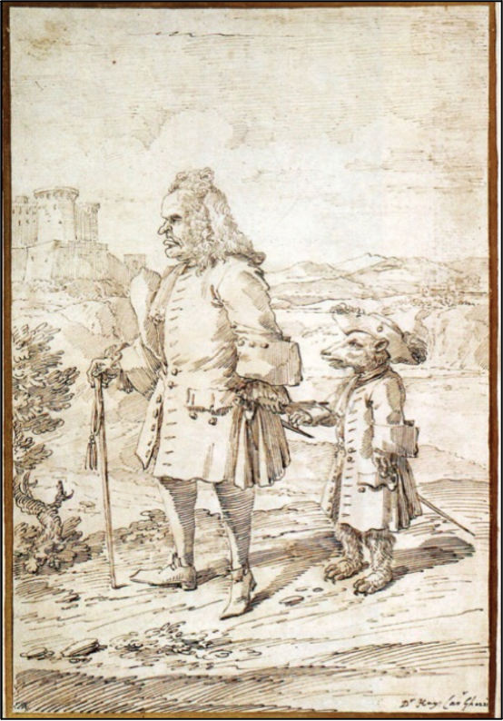
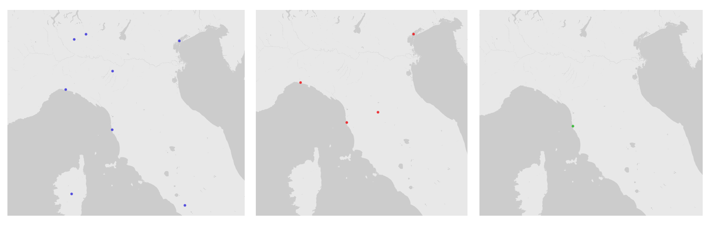
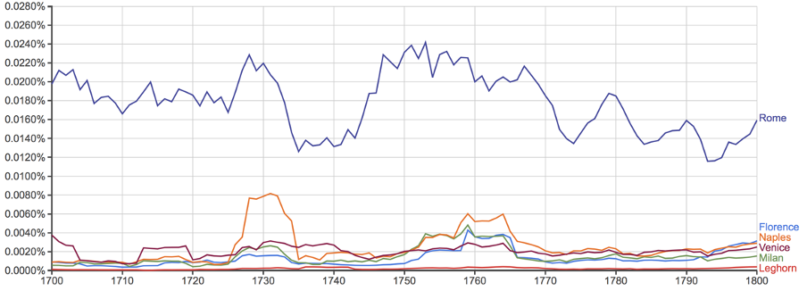
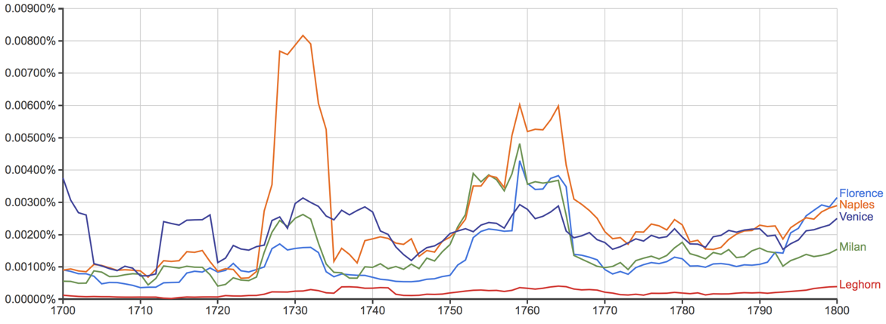

As the itinerant wizard Gandalf wrote to the then domestically-inclined hobbit Frodo Baggins in J.R.R. Tolkien’s *The Lord of the Rings*, “not all those who wander are lost.”[^1] Indeed, as the recent brouhaha over the ‘wanderlust gene’ DRD4-7R testifies, travel is a constant of human experience inflected in myriad ways by history, literature, and life; from the Aboriginal Walkabout and the Homeric epics through the Jungian archetype of ‘the wanderer’ to *Tripadvisor.com* and Ibiza stag parties.[^2]  People travel to eat, to learn, and to conquer. They travel in search of architectural inspiration, for reasons of health, and simply because destinations were ‘there,’ in Edmund Hillary’s felicitous formulation. Within this swath of human history my interest lies with a particular *kind* of purposeful travel that I would define as ‘economic.’ By this I do not mean frugal or ‘low cost,’ or for that matter more permanent migration in search of a livelihood, but travel for the purpose of improving the management of the material world---theoretically or practically, individually or collectively; more the Jesuit François Xavier d’Entrecolles discovering the secrets of Chinese porcelain in 1712 than, say, Ryanair.[^3] Economic journeys are, by default, emulative in aspiration if not in practice, as they are driven by the desire to discover better ways of doing and thinking in the economic sphere---not to mention to establish commercial linkages and networks. Such travels represent a crucial vector of globalization both past and present.[^4]

[^1]: Gandalf to Frodo Baggins in *The Fellowship of the Ring* (Boston: Mariner Books, 2005), p. 170. On the wandering origins of Gandalf himself, see Allan Asbjørn Jøn, “An Investigation of the Teutonic God Óđinn; and a Study of his Relationship to J.R. R. Tolkien’s Character, Gandalf,” MA Dissertation, University of New England, 1997, pp. 82-83 and *passim*.
[^2]: See, for overviews, Sarah Prout, “On the Move? Indigenous Temporary Mobility Practices in Australia,” *Centre for Aboriginal Economic Policy Research Working Paper No. 48*, 2008; Adam Nicolson, *The Mighty Dead: Why Homer Matters*, London: William Collins, 2014; William D. Chalmers, *The Origin of the Species homo touristicus: The Evolution of Travel from Greek Spas to Space Tourism*, Bloomington: iUniverse, 2011; and Stewart A. Weaver, *Exploration: A Very Short Introduction*, Oxford: Oxford University Press, 2014, p. 116.
[^3]: Compare William Rowe and Timothy Brook, *China’s Last Empire: The Great Qing*, Cambridge, MA: Harvard University Press, p. 84 and Alan Ruddock, *Michael O’Leary: A Life in Full Flight*, London: Penguin, 2008. On the related but distinct phenomenon of *migration* see, among others, Paul Collier, *Exodus: How Migration is Changing our World*, Oxford: Oxford University Press, 2015. For a recent example of architectural travel see Harry Seidler, *The Grand Tour: Travelling the World with an Architect’s Eye*, Cologne: Taschen, 2013; on the venerable tradition of spa travel, see the range from Roman thermal voyages in Lionel Casson, *Travel in the Ancient World*, Baltimore: The Johns Hopkins University Press, 1994 to Mirjam Triendl-Zadoff, *Nächstes Jahr in Marienbad: Gegenwelten jüdischer Kulturen der Moderne*, Göttingen: Vandenhoeck & Ruprecht, 2007 and Karl E. Wood, *Health and Hazard: Spa Culture and the Social History of Medicine in the Nineteenth Century*, Newcastle upon Tyne: Cambridge Scholars Publishing, 2012. For many other sorts of travel see Jared Diamon, *Guns, Germs, and Steel: The Fates of Human Societies*, New York: W.W. Norton, 1997. For Edmund Hilary’s phrase, see Alan Weber (ed.), *Because It’s There: A Celebration of Mountaineering from 200 B.C. to Today*, Lanham: Taylor Trade Publishing, 2003. For a representative caveat regarding eighteenth-century ‘Oeconomical’ travel, understood as low-cost, see William Patouon, “Advice on Travel in Italy [c. 1766],” in John Ingamells, *A Dictionary of British and Irish Travellers to Italy 1701-1800; Compiled from the Brinsley Ford Archive*, New Haven: Yale University Press, 1997, xxxix-lii, p. xl.
[^4]: For a striking example of this phenomenon, from the perspective largely of nineteenth-century economic travel by Italians, see Giorgio Bigatti, “Vedere per apprendere. Tra istruzione e affair: impreditori in viaggio (secolo XIX),” in Carlo G. Lacaita (ed.), *Le vie dell’innovazione: Viaggi tra scienza, tecnica ed economia (secoli XVIII-XX)*, Milan: Giampiero Casagrande Editore, 2009, 277-311, and, on it being a “*Grand Tour* in reverse,” p. 278. On the conceptual history of early globalization, see David Armitage, “Is there a Pre-History of Globalization?,” in id., *Foundations of Modern International Thought*, Cambridge: Cambridge University Press, 2013, pp. 33-45.

In the wake of East Timor’s new independence in 2002, for example, future Prime Minister Mari Alkatiri embarked on a global tour of ‘relevant’ countries, ranging from Singapore to Nauru to Norway, in order to “learn from their experiences” and choose which one to emulate as a model of national political economy.[^5] A decade later, the Wenzhou businessman Sun Jian decided to fly to Lagos, Nigeria, after having considered everything from Bangladesh to Uzbekistan, because he had heard of opportunities there for outsourcing of Chinese manufacturing.[^6] These leaders’ modes of travel, one informed by macro- and the other by micro-economic concerns, harken back to the origins of international commerce and communication itself; to the conceptual beginnings of what we today call globalization.[^7] Examples of such economic tours are bountiful, stretching back into the dimmest eons of recorded history; eighteenth-century Europe positively brimmed with them.[^8] Indeed, the mythical ‘Grand Tour’ in early modern Europe, of which these forms of instructive travel represent a woefully neglected aspect, has come to be seen as one of the cardinal institutions of the Enlightenment.[^9]

[^5]: Interview with Mari Alkatiri, Dili, East Timor, 11 August 2015.
[^6]: I am grateful to my former student and sometime research assistant Irene Yuan Sun for this reference and the interview conducted in Ogun, Nigeria, 2 July 2014, discussed in her *The Next Factory of the World: How Chinese Investment is Reshaping Africa*, Boston: Harvard Business School Press, 2017, chapter 1.
[^7]: See, for a particularly colorful example of how even accidental long-distance travel could establish commercial linkages that would last for more than half a millennium, the case of the Venetian Pietro Querini’s shipwreck in Northern Norway and the continuing Italian obsession with *stoccafisso*, in Helge A. Wold, *Querinis reise—Il viaggio di Querini*, Stamsund: Orkana, 2004, and more broadly Giovanni Panella, *Lofoten / Liguria—The Codfish Tale: Stoccafisso e baccalà*, Genoa: Tormena, 2016.
[^8]: See for some of endless examples, Jürgen Kocka, “Entrepreneurs and Managers in German Industrialization,” in Peter Mathias and M.M. Postan (eds.), *The Cambridge Economic History of Europe, vol. VII: Capital, Labour and Enterprise, Part 1: Britain, France, Germany, and Scandinavia*, Cambridge: Cambridge University Press, 1978, 492-589, p. 532; Alan Marshall, *Intelligence and Espionage in the Reign of Charles II, 1660-1685*, Cambridge: Cambridge University Press, 1994, p. 40; John Raymond Harris, *Industrial Espionage and Technology Transfer: Britain and France in the Eighteenth Century*, Aldershot: Ashgate, 1998; Peter M. Jones, *Industrial Enlightenment: Science, Technology and Culture in Birmingham and the West Midlands, 1760-1820*, Manchester: Manchester University Press, 2008, p. 95; Mark Netzloff, “Jonson’s *Volpone* and the Information Economy of Anglo-Venetian Travel and Intelligence,” in John Watkins and Kathryn L. Reyerson (eds.), *Mediterranean Identities in the Premodern Era: Entrepôts, Islands, Empires*, Aldershot: Ashgate, 2014, pp. 73-89.
[^9]: The literature on this is vast, but see Melissa Calaresu, “Looking for Virgil's Tomb: The End of the Grand Tour and the Cosmopolitan Ideal in Europe,” in Jaś Elsner and Joan-Pau Rubiés (eds), *Voyages and visions: Towards a cultural history of travel*, London: Reaktion Books, 1999, pp. 138-161; Jeremy Black, *Italy and the Grand Tour*, New Haven: Yale University Press, 2003; Attilio Brilli’s multi-volume publication project, and particularly *Il viaggio in Italia: Storia di una grande tradizione culturale*, Bologna: Il Mulino, 2008; Rosemary Sweet, *Cities and the Grand Tour: The British in Italy, c. 1690-1820*, Cambridge: Cambridge University Press, 2012.

Scholars have recently called for a broader analysis of the Grand Tour, including, among other things, the women and children, servants and middlemen, foreigners and Italians among whom wealthy young Britons travelled. Though I am principally interested in the role of travel in early modern political economy, this essay contributes to expanding the historical parameters of Grand Tourism.[^10] I have elsewhere explored how the theories and practices of countries that ‘forged ahead,’ to quote the Stanford economist Moses Abramowitz, were emulated in Europe through the medium of translation. Relatedly, I would argue that another type of ‘Grand Tour’ emerged in the eighteenth century, in which travelers visited countries of similar or more advanced economic development and geopolitical standing for both technological and governmental inspiration. To emulate, in short, foreign best practices.[^11] The exercise of collecting strategic intelligence abroad had, of course, been a primary task of spies and ambassadors in early modern Europe, but a broader and more diverse set of travelers came to carry out this activity over the course of the eighteenth century. As the statesman, intellectual, and future 117th Doge of Venice Marco Foscarini put it in a 1742 ambassadorial report from Turin, one of the primary purpose of such accounts had historically been not merely to record events, but to survey the trade networks, industries, and armies of different countries. Yet,

[^10]: See among others John Brewer, ‘Whose Grand Tour?,’ in Maria Dolores Sánchez-Jáuregui and Scott Wilcox (eds.), *The English Prize: The Capture of the Westmorland, an Episode of the Grand Tour*, New Haven: Yale University Press, 2012, pp. 45-61; Calaresu, “Looking for Virgil’s Tomb.”
[^11]: Sophus A. Reinert, “Another Grand Tour: Cameralism and Antiphysiocracy in Tuscany, Baden, and Denmark-Norway,” in Jürgen Backhaus (ed.), *Physiocrats, Antiphysiocrats and Pfeiffer*, Berlin: Springer Verlag, 2011, pp. 39-69. For Moses Abramovitz’ vocabulary see id., “Catching Up, Forging Ahead, and Falling Behind,” *Journal of Economic History*, vol. 46, no. 2, 1986, pp. 385–406. For further examples, from one end of Europe to the other, see Even Hammer, *Philonorvagi: velmeente Tanker til veltænkende Medborgere*, Copenhagen: N.P., 1771, pp. 36-44, on which see Sophus A. Reinert, “Even Hammer: Politisk økonomi I den norske opplysningstiden,” *Årbok 2017: Opplysningstida i Romsdal, 1700-1814* (Molde: Romsdalsmuseet, 2017), pp. 9-39, and J.O. Bro-Jørgensen (ed.), *Ove Høegh Guldbergs og arveprins Frederiks brevveksling med Peter Christian Schumacher 1778-1807*, Copenhagen: Danske selskab for fædrelandets historie, 1972; Marsilio Landriani, *Relazione di Marsilio Landriani sui progressi delle manifatture in Europa alla fine del Settecento*, ed. Mario Pessina, Milan: Edizioni il Polifilo, 1981.

*…as these became familiar with the passing of time, and common knowledge because of the new facility of travel, which rendered it more frequent, and because of the infinite number of published books comprehensively treating of these issues, one has, not without reason, abandoned this form of report over the past century and reduced it to a kind of particular history containing the maxims, councils, and arcane origins of the things that took place during the duration of any given Ambassadorship.*[^12]

[^12]: Marco Foscarini to the Doge and Senate of Venice, 2 March 1743, *Relazione fatta dal Marchese Foscarini gia Ambasciadore Veneto presso la Corte di Torino nel 1742. Dopo il suo ritorno a Venezia*, Archivio Storico Comunale di Casale Monferrato, Casale Monferrato, Italy, 091 93, pp. 2v, 98r. See, for similar arguments, Pietro Verri, *Considerazioni sul commercio dello stato di Milano*, ed. Carlo Antonio Vianello, Milan: Università L. Bocconi, 1939, p. p. 202 and id., “Considerazioni sulla proposizione di restringere il lusso nello stato di Milano 1763,” in *Edizione nazionale delle opere di Pietro Verri*, 6 vols., Rome: Edizioni storia e letteratura, 2003-2015, vol. II:1: *Scritti di economia finanza e amministrazione*, eds. Giuseppe Bognetti et al., pp. 93-106, 105-106.

The increasing frequency of travel, along with the exploding volume of publications in early modern Europe, changed the economy of intelligence on the continent, as a far wider spectrum of travelers and thinkers turned to questions of political economy and accumulated insights became common knowledge.[^13] Yet Foscarini insisted that travel could still offer strategic insights into the economic administration and economic systems of competing polities, even offering “perfect examples to imitate.”[^14] Like textual translation, travel thus remained one of the early modern period’s principal vehicles of both international emulation and the standardization of best practices in the Western world, not to mention, in some cases, its transoceanic connections.[^15] “The subject of Finances,” the future U.S. President John Adams mused, could be learned only “from books or from Travel.”[^16] For similar reasons, his fellow Founder and future President Thomas Jefferson (1743-1826, travel year 1787) visited Piedmont in 1787 as part of his Grand Tour to study rice-growing practices. Like many contemporary traveling collectors, Jefferson acquired rare books in Italy, including a “copy of Polybius, the best edition,” but he readily admitted that

[^13]: That said the ‘economic’ Grand Tour remained resolutely gendered, much like the fields of scholarship and policy it touched upon. For recent gender perspectives on the Grand Tour see Paula Findlen, Wendy Wassying Roworth, and Catherine M. Sama (eds.), *Italy’s Eighteenth Century: Gender and Culture in the Age of the Grand Tour*, Stanford: Stanford University Press, 2009.
[^14]: Marco Foscarini to the Doge and Senate of Venice, 2 March 1743, *Relazione fatta dal Marchese Foscarini gia Ambasciadore Veneto presso la Corte di Torino nel 1742. Dopo il suo ritorno a Venezia*, Archivio Storico Comunale di Casale Monferrato, Casale Monferrato, Italy, 091 93, pp. 36v-37v, 38r-38v.
[^15]: Reinert, *Translating Empire*, p. 5. On the importance of practice for the codification of early political economy see further “Authority and Expertise at the Origins of Macro-Economics,”, in Rosario Patalano and Sophus A. Reinert (eds.), *Antonio Serra and the Economics of Good Government*, Basingstoke: Palgrave Macmillan, 2016, pp. 112-142.
[^16]: John Adams to Joseph Palmer, 6 May 1777, in John Adams, *The Papers of John Adams*, 15 vols. to date, eds. Robert J. Taylor *et al.*, Cambridge, MA: Harvard University Press, 1977-, vol. 5, p. 179. I am grateful to Francesca Viano for this reference.

*I scarcely got into classical ground… in architecture, painting, sculpture, I found much amusement; but more than all in their agriculture, many objects of which might be adopted with us to great advantage.*[^17]

[^17]: Thomas Jefferson to George Wythe, 16 September 1787, in Thomas Jefferson, *The Papers of Thomas Jefferson*, 41 vols. to date, eds. Julian P. Boyd et al., Princeton: Princeton University Press, 1950, vol. XII, pp. 127-130. Though hardly ‘British’ at that point, Jefferson’s travels were noted in Ingamells, *Dictionary*, p. 552, for a modern treatment of which see George Green Shackelford, *Thomas Jefferson’s Travels in Europe*, 1784-1789, Baltimore: The Johns Hopkins University Press, 1995.

Though Jefferson indulged in many of the activities of the stereotypical Grand Tourist, his itinerary was fundamentally inflected by exigencies of political economy.

Macro- and micro-economic interests sometimes overlapped during what one might call ‘Economic Grand Tours,’ as was the case when the Milanese merchant and large-scale textile manufacturer Antonio Greppi traveled most of Europe not merely in search of business opportunities, but to familiarize himself with the theoretical study of international political economy.[^18] Direct experience lent authority in economic affairs, as the Abruzzo adventurer Troiano Odazi proved when he successfully advertised his extensive travels when seeking a professorship in political economy at the University of Naples.[^19] The Germanic ideal of *Bildung* so essential to the Grand Tour was, after all, pursued for individual as well as societal ends.[^20] Even the aesthetic language that Grand Tourists habitually employed to describe sublime vistas of Roman ruins and bucolic bliss found economic expression in some cases. When the Milanese patrician and scholar Alessandro Verri first visited England, for example, he marveled at the *bellissima veduta* not of Dover’s white cliffs but rather of London along the banks of the Thames, “covered with merchant ships, which form a forest of trees and another city on the sea.”[^21]

[^18]: Paolo Greppi to Antonio Greppi, 14 April 1777, in Stefano Levati and Giovanni Liva (eds.), *Viaggio di quasi tutta l’Europa colle viste del commercio dell’istruzione e della salute: Lettere di Paolo e Giacomo Greppi al padre (1777-1781)*, Milan: Silvana Editore for the Archivio di Stato di Milano and the Camera di Commercio di Milano, 2006, pp. 137-139, discussed in Sophus A. Reinert, *The Academy of Fisticuffs: Political Economy and Commercial Society in Enlightenment Italy*, Cambridge, MA: Harvard University Press, 2018, p. 313.
[^19]: Luca di Samuele Cagnazzi, *Al signor D. Matteo d’Augustinis*, Naples: Societa’ Filomatica, 1839, p. 3. On Odazi see Giovanni Di Leonardo, *L’illuminista abruzzese Don Trojano Odazj: dalle* Lezioni *di Genovesi all’amicizia con Beccaria dalla Cattedra di Economia alla cospirazione*, Mosciano S. A.: Media, 2003. On the Neapolitan chair, originally awarded Antonio Genovesi, see Sophus A. Reinert, *Translating Empire: Emulations and the Origins of Political Economy*, Cambridge, MA: Harvard University Press, 2011, pp. 194-195.
[^20]: See still the selection of writings in Walter Horace Bruford, *The German Tradition of Self-Cultivation: ‘Bildung’ from Humboldt to Thomas Mann*, Cambridge: Cambridge University Press, 1975, particularly, for the case of merchants on the Grand Tour, p. 143. 
[^21]: Alessandro Verri to Gabriele Verri, 19 October 1766, in Gianmarco Gaspari (ed.), *Viaggio a Parigi e Londra (1766-1767): Carteggio di Pietro e Alessandro Verri*, Milan: Adelphi, 1980, pp. 462-467.

The *Grand Tour Explorer* provides a remarkable tool for considering the continental experiences of travelers from what was by many accounts the world’s most advanced economy, Britain, as they ventured to Italy, a one-time seat of commercial power in Europe then in relative decline.[^22] And yet, while the *Explorer* helps visualize and analyze the British Grand Tour to Italy in new ways, it also exemplifies some of the pitfalls of applying digital tools in the humanities. By mentioning this I do not intend to diminish the value of such scholarship, but rather to contribute to furthering the ways in which old scholarship and new technologies can interact and such digital projects can truly benefit the humanities.

[^22]: See, for different perspectives, Paolo Malanima, “The Long Decline of a Leading Economy: GDP in Central and Northern Italy, 1300-1913,” *European Review of Economic History*, vol. 15, 2010, pp. 169-219; Sophus A. Reinert, “Lessons on the Rise and Fall of Great Powers: Conquest, Commerce, and Decline in Enlightenment Italy,” *The American Historical Review*, Vol. 115, No. 5, 2010, pp. 1395-1425; Sweet, *Cities and the Grand Tour*, pp. 269-270; Maria Fusaro, *Political Economies of Empire in the Early Modern Mediterranean: The Decline of Venice and the Rise of England 1450-1700*, Cambridge: Cambridge University Press, 2015. And, for a more traditional cultural history, Edward Chaney, *The Evolution of the Grand Tour: Anglo-Italian Cultural Relations since the Renaissance*, Milton Park: Routledge, 1998, p. xi and *passim*.

The *Explorer* retains many of the cornucopian qualities of its source, *A Dictionary of British and Irish Travellers in Italy 1701-1800* (1997). The latter was the work of a large editorial team led by John Ingamells in order to engage with the vast personal archive of the British collector and art historian Sir Brinsley Ford.[^23] The project of amassing the *Dictionary* was by necessity eclectic, even quixotic, but produced a unique treasure trove of information regarding the British Grand Tour to Italy in the age of Enlightenment; or, perhaps more appropriately, of contemporary British, Irish, and American travel to Italy. British visitors to Italy might or might not have made the list, depending on availability and convenience of materials, not to mention personal interest. They might be blessed with pages of text or relegated to cursory sentences (though it needs to be said that the *Dictionary* identified a *very* large number of even cursory travelers). Needless to say, the editorial team only recorded itineraries of which they were certain. This led to a number of travelers ‘teleporting’ around Italy as evidenced through fleeting appearances of names and places in archival or published sources. No Grand Tourist could *only* have visited landlocked Florence in the eighteenth century, no matter how attractive its institutional reforms and relative development were to contemporary travelers.[^24] It might even be argued that the *Dictionary* could only be so rich and varied because of what it neglected. As Orlando Pescetti put it in his *Proverbi italiani*, rendered famous by Voltaire, “the best is the enemy of the good.”[^25] In this, the *Explorer* has walked a fine line, maintaining the *Dictionary*’s original underlying structures, while also making them more transparent and increasing accessibility to its rich content.

[^23]: Ingamells, *Dictionary*, pp. ix-xi, xiii-xiv.
[^24]: On the unique attractiveness to travelers of Tuscan Enlightened reforms, see Reinert, ‘Another Grand Tour’; Jeremy Black, *The British Abroad: The Grand Tour in the Eighteenth Century*, Stroud: The History Press, 2003 [1992], p. 246; Sweet, *Cities and the Grand Tour*, p. 71.
[^25]: Orlando Pescetti, *Proverbi italiani*, Verona: La compagnia degli aspiranti, 1603, p. 30.

Ford, Ingamells, and their collaborators did *not* plan on their work being transformed into an easily accessible database. This is clear when considering, for example, the defining terms with which many of the *Dictionary*’s entries begin, which the *Explorer* has organized in the category of “Employments and Identifiers.” Perhaps only a lone British ‘editor of Shakespeare’ and a solitary ‘bear-leader’ really ventured to Italian shores in the eighteenth century---though if one were to substitute ‘bear-leader’ with the term ‘tutor’ or ‘traveling tutor’ the number swells to four---but it is hard to believe that only one solitary traveler was a ‘dilettante poet,’ one an ‘amateur scientist,’ and only one, rather implausibly, warranted the qualifier ‘miscreant.’[^26] Ingamells cared first and foremost (one is tempted to say singularly) about what Ford had called “matters connected with the arts, patronage [and] collecting,” yet he called only one lonely voyager an ‘art critic’; boding poorly for subjects he cared for not at all.[^27] Similarly, though focusing on British travelers, even for the period following the War of Independence (1775-1783), he continued to list several Americans. And can we really be certain that William Bosville (1745-1813, travel year 1779) was the British Grand Tour’s *only* ‘bon vivant,’ and John Hall Stevenson (1718-85, travel year 1753) its token ‘hedonist,’ rather than the other way around?[^28] The *Explorer* illustrates how the *Dictionary*’s categories were literary in many cases rather than simply analytical. It also shows how, in extrapolating data from a different medium, one risks codifying the tentative and impressionistic. Ingamells, after all, wished for the book to be ‘readable’ and---somewhat lethally for an analytical database---to embrace “a certain variety of style.”[^29] To a scholar of the Grand Tour, the classification of the physician and tour-guide Dr. James Hay (d. 1746, travel years 1704-1706, 1707-1709, 1711-1712, 1715, 1718-1719, 1720, 1722-1723, 1729-1734) as ‘bear-leader,’ for example, is a witty implicit reference to Pier Leone Ghezzi’s c. 1725 caricature “Dr. Hay as Bear-Leader” and the colloquial eighteenth-century nickname for a traveling tutor. But it also risks suggesting Hay was touring with actual bears---also an early modern practice---around the ruins of ancient Rome rather than wealthy British youths.[^30]

[^26]: These were, and Dr. Thomas Bowdler, Dr. James Hay, Robert Merry, George Nassau Clavering Cowper, 3rd Earl Cowper, and Henry Fisher respectively, see Ingamells, *Dictionary*, pp. 111-112, 245-247, 357, 476-477, 655-656.
[^27]: Ingamells, *Dictionary*, p. xvi. The ‘art critic’ in question was George Cumberland, on which see Ingamells, Dictionary, pp. 259-260.
[^28]: Ingamells, *Dictionary*, pp. 107, 896.
[^29]: Ingamells, *Dictionary*, p. x.
[^30]: On such actual bear-walkers, see Michel Pastoureau, *L’ours: Histoire d’un roi déchu*, Paris: Éditions du Seuil, 2007.

<figure>

<figcaption id="cap1">

<b>Fig. 1:</b> Pier Leone Ghezzi, *Dr. Hay as Bear-Leader*, c. 1725, London, British Museum. For more on Hay, see the essay on ciceroni by Carole Paul in this volume.

</figcaption>

</figure>

Even a cursory engagement with the *Dictionary* through the *Explorer* would reveal, as I already hinted, that the authors cared little, if at all, about the ‘economic’ Grand Tour. Its only ‘economist’ was the Irish banker and writer Richard Cantillon (1680-1734, travel years 1724-1725); its ‘political economist’ was Adam Smith’s nemesis Sir James Steuart (1712-1780, travel years -1739, 1758-); the lone ‘agricultural writer’ Ingamells detected was Jethro Tull (1674-1741, travel years c.1711-14); and his ‘agriculturist’ was Arthur Young (1741-1820, travel year 1789).[^31] John Symonds (1730-1807, travel years 1765-1771), Regius Professor of Modern History in Cambridge for nearly four decades, was the only tourist identified as an “agronomist, and miscellaneous writer” in the *Dictionary*, though not a ‘historian’ or, for that matter, a ‘lawyer,’ which he also was.[^32] The Welsh Major-General Henry Lloyd, one of the most Münchausen-like figures of his century, appeared both as “soldier and economist Henry Humfrey [sic] Evans” in Parma in 1769, and as the ‘mercenary, military historian’ Gen. Henry Humphrey Evans Lloyd, who traveled widely through Genoa, Leghorn, Milan, Rome, Vaprio d’Adda, and Venice.[^33] In the digital version of the *Explorer*, such redundancies can be swiftly located and resolved: Henry Lloyd’s two entries have been combined into one, for example. Moreover, the *Explorer* curates and adds new layers of navigation to the *Dictionary*’s text. The ‘Occupations and Posts’ categories now group the professions and interests of travelers in more searchable forms. Still, as a digital transformation of the original text, the *Explorer*’s data remains, so far, largely dependent on the information contained in the *Dictionary*.

[^31]: Ingamells, *Dictionary*, pp. 179, 894-895, 1036.
[^32]: Ingamells, *Dictionary*, pp. 921-922.
[^33]: Ingamells, *Dictionary*, pp. 343, 606. On Lloyd, see Sophus A. Reinert, “‘One will make of Political Economy… what the Scholastics did with Philosophy’: Henry Lloyd and the Mathematization of Economics,” *History of Political Economy*, Vol. 34, No. 4, 2007, pp. 643-677.

Yet, Ford, Ingamells, and their team *did* take note of merchants, to the extent that the second single largest category in ‘Employments and Identifiers’ after ‘painter’ (165 entries) is ‘merchant’ (157 entries). And if one adds the sundry variations of the term---‘textile merchant,’ ‘timber merchant, ‘oriental merchant,’ and ‘wine merchant’---as well as other ‘economic’ occupations such as, in ‘Occupations and Posts,’ ‘banker,’ ‘merchant banker,’ ‘financier,’ and, of course, ‘money lender,’ in this case the notorious John ‘Jew’ King (1753-1823, travel years 1785-1823)---one can create a list of 180 such ‘economic’ Grand Tourists reaching Italy from Britain during the period scrutinized by Ingamells; a similar number, incidentally, results from adding up the categories of ‘painter’ (165), ‘portrait painter’ (8), and ‘watercolourist’ (4).[^34] Both clusters are, in any case, limited compared to the 5,972 total entries in the *Explorer*, some of which were cross-referenced variations of names, but sizable in relation to the 914 travelers for whom Ingamells found ‘Employments and Identifiers,’ or even the 2,020 that we end up with if we add those with identified ‘Occupations and Posts.’ Adopting a bird’s eye view for the occasion, a map of all recorded travels of these individuals reveals a logical pattern.

[^34]: Ingamells, *Dictionary*, pp. 576-577. On John King, born Jacob Rey and popularly known as ‘Jew’ King, see also Todd M. Edelman, “The Checkered Career of ‘Jew’ King: A Study in Anglo-Jewish Social History,” *AJS Review*, vol. 7—8, 1982-1983, pp. 69-100.

As a baseline of analysis, most Grand Tourists with an employment identifier, occupation or post visited Italian cities in the same order that the raw total did: Rome (1,371), distantly trailed by Florence (926) and Venice (812), then Naples (810), Turin (476), Leghorn (441), Padua (404), and Genoa (339), then a broad swath of locations from Trieste to Sicily. Many travelers reached Italy through France and the Alps, arriving at Turin in Savoy. Genoa and Leghorn’s prominent places in the second tier of cities might also reflect geographical necessities of travel at the time (for more on this, see Rachel Midura’s essay in this collection). One can only assume that Milan would have ranked higher in an aggregate map of Grand Tourists from Northern Europe, and Trieste would be ranked higher in the case of travelers from the East.

<figure>

<figcaption id="cap2">

<b>Fig. 2:</b> Travels of Grand Tourists with ‘Employment or Identifier’ and/or ‘Occupations and Posts’ information. Note the concentration of travelers on the major cities of Rome, Florence, Venice and Naples. Points sized by the number of travelers.

</figcaption>

</figure>

Focusing on the subset of 176 ‘painters,’ ‘portrait painters,’ and ‘watercolourists,’ as identified in the ‘Employers and Identifiers,’ changes things somewhat. Unsurprisingly, Rome (158 travelers) remains the premier destination on the Grand Tour, with Florence a distant second (68). These are followed by Naples (63) and Venice (43), closely trailed by Bologna (31) and Parma (27). Only around a third of these travelers voyaged south of Rome, and, of these, even fewer outside of Naples, though it is remarkable that more visited Naples than Venice. Though this would require sustained archival work to ascertain, it is tempting to guess that the trips by this subset to many of the smaller cities reflected wishes to visit specific places of beauty or artworks on display. As William Hazlitt so famously, if wrong-headedly, derided his countrymen, “the English abroad turn out of their way to visit every pettifogging, huckstering object that they can see better at home…”[^35]

[^35]: William Hazlitt, *Notes of a Journey through France and Italy*, London: Hunt and Clark, 1826, p. 390.

<figure>

<figcaption id="cap3">

<b>Fig. 3:</b> Travels of Grand Tourists with ‘Painter,’ ‘Portrait Painter’ or ‘Watercolourist’ as the ‘Employment or Identifier.’ Travels tended to feature the major cities of the traditional Grand Tour, but show a wider distribution outside of them. Note that additional figures might be added who featured similar labels, but in the ‘Occupations and Posts’ category. Points sized by the number of unique travelers.

</figcaption>

</figure>

Turning to the 180 travelers on the ‘economic’ Grand Tour, the same number of entries now reveals a rather different set of itineraries. The Eternal City has, for the first time, been supplanted as the premier destination by Leghorn (98), followed by Naples (45), Venice (34), and Rome (31). Destinations further south were generally neglected by the itineraries of such ‘economic’ Grand Tourists, who focused squarely on the country’s center and north, with comparably high frequencies of visits to the old economic core of the peninsula from Turin down to Genoa, and through Milan to Venice. Strikingly, these travelers were far less likely to be recorded in smaller cities on the Grand Tour than were artists. As the Danish Cameralist Peter Christian Schumacher, who explicitly had set out on a Grand Tour to study European practices of political economy, justified his decision not to visit Naples, “it holds so little influence in the European system that it cannot be of particularly dire importance [*magtpaaliggende*] what system they have.”[^36]

[^36]: Peter Christian Schumacher to *Ove Høegh-Guldberg, 2 April 1784, in Ove Høegh Guldbergs og Arveprins Frederiks brevveksling med Peter Christian Schumacher 1778-1807*, ed. J.O. Bro-Jørgensen, Copenhagen: Nyt Nordisk Forlag Arnold Busck, 1972, p. 329. I have discussed Schumacher’s travels in my ‘Another Grand Tour’.

<figure>

<figcaption id="cap4">

<b>Fig. 4:</b> Travels of ‘economic’ grand tourists (180), with ‘Employment or Identifier’ related to finance and trade. Note that additional figures might be added who featured similar labels, but in the ‘Occupations and Posts’ category. Points sized by the number of unique travelers.

</figcaption>

</figure>

The *Grand Tour Explorer* in conjunction with *Palladio* amply demonstrates that an ‘economic’ Grand Tour indeed existed, and that it differed significantly in its itinerary from the travels of other groups, such as artists.[^37]

[^37]: http://grandtour.herokuapp.com; http://palladio.designhumanities.org 

Eighteenth-century Italy continued to have purchase not merely in art and culture but also in the spheres of business and political economy, for the peninsula’s relative decline did not remove it from the economic map of Europe. The former city-states of Northern Italy continued to play a role in the commerce of the continent throughout the eighteenth century, and Leghorn remained an important *entrepôt* throughout the period, particularly for British interests due to the prevalence of the Levant Company. Frequently the first port of call after London for ships heading East, and a “great pivot” for British trade in the Mediterranean, Leghorn had long established itself as the main “funnel” for Turkish trade with Britain, France, and the Netherlands.[^38] Leghorn held a unique place among Italian cities in the imagination of the Grand Tour for being clean, modern, and built for the living rather than the dead; a space of bustling trade rather than of towering ruins.[^39] Far more British merchants and sailors visited Leghorn than those identified in Ingamells’ *Dictionary*, of course (as observed by Simon Macdonald in this collection). But it remains interesting that the ‘Free Port’ of Leghorn---recently the subject of long overdue scholarly attention in the English-speaking world---would play such an important role in the more traditional Grand Tour that was the primary focus of the *Dictionary*.[^40]

[^38]: Mortimer Epstein, *The Early History of the Levant Company*, London: Routledge, 1908, p. 139 and *passim*; Alfred C. Wood, *A History of the Levant Company*, London: Routledge, 2006 [1935], pp. 64, 139. 
[^39]: Reinert, ‘Another Grand Tour’; Sweet, *Cities and the Grand Tour*, 69-73, 269.
[^40]: See, for example, Francesca Trivellato, *The Familiarity of Strangers: The Sephardic Diaspora, Livorno, and Cross-Cultural Trade in the Early Modern Period*, New Haven: Yale University Press, 2009; Francesca Bregoli, *Mediterranean Enlightenment: Livornese Jews, Tuscan Culture, and Eighteenth-Century Reform*, Stanford: Stanford University Press, 2014; Corey Tazzara, *The Free Port of Livorno and the Transformation of the Mediterranean World, 1574-1790*, Oxford: Oxford University Press, 2017.

Henry Lloyd’s version of the Grand Tour was, in many ways, characteristic of this kind of economic travel. Very much confined to the upper half of the Italian peninsula, his journeys were dictated by his career as an international spy and economic theorist, as well as by his friendship with members of the Milanese ‘Academy of Fisticuffs’ (*Accademia dei pugni*), with whom he revolutionized the use of algebra and differential calculus in political economy.[^41] Lloyd traveled for reasons of international power politics and to learn about the science and discipline of political economy---itself repeatedly declared emblematic of the Enlightenment as such.[^42]

[^41]: Reinert, *Academy of Fisticuffs*.
[^42]: See particularly Franco Venturi, *Utopia e riforma nell’Illuminismo*, Turin: Einaudi, 1970 and John Robertson, *The Case for the Enlightenment: Scotland and Naples, 1680-1760*, Cambridge: Cambridge University Press, 2005; Reinert, *Translating Empire*.
   

<figure>

<figcaption id="cap5">

<b>Fig. 5:</b> Comparison of recorded travels of Henry Lloyd (left, blue), Sir Lambert Blackwell (center, red) and Lewis Blaquiere (right, green). The maps demonstrate the diversity between Lloyd and Blackwell, and relative scarcity of data for Blaquiere.

</figcaption>

</figure>

For an example of a more specifically mercantile-political sojourn, that of Sir Lambert Blackwell (1665-1727, travel years 1689-1705), merchant and Britain’s first consul to Leghorn, later Ambassador to Venice, Florence, and Genoa, and Director of the South Sea Company, is representative, as his political appointments closely mirrored British strategic and commercial interests on the peninsula. Though hardly evocative of the Grand Tour as commonly understood, Ingamells’ fleeting and melancholy mention of Lewis Blaquiere (1722-1754, travel years 1744-1754) is also illustrative of countless other British merchants who escaped mention in the *Dictionary*:

BLAQUIERE, LEWIS (c.1722-54), merchant.
-1744-54 Leghorn
With several other members of the British Factory at Leghorn, he signed a memorial in May 1744. He was presumably the Lewis Blaquiere who died in Leghorn on 3 August 1754, aged 32, and who was buried in the Protestant cemetery.[^43]

[^43]: Ingamells, *Dictionary*, p. 98.

Blaquiere came to Leghorn on business and died there a decade later. Predictably, the map of Blaquiere’s Grand Tour matches perfectly those of a number of alphabetized ‘merchant’ entries in the *Dictionary*, all the way down to Francis Wyatt (travel year -1704), and presumably, numerous others.[^44] But, to quote my old friend U.S. Customs and Border Protection Declaration Form 6059B, “was the primary purpose of this trip business?”[^45] How relevant to the institution of the Grand Tour is Blaquiere’s resounding “yes” to this question? In the case of Jefferson, his travels were clearly driven by purposes of both business and pleasure, and the idea of an ‘Economic Grand Tour’ thus makes a certain degree of sense, but Blaquiere?

[^44]: Ingamells, *Dictionary*, p. 1025.
[^45]: *U.S. Customs and Border Protection Declaration Form 6059B*, recto.

Accepting John Brewer’s basic ideal of the Grand Tour as “an educational rite of passage,” often in preparation of “public duties,” an employee on the job abroad such as Blaquiere may actually have had more in common with his contemporary *milordi Inglesi* than one might first think.[^46] For there existed a venerable European tradition of merchants and tradesmen undergoing similar rites of passage on the road to acquire status in their professions. The British merchant stationed in Leghorn might not ultimately have been that different from a pre-revolutionary French journeyman, a stereotypical Hanseatic apprentice stuck in Bergen for a decade before returning home to a more important desk job, or, for that matter, a noble Christ Church graduate preparing for a position in British government.[^47] Inflections of this practice---quintessentially evident even in the aforementioned Aboriginal Walkabout---continue to characterize modern business and government institutions alike in large parts of the world.

[^46]: Brewer, ‘Whose Grand Tour?,’ p. 50.
[^47]: *Journal de ma vie: Jacques-Louis Ménétra, compagnon vitrier au XVIII' siècl*e, ed. Daniel Roche, Paris: Montalba, 1982, translated with an introduction by Robert Darnton as *Journal of my Life*, New York: Columbia University Press, 1989. On such travels see Cynthia Maria Truant, *The Rites of Labor: Brotherhoods of Compagnonnage in Old and New Regime France*, Ithaca: Cornell University Press, 1994.

If we focus instead on the subset of 37 Grand Tourists in the ‘Occupations and Posts’ category of ‘Finance and Trade,’ the resulting map presents a different picture.  This subset includes the sort of powerful economic actors whom contemporaries began to call “capitalists,” such as David Digues La Touche (1729-1817, travel years 1753-1754, 1781, 1787-1793), the first Governor of the Bank of Ireland. Among these tourists, Rome (19 travelers) reclaims its throne, followed by Venice (15), Florence (14), and Leghorn (11). Not surprisingly, those who *did* venture South of Italy’s financial centers did so for the reason one might expect from historiography. La Touche, for example, seemingly traveled to Capua and Naples as a “collector,” rather than on business.[^48]

[^48]: Ingamells, *Dictionary*, p. 589.

Turning to the larger occupational subset of ‘Statesmen and Political Appointees’ (884), the resulting map is in turn more reminiscent of the pattern revealed by the overall *Explorer* data. It seems improbable that only *one* of these travelers visited Pompeii, but, generally speaking, these numbers highlight the degree to which recent scholarship has exaggerated the importance of Naples relative to northern Italian cities as a destination for British travelers, and even more egregiously so to the rest of southern Italy. It remains striking that, at the moment of writing, the search for “eighteenth-century Naples” has 574 hits on Google Scholar, vastly overshadowing the equivalent searches for Florence (149), Genoa (31), Milan (73), Livorno (47; Leghorn has 0), and Turin (82), though all are dwarfed by Venice (826) and particularly Rome (1,040). A more specific search for “Grand Tour” in conjunction with the names of various cities is less informative, simply because most works on the Grand Tour mention a host of names somewhere in their texts, but the difference between Naples (8,580) and Leghorn (973) still serves to illustrate the divergence between historical travel and historiographical emphasis.[^49]

[^49]: https://scholar.google.com; last accessed 5 March 2016.

<figure>

     

<figcaption id="cap67">

<b>Fig. 6 and 7:</b> Travels of Grand Tourists included in the ‘Finance and Trade’ (above) and ‘Statesmen & Political Appointees’ (below) categories by the *Explorer* designers in the ‘Occupations and Posts’ Group. The group represents the curation of data based upon the *Dictionary*-provided occupations and posts.

</figcaption>

</figure>

City | Number of “Finance and Trade” | Number of “Statesmen and Political Appointees” | Overall Number of Travelers
-|-|-|-
Rome | 19 | 663 | 3367
Florence | 14 | 475 | 2136
Venice | 15 | 429 | 2135
Naples | 4 | 412 | 1931
Padua | 8 | 230 | 1148
Leghorn | 11 | 140 | 969
Turin | 3 | 280 | 949
Bologna | 2 | 163 | 665
Genoa | 3 | 180 | 613
Milan | 3 | 166 | 588

<figure>

<figcaption><b>Fig. 8:</b> Table comparing number of recorded traveler by ‘Occupation and Post’ to overall number of travelers. The comparison supports that the travelers belonging to the ‘Finance and Trade’ subset did follow different itineraries from the overall Tour, as well as larger subset of ‘Statesmen and Political Appointees’.</figcaption>

</figure>

Though far from a perfect proxy for general cultural interest, a Google Ngram of the names of Italian cities in English publications of the eighteenth century can throw light on the problem from a complementary perspective.[^50] Rome naturally remains by far the most often mentioned Italian city throughout the century, because it was the seat of the Papacy, capital of the greatest Empire in world history, and, to many, the fountainhead of Western civilization.[^51] The other, less myth-spun cities enjoyed shifting fortunes, with Naples seeing two peaks of interest around 1730 and 1760, along with a resurgence of mentions of most other major Italian cities. In the eighteenth century, English books mentioned Naples more frequently than English travelers actually visited the city, based on the *Explorer*, particularly in comparison to other cities. Leghorn was more important to English trade and travel than the aggregate book history as channeled by a Google Ngram would suggest. If nothing else, these different perspectives on the Grand Tour made possible by digital history suggest more expansive approaches to different cities than have been traditionally employed.

[^50]: https://books.google.com/ngrams; last accessed  5 March 2016.
[^51]: The literature on Rome’s many and changing aspects is immense, but see still the epochal Edward Gibbon, *The History of the Decline and Fall of the Roman Empire*, ed. David P. Womersley, 3 vols., London: Penguin, 1996, on which see J.G.A. Pocock, *Barbarism and Religion*, 6 vols., Cambridge: Cambridge University Press, 1999-2015; and, for recent scholarship, Peter Bondanella, *The Eternal City: Roman Images in the Modern World*, Chapel Hill: The University of North Carolina Press, 1987 as well as Richard J. B. Bosworth, *Whispering City: Rome and Its Histories*, New Haven: Yale University Press, 2011; Greg Woolf, *Rome: An Empire’s Story*, Oxford: Oxford University Press, 2012; and, for today’s Rome, Isabella Clough Marinaro and Bjørn Thomassen (eds.), *Global Rome: Changing Faces of the Eternal City*, Bloomington: Indiana University Press, 2014.

<figure>

    
<a name="figure-10"> 

<figcaption id="cap910">

<b>Fig. 9 and 10:</b> Google Ngrams of Mentions of Select Italian Cities in English Publications, 1700-1800.

</figcaption>

</figure>

The *Grand Tour Explorer* supports the theory that economic travelers to Italy as a whole ventured to different places than those visited by the average traveler identified in the *Dictionary*, as well as those habitually emphasized by historians of the Grand Tour. Furthermore, it indicates a direction for more extensive archival work to answer the question of why, exactly, economically-interested individual British travelers chose particular destinations. Finally, the visualizations made possible by the use of digital tools suggest that significant historiographical revisionism is in order, as the center of gravity for British travelers to Italy matched the centers of economic activity on the peninsula far more closely than recent scholarship would suggest, even, as the aggregate data reveals, in the case of stereotypically aristocratic travelers seeking *Bildung* through exposure to the material remnants of antiquity.[^52] The Grand Tour was a protean institution in the eighteenth and nineteenth centuries, the shifting geography of which reflected changing spaces of cultural importance in Europe.[^53] Though the Enlightenment fervor for exoticism, antiquarianism, collecting, and bric-a-brac generally has been studied in recent decades, travel was also one of the most important vectors for worldlier processes of international commerce, communication, competition, and emulation at the time. The greatest difference between the traditional scholarly Grand Tour and its economic variation, however, might be that while the former looked to the past, the latter looked resolutely to the future, inventing rather than confirming established tropes.[^54] Journeying for business and political economy remains a vast, trans-historical phenomenon, of which the economic tourism traceable through the *Grand Tour Explorer* must be considered an important subset; the Grand Tour itself a particularly vibrant chapter in the timeless flow of goods, people, and ideas that forms our past and our present.

[^52]: On the importance of Southern Italy from this perspective, see among others Giovanna Cesarani, *Italy’s Lost Greece: Magna Graecia and the Making of Modern Archaeology*, Oxford: Oxford University Press, 2012.
[^53]: See, for the change of German emphasis from antique Rome to Renaissance Florence as the premier goal of the Grand Tour, for example, Martin A. Ruehl, *The Italian Renaissance in the German Historical Imagination, 1860-1930*, Cambridge: Cambridge University Press, 2015, pp. 1-3.
[^54]: On the Grand Tour reaffirming tropes, see among others Brewer, ‘Whose Grand Tour?,’ p. 50.

**Acknowledgements**

This paper was prepared as part of Giovanna Cesarani’s *Grand Tour Explorer Project*, and I am grateful to the participants at her Stanford conference of 4-5 March 2016 as well as to Steven L. Kaplan and Robert Fredona for comments.

<h3>References</h3>
