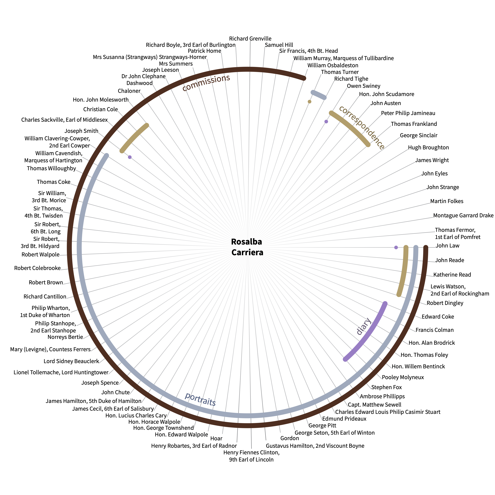
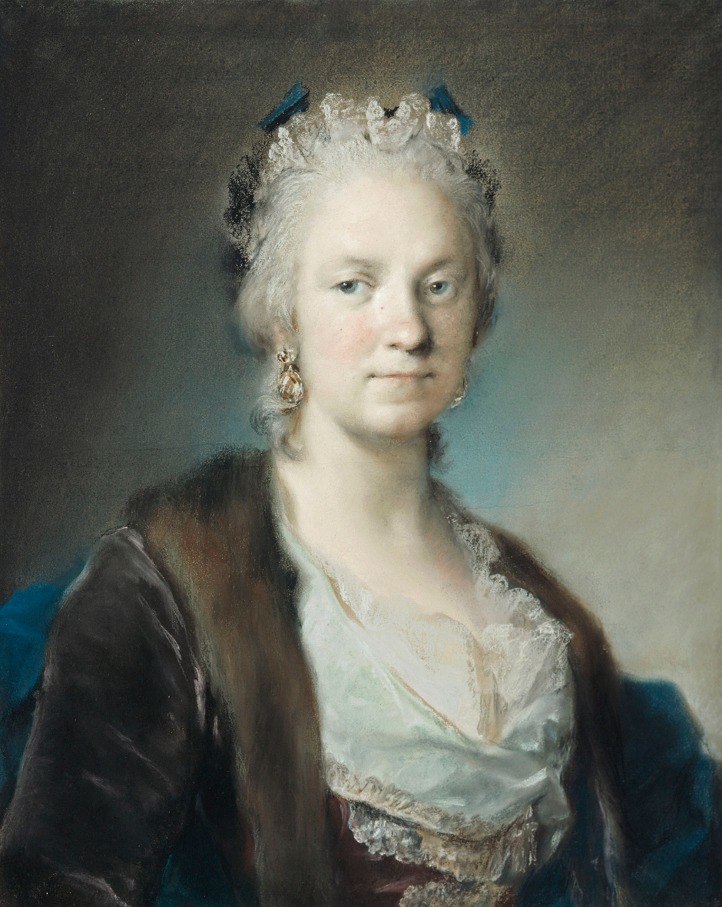
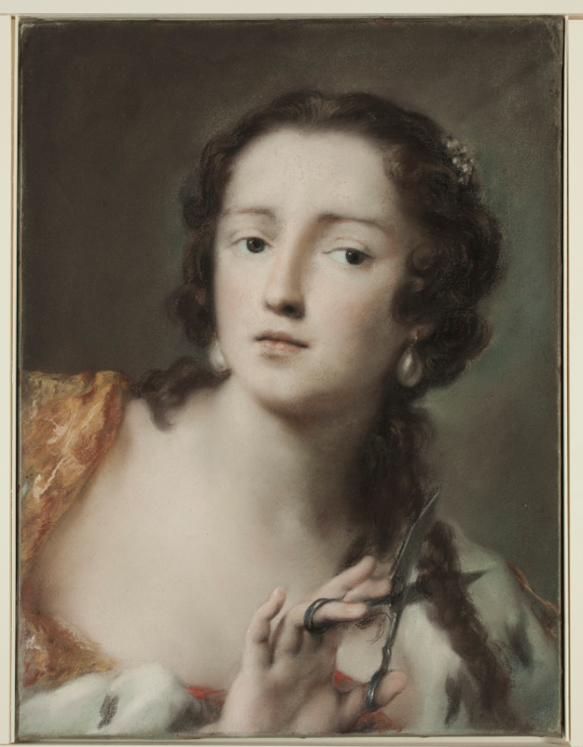
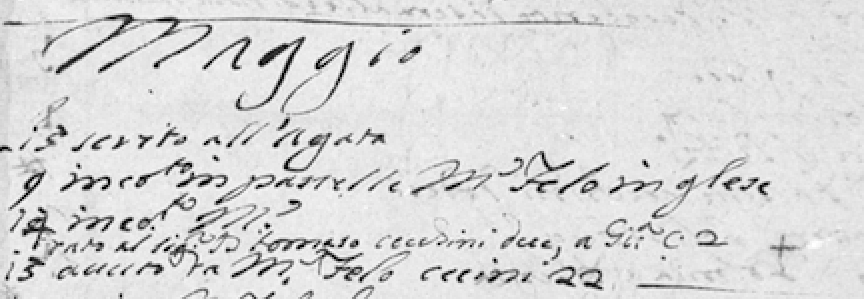
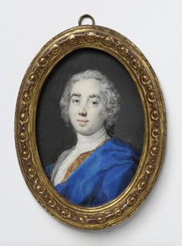
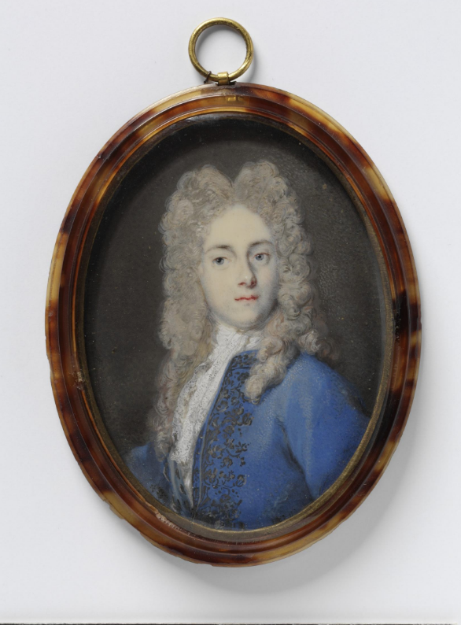
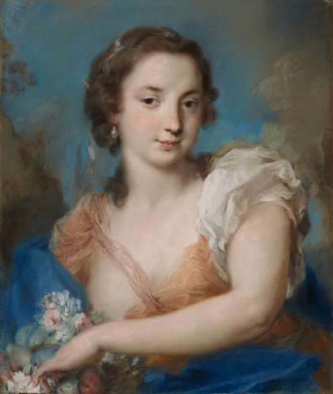
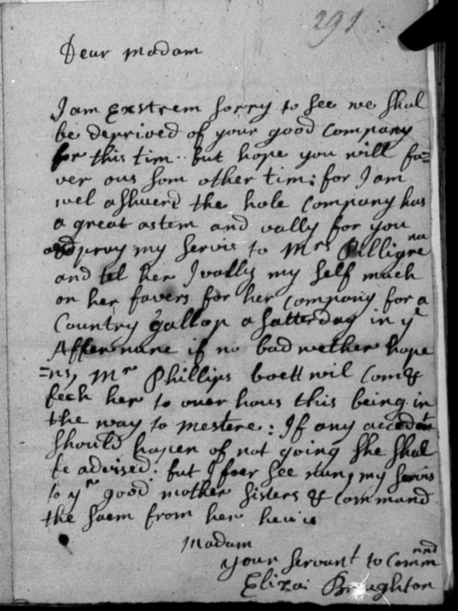
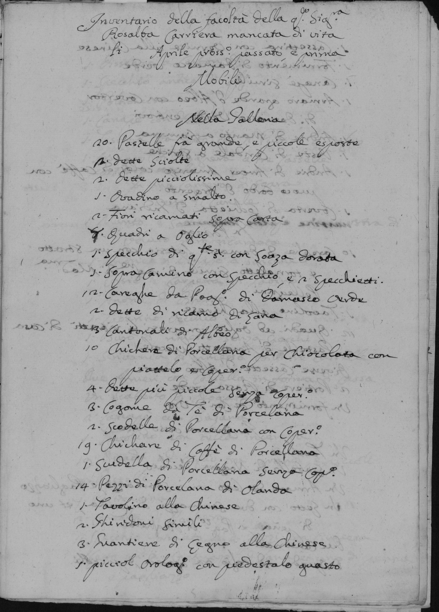

<figure>

<a name="figure-1">  </a>

<figcaption id="samaCap1">

<b>Fig. 1:</b>

</figcaption>

</figure>

The Venetian Rosalba Carriera (1673-1757) was one of the most important female artists in Europe during the first half of the eighteenth century ([Figure 1](#figure-1)). Her patrons included foreign collectors, artists, and members of the clergy, as well as fellow Venetians and other Italians. Royals across Europe sought her work: Frederick IV, King of Denmark; Johann Wilhelm von der Platz, Elector Palatine; and Frederick Augustus II, Prince-Elector of Saxony (also known as Augustus III, King of Poland), who amassed over one hundred pastels by Carriera for a gallery he dedicated to her in Dresden. Carriera's studio, which she maintained in her home on the Grand Canal, was an important stop on the Grand Tour. Her clients sought portraits of themselves, depictions of various types of allegories, or portraits of Venetian women famous for their beauty or musical talent.[^1]

[^1]: For essential works on Carriera, see Bernardina Sani's edited volumes of the artist's correspondence and diary as well as her catalogs of Carriera's works: *Rosalba Carriera. Lettere, diari, frammenti* (Firenze: Olschki, 1985); *Rosalba Carriera (1673-1757). Maestra del pastello nell'Europa ancien régime*. Catalogo delle opere. (Torino: Umberto Allemandi, 2007). [First edition: 1988]. See also Giuseppe Pavanello's edited volumes *Rosalba Carriera "prima pittrice de l'Europa"* (Venezia: Marsilio, 2007); and Rosalba Carriera (1673-1757). *Atti del Convegno Internazionale di Studi*, 26-28 aprile 2007 (Venezia: Scripta, 2009). For the most up to date and complete catalog of Carriera's pastel works, see Jeffares, *Dictionary of pastellists before 1800*, London, 2006; online edition [<http://www.pastellists.com/articles/Carriera.pdf>], accessed/update 07-04-2019.

<figure>

<a name="figure-2">  </a>

<figcaption id="samaCap2">

<b>Fig. 2:</b> Self portrait <a href="https://www.rct.uk/collection/452375" target="_blank">(Royal Collection Trust)</a>. Credit: Royal Collection Trust / © Her Majesty Queen Elizabeth II 2019

</figcaption>

</figure>

British travelers were among her most numerous and devoted clients. One of Carriera's most ardent supporters was [Christian Cole](http://grand-tour-explorer-2017.herokuapp.com/#/entries/1035){:target="\_blank"} (fl. 1697-1735, travel years 1701-1705, 1707-1714, 1715), secretary to the [English Ambassador to Venice](https://grand-tour-explorer-2017.herokuapp.com/#/entries/3158){:target="\_blank"}. In a letter to the artist alerting her to the imminent arrival of [Sir Thomas Frankland](https://grand-tour-explorer-2017.herokuapp.com/#/entries/1833){:target="\_blank"} (c. 1683-1747, travel years 1704-1705), Cole noted that his compatriot, "would not like to pass through Venice without seeing the Signora Rosalba [who is] justly esteemed an ornament of Italy, and [the] premier painter of Europe."[^2] When traveling through Venice British travelers also acted as couriers for the artist, ferrying letters, books, pastel chalks and works of art between Carriera and other friends and acquaintances; among these individuals who populate the *Explorer*, we can count Cole, Frankland, and [Thomas Turner](https://grand-tour-explorer-2017.herokuapp.com/#/entries/4868){:target="\_blank"} (travel years 1704-1705). Still others---[Peter Philip Jamineau](https://grand-tour-explorer-2017.herokuapp.com/#/entries/2658){:target="\_blank"} (travel years -1735-1745) and [Owen Swiney](https://grand-tour-explorer-2017.herokuapp.com/#/entries/4657){:target="\_blank"} (1676-1754, travel years 1715-1732)---acted as agents for Carriera, negotiating commissions and arranging for payment and deliveries. In short, Carriera's career was tightly bound to the transactional world of the Grand Tour, and British travelers collectively played a vital and multifaceted role in the artist's work life.[^3]

[^2]: My translation. In the original Italian: "...non vorrebbe passar à Venetia senza veder La signora Rosalba giustamente stimata un ornamento d'Italia, e prima pittrice de l'Europa" The letter is published in Sani, ed., *Rosalba Carriera. Lettere, Diari, Frammenti*, 89. Christopher Johns includes parts of this and other letters from Cole(to Carriera in his essay on Cole's influence on the artist's early career: "'An Ornament of Italy and the Premier Female Painter of Europe': Rosalba Carriera and the Roman Academy" in Melissa Hyde and Jennifer Milam, eds., *Women, Art and the Politics of Identity in Eighteenth-Century Europe* (Hants, England: Ashgate, 2003), 20-45.

[^3]: On Carriera's connections to the British, see especially Catherine Whistler, "Rosalba Carriera e il mondo britannico," in G. Pavanello, ed., *Rosalba Carriera 1673-1757 Atti del convegno*, 181-206 and Bruce Redford, *Venice and the Grand Tour* (New Haven: Yale University Press, 1996).

I came to the *Grand Tour Explorer* as a scholar of Rosalba Carriera, whose correspondence I am currently co-translating and editing.[^4] With few exceptions (including [Cole](http://grand-tour-explorer-2017.herokuapp.com/#/entries/1035){:target="\_blank"}), British clients and acquaintances are mostly absent from this correspondence. I wondered what further information the *Explorer* could offer about the artist and her interactions with these individuals, beyond the connections already widely established by art historians. This seemed a particularly intriguing question because, as an Italian artist, Rosalba Carriera does not have an entry in the richly detailed *A Dictionary of British and Irish Travellers in Italy*, compiled from the Brinsley Ford Archive by John Ingamells (1997). Consequently, information about Carriera cannot be found in one easily identifiable place; instead, references to her appear scattered throughout the entries of the *Dictionary*. The search power of the *Explorer* made it easy to gather these references: one inquiry using the 'Free Search' tool with the terms 'Rosalba' or 'Carriera' elicited 81 entries---a promising start to a more detailed investigation. I decided to explore the database in tandem with Carriera's correspondence, her work diary, and other primary sources to confirm or clarify details about her British clients and to see if I could discover new information. Pairing primary sources with the database's digital search capability was powerful: in some cases it allowed me to trace connections between Carriera and British clients even when neither Carriera nor Venice were mentioned in the *Explorer*'s entries. In others, unexpected aggregations of travelers in the search results produced new questions and ideas.

[^4]: The co-translator for this volume is Julia Kisacky of Baylor University. The volume was commissioned for publication in The Other Voice in Early Modern Europe book series edited by Margaret King and Albert Rabil [<http://www.othervoiceineme.com/othervoice-toronto.html>].

<figure>

<a name="figure-3">  </a>

<figcaption id="samaCap3">

<b>Fig. 3:</b> Rosalba Giovanna Carriera, Caterina Sagredo Barbarigo as "Berenice", ca.1741, Pastel on gray-blue laid paper, mounted onto thin canvas. <a href="https://www.dia.org/art/collection/object/caterina-sagredo-barbarigo-berenice-36302" target="_blank">Detroit Institute of Arts</a>, Gift of Mrs. William D. Vogel in memory of her mother Mrs. Ralph Harman Booth, 56.264.

</figcaption>

</figure>

Searches of the database using specific dates and places also help identify individuals whose names are illegible in manuscript sources. For example, on 9 May 1724 Carriera recorded in her work diary the visit to her studio of a 'M.r Felo inglese' ([Figure 3](#figure-3)). A quick search of the *Explorer* using 'Venice' and this specific date reveals that the British traveler [Coulson Fellowes](http://grand-tour-explorer-2017.herokuapp.com/#/entries/1683){:target="\_blank"} (1696-1769, travel year 1724), was in and around Venice at this time. Even though Carriera is not mentioned in Fellowes' entry and despite the fact that his name is difficult to decipher in the primary source, we can confirm his identity. By perusing Ingamells' *Dictionary* in print form, art historians have used this strategy to resolve questions about Fellowes and several other names in Carriera's work diary.[^5] Anyone seeking to clarify such uncertainties can now do so much more easily using the database.

[^5]: Footnote missing.

<figure>

<a name="figure-4">  </a>

<figcaption id="samaCap4">

<b>Fig. 4:</b>

</figcaption>

</figure>

In this essay I share my experience using the *Explorer* in order to investigate two specific aspects of Carriera's life and work: first, her connections with other women, and second, her studio as a physical and social space. In so doing, I also aim to provide a vademecum of sorts for anyone wishing to navigate the expansive territories of the *Explorer*, particularly for those whose research focuses on the Italians or other Europeans with whom the British travelers interacted.

**Rosalba Carriera**

Little is known about Carriera's early life and artistic training.[^6] Most women who became successful artists had fathers, brothers or husbands who were also artists. This was not the case for Carriera: her father worked as a government office clerk, she had no brothers, and she never married. She maintained her own studio where her sisters Giovanna and Angela (until the latter's marriage) worked as assistants and collaborators. After their father's death, Rosalba---aged 46---became the head of the family household, continuing to live with and support her mother and younger sister Giovanna for the rest of their lives.

[^6]: On Carriera's training, see Sani, "Precisazioni su Rosalba Carriera, i suoi maestri e la sua scuola. Un percorso europeo tra Rococò e Illuminismo," in Pavanello, ed., *Atti del Convegno Internazionale*, 97-113; and Sergio Marinelli, "Antonio Balestra e Rosalba Carriera", Ibid., 115-128.

By her late twenties, the Venetian artist began to make a name for herself throughout Europe. She received invitations to courts across Europe and left the lagoon city for three extended trips. The most important of these was an invitation to Paris, where she lived for a year (1720-21) with her mother and sisters in the home of the financier and collector, Pierre Crozat. Much admired by fellow artists as well as royalty, she counted among her numerous clients Antoine Watteau and the young Louis XV. Back in Italy, two years later, in 1723, she was invited to the court of the Duchy of Modena and Reggio, where she lived for about five months while she created portraits of the princesses of the Este family. In 1730, she travelled with her sister, Giovanna, to the court in Vienna where she worked for about three months, creating portraits of various members of the court, including the Dowager Empress Wilhelmina Amalia.

Carriera's talent was rewarded by special admission to academies of art in Italy and France, despite their regulations barring female members. In 1705, she was admitted to the Academy of St. Luke in Rome as a meritorious member---rather than as a mere 'honorary' member, as was typical for most women admitted to art academies.[^7] In 1720 she became a member of two other academies: the Clementine Academy in Bologna and the prestigious Royal Academy of Painting and Sculpture in Paris.

[^7]: See Johns, "'An Ornament of Italy and Premier Female Painter of Europe'".

Throughout her life, Carriera worked assiduously. She was an astute businesswoman, earned a good living, and invested her savings; she was frequently able to lend money to family members and friends in need. She also dedicated time to female apprentices; one of them, Felicita Sartori (1715-1760), lived and worked in the Carriera home/studio for over 30 years and made a name for herself as a miniaturist, pastellist and engraver. Carriera worked into her early seventies---undergoing surgeries for cataracts, only partially successful, until blindness forced her to stop.[^8]

[^8]: On Carriera as a businesswoman, see Shearer West, "Gender and Internationalism: The Case of Rosalba Carriera," in Shearer West, ed., *Italian Culture in Northern Europe in the Eighteenth Century* (Cambridge: Cambridge University Press, 1999), 46-66. On Sartori, see Caterina Furlan, "Pittura al femminile a Dresden: Rosalba Carriera e Felicita Sartori Hoffmann," in *Arte per i re: Capolavori del settecento dalla Galleria Statale di Dresden*, ed. Harald Marx (Udine: Arti grafiche friulane, 2004), 104-114 and Bernardina Sani, ed., *Rosalba Carriera. Lettere, diari, frammenti* (Firenze: Olschki, 1985), 497; 818.

**Miniatures and Pastels**

Early in her career, Carriera was renowned for her delicate miniature portraits and allegories in tempera, watercolor, or gouache on an ivory ground. She helped raise the status of miniature painting to a fine art by removing it from the purely decorative realm of snuff boxes. She was one of the first artists in Europe to bring the feel and texture of large paintings to the miniature form, and her innovative techniques influenced the evolution of the art of miniature painting over the course of the eighteenth century.[^9] At first Carriera used the ivory bottoms or tops of snuff boxes (no longer attached or functioning as such) for her miniatures, but eventually she began to purchase small pieces of ivory and have them cut to size, usually in a vertical oval form. She covered her miniatures with glass and mounted them in metal or tortoiseshell cases before sending them to her clients, who could display them in cabinets, keep them in coat pockets, or hang them from ribbons around their necks. Among the clients present in the *Explorer* who commissioned miniatures from Carriera are [Richard Boyle Burlington](http://grand-tour-explorer-2017.herokuapp.com/#/entries/707){:target="\_blank"} (1694-1753, travel years 1714-1715), who bought twelve of them, [Lucius Charles Cary](http://grand-tour-explorer-2017.herokuapp.com/#/entries/834){:target="\_blank"} (1705-1785, travel years 1724-1725), [Christian Cole](http://grand-tour-explorer-2017.herokuapp.com/#/entries/1035){:target="\_blank"}, [William Osbaldeston](http://grand-tour-explorer-2017.herokuapp.com/#/entries/3682){:target="\_blank"} (1688-1766, travel years 1710-1711), [Mrs. Summers](http://grand-tour-explorer-2017.herokuapp.com/#/entries/4632){:target="\_blank"} (travel years c. 1700-1705), [William Murray, Marquess of Tullibardine](http://grand-tour-explorer-2017.herokuapp.com/#/entries/4860){:target="\_blank"} (1689-1746, travel year 1710, 1717) and [Robert Walpole](http://grand-tour-explorer-2017.herokuapp.com/#/entries/4977){:target="\_blank"} (c. 1701-1751, travel years 1722-1723).

[^9]: On Carriera's miniatures, see Bernardo Falconi, "Rosalba Carriera e la miniatura su avorio," in Pavanello, ed., *Atti del Convegno*, 215-236.

<figure>

<a name="figure-5">  </a>

<figcaption id="samaCap5">

<b>Fig. 5:</b> Robert Walpole

</figcaption>

</figure>

<figure>

<a name="figure-6">  </a>

<figcaption id="samaCap6">

<b>Fig. 6:</b> William Osbaldeston

</figcaption>

</figure>

Although she enjoyed great success with her miniatures, Carriera is even more famous for her contributions to the medium of pastel. Indeed, about three-quarters of the roughly 440 works attributed to her are pastels.[^10] The Venetian artist helped transform pastel chalks from something used mostly for preliminary sketches to a respected and popular medium for portraiture. French and Italian artists who admired and were influenced by Carriera include Charles-Antoine Coypel, Maurice Quentin de LaTour, Giovanna Fratellini, Jean-Baptiste Perroneau, Pietro Rotari, Nicolas Vleughels and Antoine Watteau. Among British artists who admired, owned or copied her works we may count [George Knapton](https://grand-tour-explorer-2017.herokuapp.com/#/entries/2797){:target="\_blank"} (1698-1778, travel years 1725-1733), [Arthur Pond](https://grand-tour-explorer-2017.herokuapp.com/#/entries/3921){:target="\_blank"} (1701-1758, travel years 1725-1727), [William Hoare](https://grand-tour-explorer-2017.herokuapp.com/#/entries/2446){:target="\_blank"} (1707-1792, travel years 1728-1737), Francis Cotes and [Katherine Read](https://grand-tour-explorer-2017.herokuapp.com/#/entries/4047){:target="\_blank"} (1723-1778, travel years 1751-1753).[^11] The artist's pastels were extremely popular among her clients, whether these were foreign royalty, Venetian patricians, or Grand Tourists. In fact, the majority of the individuals from the database who have some connection to Carriera sat for a pastel portrait or commissioned allegorical works in pastel. Some of the most well-known British Grand Tourists in the *Explorer* with pastel portraits by the Venetian artist are [Gustavus Hamilton, Second Viscount Boyne](https://grand-tour-explorer-2017.herokuapp.com/#/entries/543){:target="\_blank"} (1710-1746, travel years 1730-1731), [Henry Fiennes Clinton, Ninth Earl of Lincoln](https://grand-tour-explorer-2017.herokuapp.com/#/entries/2956){:target="\_blank"} (1720-1794, travel years 1739-1741), [Charles Lennox, Second Duke of Richmond](https://grand-tour-explorer-2017.herokuapp.com/#/entries/3185){:target="\_blank"} (1701-1750, travel year 1721), [Charles Sackville Middlesex, Second Duke of Dorset](https://grand-tour-explorer-2017.herokuapp.com/#/entries/3305){:target="\_blank"} (1711-1769, travel years 1731-1733) and [Joseph Spence](https://grand-tour-explorer-2017.herokuapp.com/#/entries/4469){:target="\_blank"} (1699-1768, travel years 1731-1733, 1739-1741), [Philip, First Duke of Wharton](https://grand-tour-explorer-2017.herokuapp.com/#/entries/5088){:target="\_blank"} (1698-1731, travel years 1719, 1726, 1728), and [Lewis Watson, Second Earl of Rockingham](https://grand-tour-explorer-2017.herokuapp.com/#/entries/4129){:target="\_blank"} (c. 1714-1745, travel years 1733-1734).

[^10]: See Jeffares, "Rosalba Carriera", *Dictionary of pastellists*; online edition.

[^11]: <figure>

<a name="figure-7"> </a>

<figcaption id="samaCap7">

<b>Fig. 7:</b> Gustavus Hamilton

</figcaption>

<figure>

<a name="figure-8"> </a>

<figcaption id="samaCap8">

<b>Fig. 8:</b> Philip, Duke of Wharton

</figcaption>

</figure>

Whether creating pastels or miniatures, Carriera heightened both the academic value and the popularity of her work by painting allegories or imbuing her portraits with allegorical elements. This strategy was highly successful with Grand Tourists who specifically requested pictures depicting mythological figures, allegorical figures or portraits of beautiful Venetian women as well as portraits of themselves. Her sets of the Four Seasons and the Four Elements were very popular, as were her renditions of Diana and Flora.[^12] [Robert Dingley](https://grand-tour-explorer-2017.herokuapp.com/#/entries/1405){:target="\_blank"} (1710-81, travel years 1733-34), collector and future director of the Bank of England, wrote to Carriera from London in 1735, requesting a picture of a "pretty young country girl" in the guise of Winter, specifically "like the one in the cabinet of [Mr. [Joseph] Smith](https://grand-tour-explorer-2017.herokuapp.com/#/entries/4417){:target="\_blank"}" (c. 1674-1770, travel years c. 1700-1770). It is likely that Dingley had noticed this picture during his Italian tour in the personal collection of Smith, who spent most of his life in Venice as a merchant banker and as the British Consul from 1744 to 1760. Dingley hastened to add that there was "no need to say anything to Mr. Smith about this."[^13] His letter reveals how Carriera at times needed to deftly and discreetly serve the ambitions of multiple, competitive British clients.

[^12]: Ibid.

[^13]: My translation. In the original Italian: "una bella giovinetta contadina...nel gusto del quadro dell'Inverno nella cabinetta del Sig. Smith....Non è necessario dire niente al Signor Smith." See Francis Haskell who describes this exchange in *Patrons and Painters. Art and Society in Baroque Italy* (New Haven: Yale, 1980), 303. The complete letter is published in Sani, ed., *Rosalba Carriera. Lettere, Diari, Frammenti*, 603.

<figure>

<a name="figure-9"> </a>

<figcaption id="samaCap9">

<b>Fig. 9:</b> Personification of Winter

</figcaption>

</figure>

Carriera's popularity with Grand Tourists may have been enhanced by the media and genres in which she worked. Her miniatures' tiny sizes (ranging from c. 7x5cm to 15x10cm) meant they were easy to wear, carry or send by post. Carriera's pastels did not need the extensive drying time of oil paintings, and their generally moderate size (ranging from 30x25 to 70x50 cm) made them relatively easy to ship or, ideally, have hand delivered through couriers and friends traveling to other cities.

**Exploring the Grand Tour Explorer**

Most of the travelers that emerge from searching for Carriera in the *Explorer* are already known to scholars of the British Grand Tour. But the search results produce new groupings among her British interlocutors---leveling famous with less well-known clients, acquaintances with friends, intermediaries with visitors to her studio. They therefore offer us a uniquely nuanced and textured view of Carriera's Grand Tour connections.

**Carriera's connections with other women**

One way I attempted to harness the powers of the Explorer was to tap it for information regarding Rosalba Carriera's connections with other women. By using the 'Free Search' term and filtering for gender with search terms such as woman, wife, widow, daughter, Mrs., etc. the database led me to two women: [Elizabeth Eaton Broughton](https://grand-tour-explorer-2017.herokuapp.com/#/entries/621.1){:target="\_blank"} (d. 1734, travel years 1691-1734) whom we hear about through the *Dictionary*'s entry on her husband, [Hugh Broughton](https://grand-tour-explorer-2017.herokuapp.com/#/entries/621){:target="\_blank"}, British Consul of Venice (d. 1716, travel years -1691-1716); and the pastellist, [Katherine Read](https://grand-tour-explorer-2017.herokuapp.com/#/entries/4047){:target="\_blank"}, sometimes referred to by contemporaries as "the present English Rosalba"[^14] and one of the few women with her own entry in the original *Dictionary*. I was already familiar with Broughton and Read because of their (spare) presence in the Carriera correspondence. However, because the *Explorer* search aggregated them into a single result, I noticed that they both highlighted difficulties Carriera experienced in working with the impresario [Owen Swiney](https://grand-tour-explorer-2017.herokuapp.com/#/entries/4657){:target="\_blank"}, who acted as agent and intermediary between the artist and her British clients, handling commissions, deliveries and payments.[^15] I was therefore able to look at these women in a new way, appreciating their role as sources of information on Carriera as a businesswoman, and considering further the artist's place in a network of supportive women.[^16]

[^14]: On [Read](https://grand-tour-explorer-2017.herokuapp.com/#/entries/4047){:target="\_blank"}, see Jeffares, "Katherine Read", *Dictionary of pastellists*; online edition [<http://www.pastellists.com/articles/Read.pdf>], accessed/update 14-04-2019.

[^15]: On [Owen Swiney](https://grand-tour-explorer-2017.herokuapp.com/#/entries/4657){:target="\_blank"} in Italy, see Elizabeth Gibson, *The Royal Academy of Music 1719-1728: The Institution and Its Directors* (New York: Garland, 1989), 348-342.

[^16]: For my previous work on Carriera and networking with other women, see Sama, "Luisa Bergalli e le sorelle Carriera: un rapporto d'amicizia e di collaborazione professionale" in Adriana Chemello, ed., *Luisa Bergalli, poetessa drammaturga traduttrice critica letteraria* (Mirano-Venice: Eidos, 2008), 59-75 and Sama, "'On Canvas and On the Page': Women Shaping Culture in 18th-Century Venice," in Paula Findlen, Wendy Roworth and Catherine Sama, eds., *Gender and Culture in the Age of the Grand Tour* (Stanford: Stanford University Press, 2009), 125-150.

Unlike many of the travelers in the *Explorer* database, [Elizabeth Eaton Broughton](https://grand-tour-explorer-2017.herokuapp.com/#/entries/621.1){:target="\_blank"} was a long-term resident in Venice. From 1690 to 1716 she lived there in her role as wife of the [British Consul](https://grand-tour-explorer-2017.herokuapp.com/#/entries/621){:target="\_blank"}. After her husband's passing, she remained in the lagoon city (or at least sojourned there) until her own death nearly twenty years later in 1734.[^17] The two extant letters Broughton wrote to Carriera indicate that she was a close friend of the artist and her family, and that she interacted with them in both English and Italian. One of the letters reflects a quotidian familiarity between the two women; in it, Broughton extends an invitation to Carriera's sister Angela for a "country gallop a satterday in y.e afternoon" in Mestre, should weather permit such an outing ([Figure 10](#figure-10)).[^18]

[^17]: [Elizabeth Broughton](https://grand-tour-explorer-2017.herokuapp.com/#/entries/621.1){:target="\_blank"} is buried in Venice in a Protestant cemetery on the Lido. See *Miscellania Genealogica et Heraldica*, Vol.1, Joseph Jackson Howard, ed., (London: Mitchel and Hughes, 1886), 348.

[^18]: The letter is undated. In Sani, ed., *Lettere, Diari, Frammenti*, 750.

<figure>

<a name="figure-10">  </a>

<figcaption id="samaCap10">

<b>Fig. 10:</b>

</figcaption>

</figure>

[Broughton](https://grand-tour-explorer-2017.herokuapp.com/#/entries/621.1){:target="\_blank"} penned the other letter (in Italian) in 1721 soon after Carriera returned to Venice following the artist's year away in Paris. Perhaps in part because Carriera was still re-inserting herself into life and work in Venice, Broughton wrote in order to relay confidential information about current gossip regarding payments for Carriera's paintings: "My dear friend, since [Mr. Sueniy](https://grand-tour-explorer-2017.herokuapp.com/#/entries/4657){:target="\_blank"} has let all our compatriots know that he isn't giving more than 15 sequins for the Portrait you made of Milord, I thought it a good idea to warn you, so that you can act accordingly and make sure you are well paid for the one of Mr. Ratley, and have no other regard than your own interest." After penning the closing salutation, Broughton made sure to add, "I send this for your information and all of it must remain between us."[^19] Although Carriera's work diary---the principal source we have of payments received---is silent at the time Broughton penned this letter, we know that between 1723 and 1728, the artist charged roughly 22 sequins for a large pastel portrait. We also know that her prices generally remained consistent throughout her career. Furthermore, Broughton---a well-informed and well-connected member of British grand tourist circles---clearly indicates that she thought Swiney was promoting insufficient remuneration of the artist.[^20]

[^19]: The letter is dated 5 July 1721. My translation. In the original Italian: “Signora Rosalba, mia Cara Amica, Come il Signor Sueniy si a datto da intender alli nostri partrioti che a Lej non dà più di quindecj cechini per il Ritratto che gli [h]a fatto di Milord, mj è parso bene dargli questo aviso, aciò Lej si possj regolar e farsi ben pagar per quello de Signor Ratley e di non haver altro risguardo che il suo proprio intheresse…. Mando questo per vostro governo et che resti fra di noi il tutto.” In Sani, ed., *Rosalba Carriera. Lettere, diari, frammenti*, 396-397.

[^20]: On prices for Carriera’s works see Pietro Del Negro, “Le relazioni di Rosalba Carriera e della sua famiglia con il patriziato veneziano,” in *Atti del convegno*, 75-80; Sani, ed., *Rosalba Carriera. Lettere, Diari, Frammenti*, 31; and Thomas McGeary, “British Grand Tourists visit Rosalba Carriera, 1732-1741. New Documents,” *The British Art Journal* 15.1 (2014), 117-119.

Thirty-odd years later in 1753, [Katherine Read](https://grand-tour-explorer-2017.herokuapp.com/#/entries/4047){:target="\_blank"} wrote to Carriera from Paris, after having recently visited the 80-year old Venetian artist in her studio and made her portrait. She noted that she was taking great pleasure in viewing works by Carriera at the Académy Royale de Peinture and in private collections. Since she was about to return to London, she asked if she might be of service regarding some (unidentified) business with [Swiney](https://grand-tour-explorer-2017.herokuapp.com/#/entries/4657){:target="\_blank"}. The impresario-agent appears at the center of the next extant letter from Read, which she wrote after hearing from Carriera for the first time in a year. The lack of communication, and a rumor of the artist's death, had previously led Read to mourn Carriera as "a friend and an artist without equal who had brought greater honor to her sex than had ever been done before."[^21] This letter reveals that Read has been trying for nearly two years to help Carriera and Consul [Joseph Smith](https://grand-tour-explorer-2017.herokuapp.com/#/entries/4417){:target="\_blank"} (in whose care Read had previously sent letters to Carriera) receive money owed to them by the recently deceased Swiney. She had even consulted a friend who had transcribed a copy of Swiney's last wishes and she was told that the impresario had left everything to 'Mademoiselle Woffington'[^22] who, in turn, told Read that just before his death, Swiney claimed he owed the Venetian artist nothing. Read explains all of this to Carriera in her letter, saying that she hopes "with all my heart that you can recover your money," but she is not optimistic.[^23]

[^21]: The letter is dated 31 May, 1756. My translation. In the original French: “Je vous regrettez comme un Ami et comme une artiste sans égale, qui avoit fait plus d’honneur à son sexe, qu’il n’en eut jamais été…” In Sani, *Rosalba Carriera. Lettere, Diari, Frammenti*, 732.

[^22]: [Read](https://grand-tour-explorer-2017.herokuapp.com/#/entries/4047){:target="\_blank"} is referring to the Irish actress Margaret “Peg” Woffington (1720-60).

[^23]: My translation. In the original French: “Je luy [Mlle. Woffington] ai parlé de cette affaire, elle m’a dit qu’elle avoit entendu dire à Swinne [sic], un peu avant sa mort, qu’il ne vous devoit rien….Je souhait de tout mon coeur que vous puissiez recouvrir votre argent.” In Sani, *Rosalba Carriera. Lettere, Diari, Frammenti*, 732-733.

The younger artist concludes her letter expressing her desire to purchase one of Carriera's works: a Madonna "which I think I heard was your last work" or a Cleopatra, "or another of your finest ideal heads," whichever the artist would prefer to part with. She tells Carriera that she will pay whatever the artist wishes, and with her closing line she promises that she "will be more punctual than [Swinnie](https://grand-tour-explorer-2017.herokuapp.com/#/entries/4657){:target="\_blank"}."[^24] Clearly, Carriera was still conducting business despite her blindness and advanced age, and British travelers were still active participants in her professional life.

[^24]: Ibid, 733. My translation. In the original French: “Mandez moi aussi si vous préférez di partager avec la Madona [sic], qui me semble m’a dit être votre dernier ouvrage...la Cleopatre [sic] ou une autre de vos meilleures têtes idéals...Je vous payeray [sic] pour cela ce qu’il vous plaira...Je serais plus exacte que Swinnie.”

The letters of [Broughton](https://grand-tour-explorer-2017.herokuapp.com/#/entries/621.1){:target="\_blank"} and [Read](https://grand-tour-explorer-2017.herokuapp.com/#/entries/4047){:target="\_blank"} give us a brief behind-the-scenes look into the ways friends, artists, patrons and agents navigated the waters of producing and selling art. Like the letter mentioned above from [Robert Dingley](https://grand-tour-explorer-2017.herokuapp.com/#/entries/1405){:target="\_blank"} to Carriera, these missives also reflect the highly interconnected and at times secretive social networking among British travelers to Italy. When considered together, the three letters allow us to consider how Carriera interacted with that network as a businesswoman. Were Broughton and Read writing to her simply as supportive friends? Or were they also writing as women seeking to protect another woman (artist) from being exploited by a man like [Swiney](https://grand-tour-explorer-2017.herokuapp.com/#/entries/4657){:target="\_blank"}, who could manipulate the art market in British circles? Regretfully, if Carriera penned responses to these letters, they are lost to us, so we can only speculate about what her thoughts might have been. Nevertheless, it is clear that the artist gained important information from women such as Broughton and Read. Ultimately, as Carriera's correspondence reveals, her business could both benefit and suffer from the close connections and maneuverings in the circles of British travelers to Italy.

**Into the studio**

What might the *Explorer* be able to tell us about Carriera's studio? The richest source of information on the physical layout and contents of the studio is the inventory of Carriera's belongings after her death.[^25]  We thus know that when visitors entered the gallery area of the artist's studio, they would have stepped into a large, comfortable, vibrant space decorated with green wallpaper and gilt-framed mirrors. The room was populated by numerous chairs upholstered in green damask, small Chinoiserie tables and a small clock set on a pedestal. At the ready were sets of porcelain cups and saucers for hot chocolate and coffee. In winter, visitors could warm themselves by the fireplace as they studied the paintings on display: the inventory notes twenty pastels and seven oil paintings in the gallery in addition to numerous other works of art in the central corridor ([Figure 11](#figure-11)).

[^25]: Lino Moretti, “Rosalba Carriera: l’inventario dei suoi beni e alcune minuzie marginali,” in *Arte veneta* 68 (2011): 308-319.

<figure>

<a name="figure-11">  </a>

<figcaption id="samaCap11">

<b>Fig. 11:</b>

</figcaption>

</figure>

I hoped the *Explorer* could help me learn more about the process of sitting for a portrait in Carriera's studio as well as the studio's role as a social space. I was, therefore, looking for first-hand descriptions by Grand Tourists of their visits to the studio, something I could do efficiently because the database includes excerpts from travelers' letters and journals. I created search term combinations such as 'Carriera'/'Rosalba' combined with words and phrases such as: 'studio,' 'sat to,' 'sitting,' 'miniature,' 'pastel,' 'portrait,' 'likeness,' 'draw,' 'paint,' 'chalk,' 'studio,' 'mask,' etc. These searches resulted in, among others, three entries for [George Sinclair](https://grand-tour-explorer-2017.herokuapp.com/#/entries/4366){:target="\_blank"} (after 1714-1776, travel years 1737-1738), [Martin Folkes](https://grand-tour-explorer-2017.herokuapp.com/#/entries/1760){:target="\_blank"} (1690-1754, travel years 1733-1735) and [Willem (or William) Bentinck](https://grand-tour-explorer-2017.herokuapp.com/#/entries/368){:target="\_blank"} (1704-1774, travel years 1727-1728). The information in each individual entry has been noted in the past by scholars, but the *Explorer* search results pushed me to consider the three entries together as a group. The result is that we are granted a more vibrant and nuanced picture of life inside Carriera's studio from the traveler's vantage point.

Visitors frequently remarked that Carriera had portraits of their compatriots on display in her studio. When [George Sinclair](https://grand-tour-explorer-2017.herokuapp.com/#/entries/4366){:target="\_blank"} visited the artist in the spring of 1738, he noted in his travel journal that he "saw many of her Portraits, both men and women, several english [sic] among them." Keeping these likenesses about the studio was surely Carriera's strategy not only to exhibit her talent but also to induce visitors to have their own portraits made by the famous artist's hand. In this way, she promoted the notion that possession of her artworks was a benchmark of social success.

The display of such portraits also served a social function in the life of the studio. [Martin Folkes](https://grand-tour-explorer-2017.herokuapp.com/#/entries/1760){:target="\_blank"}---scientist, antiquary and protégé of Isaac Newton---visited Carriera in the summer of 1733 as part of his travels in Italy. In his journal on 14 July, he noted that the artist's "pictures in crayon have been with Justice esteem[e]d the most excellent pieces of art of that sort."[^26] He described the artist as "now better than 50" (she was 60 years old) and declared that during his visit to the studio he was "extremely well entertained with a great number of fine portraits some of my acquaintance very like." Folkes also mentioned seeing an Allegory of Music in the studio, which he declared to be "as fine and well disposed as almost anyth[ing] I have seen." He believes the model for the painting was the lover of an Englishman.[^27]

[^26]: Thomas McGreary published the entire passage regarding [Folkes](https://grand-tour-explorer-2017.herokuapp.com/#/entries/1760){:target="\_blank"}’ visit to the studio in “British Grand Tourists visit Rosalba Carriera,” 118. See also Bruce Redford in Venice and the Grand Tour (New Haven: Yale University Press, 1994), 93.

[^27]: McGreary speculates that this is a reference to singer Lucia Panichi (known as “La Muscovita”) who accompanied British traveler [Charles Sackville Middlesex](https://grand-tour-explorer-2017.herokuapp.com/#/entries/3305){:target="\_blank"} back to England in order to sing in his London opera company. See “British Grand Tourists visit Rosalba Carriera,” 119.

Whether or not visitors commissioned a work by Carriera, then, it could please and amuse them to find their acquaintances visually present in the studio along with them. By functioning as 'virtual' companions and as conversation pieces, the portraits enhanced the level of sociability in Carriera's studio by encouraging sitters and guests to feel at ease and engaged. Although the excerpt is not included in the *Explorer* entry, [Folkes](https://grand-tour-explorer-2017.herokuapp.com/#/entries/1760){:target="\_blank"}' journal supplies us with further information about social life in the studio. Folkes noted that all three Carriera sisters were present during his visit---Rosalba, Giovanna and Angela---and he remarked that the latter expressed 'a great regard' for England, since she had sojourned there with her husband, the artist Antonio Pellegrini.[^28] Not only did Angela and especially Giovanna work in the studio; they also engaged in professional networking by participating in social gatherings with visitors and potential clients.

[^28]: Ibid.

The *Explorer* entry on Anglo-Dutch traveler and statesman [Willem (or William) Bentinck (van Rhoon)](https://grand-tour-explorer-2017.herokuapp.com/#/entries/368){:target="\_blank"} is especially rich regarding Carriera's studio.[^29] Excerpts from Bentinck's and from his tutor's letters to family in England offer what may be the most detailed account that we have of a client sitting to Carriera. In 1727, as part of a two-year tour of Europe, the grand tourist and his tutor [Moses Bernège](https://grand-tour-explorer-2017.herokuapp.com/#/entries/389){:target="\_blank"} (travel years 1717-1728, 1730-1731) spent three weeks in Venice. Just prior to their arrival in Venice, they had seen and admired Carriera's portraits of King Augustus in Dresden. Bentinck sat to Carriera, intending the portrait to be a gift for his mother, the Dowager Countess of Portland. Bernège's letter to the Countess discloses that when Bentinck arrived for the fifth and final sitting, "Rosalba chastised him roundly" for having cut his hair.[^30] In Bernège's account the artist was so frustrated at the change in her client's appearance from his previous sittings that she demanded that he complete the portrait himself by drawing in his hair the way it was before he had cut it. This image of an impatient Carriera is echoed in her correspondence where she occasionally bemoans the fact that she must spend time making portraits of so many *inglesi* that she cannot get to her other commissions, even for important, royal patrons.

[^29]: On the Anglo-Dutch Bentinck van Rhoon family, see P.E. Schazmann, *The Bentincks.The History of a European Family* (London: Weidenfeld and Nicolson, 1976), where the visit to Carriera’s studio is noted (p.137).

[^30]: My translation.  In the original French:  “la Rosalba le querella fort de les avoir coupez”. 

The *Explorer* search results prompted me to take a closer look at the [Bernège](https://grand-tour-explorer-2017.herokuapp.com/#/entries/389){:target="\_blank"}/[Bentinck](https://grand-tour-explorer-2017.herokuapp.com/#/entries/368){:target="\_blank"} papers directly.[^31] Many of Carriera's European contacts and clients populate these letters: from couriers and middlemen to clergy, royalty and artists. Details in the manuscripts that are not included in the database allowed me to add further dimension to our view into Carriera's studio. In contrast to his tutor's version of events, Bentinck's is far more peaceable, implying that it had been a collaborative and even thoughtful idea for him to draw in his own hair, specifically in order to ensure that his mother not be startled by any change in his appearance. As he relates the experience: "But as you remember me with my hair, which was cut off before the Picture was made, that must have made some alteration in the Physio[g]nomy. Yet to prevent that as much as possible and to hide the cutting of my hair, which I did not think you knew, Rosalba gave me her colours, and all the hair upon the forehead, and close to the face are of my own painting, as much as I could remember my hair had been."[^32] Frequently eager to please and assuage his mother in his letters, Bentinck is keen to assure her that the portrait was indeed a good likeness, as "it was thought like by those that saw it at Venice, before I sent it."[^33] In fact, son and tutor consistently offer conflicting views of the visit. While Bentinck assures his mother that his portrait "will always be worth something," his tutor notes that there were portraits hanging in Carriera's studio that were 'strong likenesses,' and that Bentinck's, while good, would have been better had he not cut his hair. Bernège also implies that his ward may have squandered his opportunity for acquiring a fine portrait by Carriera, commenting tersely that "she will stop working very soon as she is starting to become quite aged."[^34] Carriera would go on to work for over two more decades.

[^31]: Letters to the Countess Dowager of Portland from her sons, William and Charles [Bentinck](https://grand-tour-explorer-2017.herokuapp.com/#/entries/368){:target="\_blank"}, and their tutors; 1718-31. British Library, MS Egerton 1711.

[^32]: British Library, MS Egerton 1711, ff.531-532v. [Bentinck](https://grand-tour-explorer-2017.herokuapp.com/#/entries/368){:target="\_blank"} penned the letter in Rome on 13 September 1727.

[^33]: Ibid.

[^34]: My translation. In the original French: “Nous avons vu chez elle des portraits de sa façon qui sont fort ressemblant, quoyque celui de M.r Bentinck soit bon, il auroit encore eté mieux s’il avoit eu ses cheveux, la Rosalba le querella fort de les avoir coupez, et elle cessera bien tot di travailler car elle commence d’etre fort agée.“ From [Bernège](https://grand-tour-explorer-2017.herokuapp.com/#/entries/389){:target="\_blank"}’s letter of 30 August 1727 to the Dowager Countess. British Library, MS Egerton 1711, ff 527-528 v. 

The [Bentinck](https://grand-tour-explorer-2017.herokuapp.com/#/entries/368){:target="\_blank"}/[Bernège](https://grand-tour-explorer-2017.herokuapp.com/#/entries/389){:target="\_blank"} papers also highlight the dangers inherent in shipping works of art and other memorabilia acquired on the Grand Tour: namely, damage and theft. Bentinck's instructions to the Dowager Countess reflect the attention Carriera gave to protecting her works from damage in transit, a theme that appears frequently in her correspondence. He tells his mother that the portrait will arrive "in a little black frame with a glass over it and must be left so, she [Carriera] herself desired me that it might be left just as it is because taking it out might easily spoil the Picture, and nothing moist must come near it."[^35] In a subsequent letter, Bernège expresses relief in the knowledge that Carriera's portrait arrived safely in England "because there was reason to fear that the ship had been commandeered by pirates and taken to Spain. The loss of the portrait would have deeply saddened us."[^36]

[^35]: From [Bentinck](https://grand-tour-explorer-2017.herokuapp.com/#/entries/368){:target="\_blank"}’s letter on 28 April 1727 (Naples). British Library, MS Egerton 1711, ff. 463-464v. Whistler refers to this letter in “Rosalba Carriera e il mondo britannico, in Pavanello, ed., *Atti del convegno*, 197.

[^36]: My translation. In the original French: “J’ai eté fort aise que tout Vous soit parvenu heureusement car il y avoit a craindre que le vaisseau ne fut enlevé par les corsaires et emmené en Espagne, la perte du Portrait nous auroit chagrinez.” British Library, MS Egerton 1711, ff. 527-528 v. From [Bernège](https://grand-tour-explorer-2017.herokuapp.com/#/entries/389){:target="\_blank"}’s 30 August 1727 letter to the Dowager Countess. 

The [Bentinck](https://grand-tour-explorer-2017.herokuapp.com/#/entries/368){:target="\_blank"}/[Bernège](https://grand-tour-explorer-2017.herokuapp.com/#/entries/389){:target="\_blank"} correspondence is also of interest because it may challenge the oft-quoted notion that the creation of pastel portraits was a quick affair, especially when compared to portraits in oil, which required extensive time to dry. Bernège reported that "Madame Rosalba took great care to do it, and requested several visits of Monsieur Bentinck so she could be as successful as possible."[^37] Perhaps pastel portraits did take longer than is usually assumed if Carriera typically had her clients sit to her several times for one portrait.

[^37]: Ibid. My translation. In the original French: “la Donna Rosalba a pris de la peine a le faire, et demanda plusieurs visites de Mons. Bentinck pour y pouvoir mieux reussir.”

As we have seen in the case with Rosalba Carriera, navigating the *Explorer* in combination with primary sources is an effective and engaging way to build a more nuanced map of the connections between British Grand Tourists and their Italian contemporaries. In diverse ways, the *Explorer* exemplifies the best of digital humanities resources. Its accessibility online makes it a resource not only for scholars, but for any interested reader, regardless of one's knowledge about the world of the Grand Tour. Scholars interacting with the database can design and employ diverse combinations of searches and filters for efficient and precise targeting of information. Finally, one of the *Explorer*'s most important features is the way that its search power puts seemingly unrelated pieces of information (some familiar, some not) into dialogue with one another, leading to new perspectives, questions and ideas.

Cite as Catherine M. Sama "Going Digital: Re-Searching Connections between Rosalba Carriera and British Grand Tourists." Scholars' Essays Digitizing the Grand Tour, edited by Giovanna Ceserani and Rachel Midura. G. Ceserani, A World Made by Travel: The Digital Grand Tour, section IV. CESTA Stanford 2020. <https://dx.doi.org/xxxx/xxx>

<h3>References</h3>

**Primary Sources**

Letters to the Countess Dowager of Portland from her sons, William and Charles Bentinck, and their tutors; 1718-31. British Library, MS Egerton 1711.

Manoscritti Originali, e Carteggio della celebre Pittrice Rosalba Carriera. Biblioteca Medicea Laurenziana, MS Ashburnham 1781.

**Secondary Sources**

Pietro Del Negro, "Le relazioni di Rosalba Carriera e della sua famiglia con il patriziato veneziano," in G. Pavanello, ed., Rosalba Carriera. *Atti del Convegno Internazionale di Studi*, 26-28 aprile 2007 (Venezia: Scripta, 2009), 45-96.

Falconi, Bernardo. "Rosalba Carriera e la miniatura su avorio," in G. Pavanello, ed., *Rosalba Carriera. Atti del Convegno Internazionale di Studi*, 26-28 aprile 2007 (Venezia: Scripta, 2009), 215-236.

Furlan, Caterina. "Pittura al femminile a Dresden: Rosalba Carriera e Felicita Sartori Hoffmann," in Harald Marx Arte, ed., *Arte per i re: Capolavori del settecento dalla Galleria Statale di Dresden* (Udine: Arti grafiche friulane, 2004), 104-114.

Jeffares, Neil. *Dictionary of pastellists before 1800*, London, 2006; online edition [<http://www.pastellists.com>].

Johns, Christopher. "'An Ornament of Italy and the Premier Female Painter of Europe': Rosalba Carriera and the Roman Academy" in Melissa Hyde and Jennifer Milam, eds., *Women, Art and the Politics of Identity in Eighteenth-Century Europe* (Hants, England: Ashgate, 2003), 20-45.

McGeary, Thomas. "British Grand Tourists visit Rosalba Carriera, 1732-1741. New Documents," *The British Art Journal* 15.1(2014) 117-119.

Moretti, Lino. "Rosalba Carriera: l'inventario dei suoi beni e alcune minuzie marginali," in *Arte veneta* 68 (2011): 308-319.

Pavanello, Giuseppe, Ed., *Rosalba Carriera "prima pittrice de l'Europa"*, Catalogo della mostra (Venezia: Marsilio, 2007).

--- Rosalba Carriera (1673-1757). *Atti del Convegno Internazionale di Studi*, 26-28 aprile 2007 (Venezia: Scripta, 2009).

Redford, Bruce. *Venice and the Grand Tour* (New Haven: Yale University Press, 1996).

Sama, Catherine. "Luisa Bergalli e le sorelle Carriera: un rapporto d'amicizia e di collaborazione professionale," in Adriana Chemello, ed., *Luisa Bergalli, poetessa drammaturga traduttrice critica letteraria* (Mirano-Venice: Eidos, 2008), 59-75.

--- "'On Canvas and On the Page': Women Shaping Culture in 18th-Century Venice," in Paula Findlen, Wendy Roworth and Catherine Sama, eds., *Gender and Culture in the Age of the Grand Tour* (Stanford: Stanford University Press, 2009), 125-150.

Sani, Bernardina. Ed., *Rosalba Carriera. Lettere, Diari, Frammenti* (Firenze: Olschki Editore, 1985).

--- Rosalba Carriera (1673-1757). *Maestra del pastello nell'Europa ancien régime. Catalogo delle opere.* (Torino: Umberto Allemandi, 2007). [First edition: 1988].

--- "Precisazioni su Rosalba Carriera, i suoi maestri e la sua scuola. Un percorso europeo tra Rococò e Illuminismo," in G. Pavanello, ed., *Atti del convegno*, 97-113.

West, Shearer. "Gender and Internationalism: The Case of Rosalba Carriera," in Shearer West, ed., *Italian Culture in Northern Europe in the Eighteenth Century* (Cambridge: Cambridge University Press, 1999), 46-66.

Whistler, Catherine. "Rosalba Carriera e il mondo britannico," in G. Pavenallo, ed., *Rosalba Carriera 1673-1757 Atti del convegno*, 181-206.

<h3>References</h3>

::: {#popup .overlay style="display:flex; flex-direction:column; flex-wrap: wrap; background: #f7f6f3"}
    <div id="imgs" style="height:80%">
        <div class="overlay-close">
            <a><i class="material-icons">close</i></a>
        </div>
        
        
    </div>
    <div id="capWrapper" style="height:20%">
        <p id="cap" style="float:left; max-width:80%; position:relative; left:120px; display:inline-block"></p>
        <div style="display:inline-block; float: right">
            <div style="display:flex; flex-direction:column; position:relative; right:100px">
                <i class="material-icons link-cite" aria-label="Cite this image" data-balloon-pos="left">format_quote</i>
                <i class="material-icons link-copy" aria-label="Copy link to this image" data-balloon-pos="left">link</i>
                <i class="material-icons" aria-label="Download" data-balloon-pos="left">arrow_downward</i>
            </div>
        </div>
    </div>
:::

```{=html}
<script>
function zoom(obj, obj2, caption) {
    var popup = document.getElementById("popup");
    popup.style.maxHeight = "80%";
    popup.style.height = "80%"
    var image = document.getElementById("img");
    var image2 = document.getElementById("img2");
        
    image.src = obj.src;
    image.style.display = "block";
    image.style.marginLeft = "auto";
    image.style.marginRight = "auto";
    image.style.left = "0";
    image.style.right = "0";
    image.style.width = "100%";
    image.style.height = "100%";

    image2.style.display = "none"; // hide in case Fig 1 or 2 were clicked
    document.getElementById("capWrapper").style.width = image.offsetWidth;

    if (obj2 != undefined && obj2 != null) { // Figure 1 & 2 are paired
        image.style.float = "left";
        image.style.width = "50%";

        image2.src = obj2.src;
        
        image2.style.display = "block";
        image2.style.marginLeft = "auto";
        image2.style.marginRight = "auto";
        image2.style.left = "0";
        image2.style.right = "0";
        image2.style.float = "left";
        image2.style.width = "50%";
        image2.style.height = "100%";

        document.getElementById("capWrapper").style.width = image.offsetWidth + image2.offsetWidth; 
    }
    var cap = document.getElementById("cap");
    if (caption != undefined && caption != null) {
        cap.innerHTML = caption.innerHTML;
        cap.style.display = "block";
    } else {
        cap.style.display = "none";
    }
    var overlays = document.getElementsByClassName("overlay");
      for (overlay of overlays) {
        overlay.classList.remove("visible");
      }
    popup.classList.add("visible"); 
}    
</script>
```