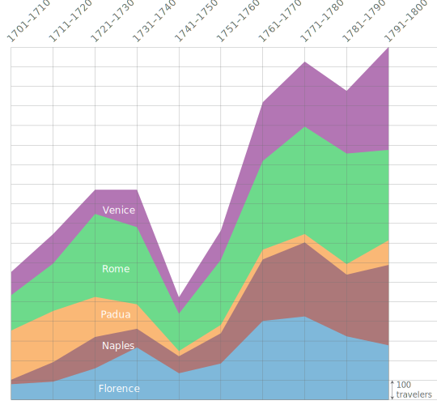
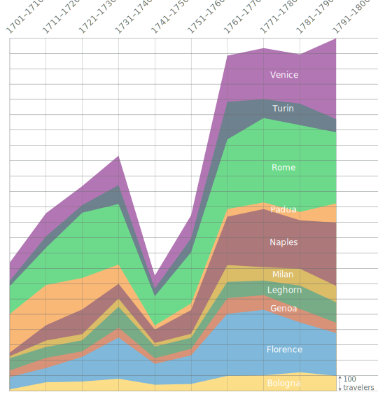
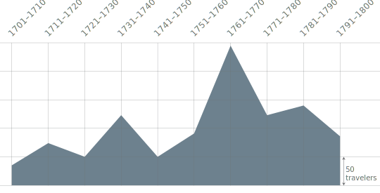
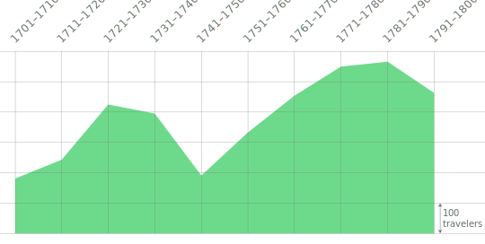
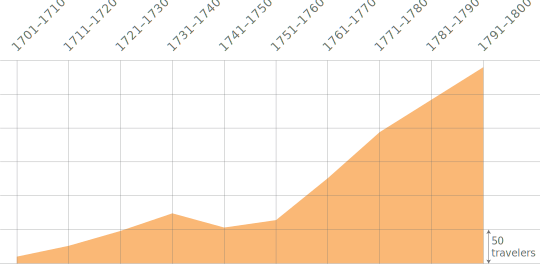
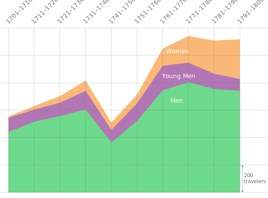

My interest in the Grand Tour explorer arises out of my own work on the engagement of British travelers with Italian cities during the long eighteenth century. Some years ago, I published a book that concentrated upon British experiences and representations of Italian cities during the long eighteenth century, *Cities and the Grand Tour: The British in Italy, c. 1690-1820*.[^1] As an urban historian, I was less concerned with what was collected or purchased by travelers, or with their social networks, than with exploring how images of major Italian cities were constructed and considering their influence in British culture. Given the opportunity to work with the *Grand Tour Explorer*, I wanted to use it to pursue several questions.

[^1]: Rosemary Sweet, *Cities and the Grand Tour: the British in Italy, c. 1690-1820* (Cambridge: Cambridge University Press, 2012).

Like many historians, years of immersion in the primary sources meant that I had an intuitive sense of evolving patterns of travel and the composition of the traveling body. However, I was unable to provide any rigorous quantifiable basis for my conclusions or generalizations. How far were my generalizations borne out by the evidence of the *Explorer*, while taking into account the complex nature of its data, which we know to be far from complete (see the [introduction](/gt-book/preface-and-acknowledgments){:target="\_blank"} of the book)? What new light could the *Explorer* cast on my own qualitative and more impressionistic research by providing more granular and accurate snapshots of topics such as itineraries, numbers of travelers, or duration of stay? What could the *Explorer* tell us about the changing social composition of tourists, shifts in the gender ratio, and patterns in the age cohort of the traveling body? The dominant paradigm of the Grand Tour is that of the aristocratic young man, sent to Italy to finish his education and to prepare him socially for a life of political and cultural leadership, whose taste, acquired and polished in Italy, exercised such a powerful influence upon Britain's eighteenth-century cultural life through patronage of artists and architects.[^2] But it was also clear from my own research in both published and unpublished sources that traveling alongside such young men were a diverse range of other individuals, whose recorded experience had become subsumed within that of an archetypal aristocratic grand tourist. One of the themes that I had tried to draw out throughout my book was the increasing presence of both female travelers and travelers from beyond the landed elite over the course of the eighteenth century, and the *Explorer* provided the opportunity to test this thesis. Finally, because I had focused very heavily on the four major cities of the Italia tour in my book: Florence, Rome, Naples and Venice, I was interested to see what light the *Explorer* might cast both on the dominance exercised by these cities in the Grand Tour as an institution, and the significance of other centers with a lower profile: such as Turin, Bologna, Milan, Padua, Genoa and Leghorn.

[^2]: Bruce Redford, *Venice and the Grand Tour* (New Haven: Yale University Press, 1996). See also John Brewer "Whose Grand Tour?" in, María Dolores Sánchez-Jáuregui and Scott Wilcox, eds., *The English Prize: The Capture of the Westmorland, an Episode of the Grand Tour* (New Haven: Yale University Press, 2012), pp. 45-61, for expanding the scope beyond the 'typical' Grand Tourists.

My initial approach was very basic: simply looking at patterns of travel and the relative popularity (in terms of numbers of visitors, rather than length of stay) of individual cities. [Figure 1](#figure-1) shows the numbers of travelers to individual cities by decade; [Figure 2](#figure-2) depicts visitor numbers at the top ten.

<figure>

 

<figcaption id="cap12">

<b>Fig. 1 and 2:</b> Bar and line graphs charting the numbers of travelers by start year of travel to selected cities. The top five cities bear out many known patterns, however the addition of the next five cities complicates the picture of rising and falling traveler numbers. Note that the number of travelers has been aggregated by decade. This has been done for readability, as absent data prevents perfect continuous representation by individual year. (For another strategy, see the use of a moving average trend-line in <a href="/gt-book/scholars-essays/midura-british-arrival" target="_blank">Rachel Midura's essay</a>.

</figcaption>

</figure>

The data helps to clarify what most of us who have studied the Grand Tour without engaging in any quantitative analysis knew anyway---that travel declined in times of war---most strikingly in the 1740s during the War of the Austrian Succession (1740-1748) and to a lesser extent during the American War of Independence (1775-1783); that Naples was increasingly popular as a destination in the latter half of the century, and that Rome was the most frequented city by some margin. The data also confirms that numbers of travelers increased significantly after the Peace of Paris (1763), and that travel did not immediately stop following the outbreak of the French Revolution (1789). Beyond the main four cities (and initially Padua) cities such as Bologna, Genoa, and Milan showed more or less the same pattern: a small but steady increase in numbers, particularly after 1760, until a stabilization or decline at the very end of the century. Although new areas were added to the tour of Italy--- notably south of Naples in the later eighteenth century---Padua was the only destination which saw a clear decline in significance in the itineraries of British travelers over the course of the eighteenth century.

The dominance of Naples over Florence in the last two decades of the century is a striking feature. Again, one might have inferred this from the comments of visitors in journals, letters and topographical literature: enthusiasm for Naples and the warm south was growing while anxiety about its dangers and licentiousness diminished, whereas the charms of Florence were felt more keenly earlier in the century. Meanwhile, the rediscovery of medieval and early Renaissance Florence---the version of the city which so charmed the Victorians---had yet to be made.[^3] Similarly, although Venice was always one of the most important destinations of the Italian tour, the data suggests that it was overtaken in popularity by Florence and Naples during the second half of the century until the last decade. There are a number of reasons why this might have been the case: first and most pragmatically, while both Florence and Naples were centers where British tourists were happy to reside for weeks or even months, Venice was a city through which visitors passed much more swiftly, seldom spending more than a week or two. There is therefore a higher chance that visits went unrecorded. The relative downward trend in Venice's appeal is borne out by more qualitative comments, the tenor of which showed increasing awareness of Venice's decline and was more prone to find fault with the city's appearance, its society and its virtue. In the 1790s, however, when visitor numbers in other cities were falling, numbers in Venice (and to a lesser extent to Padua) increased: a shift that reflects the geopolitics of the time as travelers were funneled out of Italy through the Austrian Tyrol, rather than through enemy France.[^4]

[^3]: On attitudes towards and relative popularity of the different cities see Sweet, *Cities and the Grand Tour*, chapters 2-5.

[^4]: For more on shifts in transalpine travel, see the essay by Rachel Midura.

The most striking point, however, is the dominance of Padua in the early eighteenth century. Indeed, during the first decades of the eighteenth century we know of more travelers in Padua than in any other city, Rome included. In the second decade the number was equal to those in Rome, by the third decade Padua appears to have been losing its dominance, and by mid-century it had become, apparently, a relatively unimportant destination on the British Grand Tour. In general terms, this broad outline bears out what we know already: the reputation of Padua's medieval university was in decline during the eighteenth century; it was not a contemporary hub of major artistic or cultural production; nor was it a political or religious center. Beyond that, this data highlights one of the problems with the archival base of *A Dictionary of British and Irish Travellers in Italy*, compiled from the Brinsley Ford Archive by John Ingamells (1997), which is carried over in the *Explorer*. A key source for the compilers of the *Dictionary* was the register of matriculation at the [University in Padua](http://grand-tour-explorer-2017.herokuapp.com/#/search/%7B%22entry%22:%7B%22terms%22:%5B%7B%22value%22:%22university%20of%20padua%22,%22beginning%22:true,%22end%22:true%7D%5D,%22sections%22:%5B%7B%22key%22:%22biography%22,%22name%22:%22Biography%22,%22checked%22:true,%22$$hashKey%22:%22object:12578%22%7D,%7B%22key%22:%22narrative%22,%22name%22:%22Narrative%22,%22checked%22:true,%22$$hashKey%22:%22object:12579%22%7D,%7B%22key%22:%22tours%22,%22name%22:%22Tours%22,%22checked%22:true,%22$$hashKey%22:%22object:12580%22%7D,%7B%22key%22:%22notes%22,%22name%22:%22Notes%22,%22checked%22:true,%22$$hashKey%22:%22object:12581%22%7D%5D,%22operator%22:%22or%22%7D%7D){:target="\_blank"} which visitors in the late seventeenth and early eighteenth centuries made a point of signing.[^5] As Ingamells explained in his introduction to the *Dictionary*, this source allowed the compilers of the *Dictionary* to document visitors passing through Padua early in the century more completely than for most other cities. However, the declining numbers that we see from the 1730s also correspond with a decline in the practice of signing the register: the last signature was recorded in 1765.[^6] This does not mean that visitors were no longer passing through the city; simply that there was no longer a single source of evidence to verify their presence; the reliability of the *Dictionary* in noting visits to lesser cities is, unsurprisingly, therefore less consistent. This point, of course, applies to any city where visitors spent a matter of days rather than weeks---and reflects the interests of those compiling the *Dictionary* whose agenda was the history of art, collecting, and examining the social networks of those who were engaged in shaping taste and exercising patronage. The experience of travel per se was not the driving concern. For example, the Norwich merchant [Robert Harvey](http://grand-tour-explorer-2017.herokuapp.com/#/entries/2294){:target="\_blank"}'s (1753-1820, travel year 1773, GTE 2294) visit to Padua, was undocumented in the *Dictionary*; however, his journal records that he became stuck in the mud outside Padua and spent the following day wandering around "this large, straggling, ill built, ancient city with arcades said to have been built by Antenor, whose tomb they pretend to show you."[^7] Yet the entry in the *Dictionary* has him proceeding from Rome to Venice, in common with many other entries, with no mention of any of the intervening cities.

[^5]: Horatio F. Brown, *Inglesi e Scozzesi all' Università di Padova dall' anno 1618 sino al 1765* (Venice, 1921).

[^6]: Ingamells, *Dictionary*, p. x.

[^7]: Norfolk Record Office MS 20677 Journal of Robert Harvey, entry for 26 Oct. 1773 (p. 210).

Numbers of visitors to all cities increased in the 1760s, but the spike for Turin is particularly noticeable; moreover, the increase was not sustained subsequently whereas in other cities numbers of visitors continued on an upward trend. The pattern becomes clearer if we look at Turin in isolation as in [Figure 3](#figure-3) below.

<figure>

<figcaption id="cap3">

<b>Fig. 3:</b> Number of travelers as counted by start year of travel to Turin. The graph shows the anomalous spike in numbers of travelers between 1761-1770.

</figcaption>

</figure>

Turin's geographical situation ensured its importance as a center for travelers, being the first major city for those who approached Italy via the Mt. Cenis pass. Travelers conventionally stayed there for at least a couple of days, if not longer, to recover from the rigors of the journey and admire the prospect view of the mountains which they had so recently traversed. As the "bear-leader," [Joseph Spence (1699-1768, years of travel 1731-3, and 1739-41)](http://grand-tour-explorer-2017.herokuapp.com/#/entries/4469){:target="\_blank"}, informed his mother, "The view we have from the ramparts is the prettiest and the most extraordinary I ever saw in my life, for on one side you see the Alps, rugged and all covered with snow, and on the other the most beautiful hills sprinkled with little country seats, vineyards, fine clumps of wood, and the Po, running at the bottom of them."[^8] The presence of the court, reckoned by Spence "one of the politest in Europe,"[^9] was always an attraction, as were the royal art collections, the University and the formal symmetry, regularity and monumentality of the new town. The dramatic surge in visitors in the decade 1761-70 is therefore somewhat puzzling.

[^8]: Slava Klima ed., *Joseph Spence: Letters from the Grand Tour* (Montreal and London: McGill University Press, 1975), p. 227, Spence to his mother, 7 Nov. 1739.

[^9]: *Ibid*., p. 74, Spence to his mother, 27 Oct. 1731.

The spike in visitors might well reflect the vagaries of the evidence compiled for the *Dictionary* and the idiosyncrasies of principles for inclusion, but it could also be occasioned by shifts in Alpine travel, as discussed by [Midura in this volume](/gt-book/scholars-essays/midura-british-arrival){:target="\_blank"}. One further reason for the attraction of Turin to British visitors is worth consideration: the Royal Academy (*Reale Accademia di Savoia*) reorganized by the King of Sardinia in 1729 for the education of the European elite and a key destination for many of the aristocratic youth, who stayed there for months at a time with their tutors. Young elite men attended the Accademia (and other similar academies throughout Europe) in order to perfect physical skills such horsemanship, fencing, or dancing and to be taught subjects such as fortifications and mathematics.[^10]

[^10]: Paola Bianchi, 'In cerca del moderno. Studenti e viaggiatori inglesi a Torino nel Settecento', *Rivista storica Italiana*, 115:3 (2003), pp. 1021-51.

Young men and foreigners, advised [Thomas Martyn](http://grand-tour-explorer-2017.herokuapp.com/#/entries/3215){:target="\_blank"} (1735-1825, travel years 1779-1780, GTE 3215), could be trained there at moderate expense because the King defrayed part of the cost.[^11] The value for money emphasized by Martyn may not have been the deciding factor for aristocratic parents like the 10th earl of Pembroke [Henry Herbert](http://grand-tour-explorer-2017.herokuapp.com/#/entries/3799){:target="\_blank"} (1734-1792, travel years 1753-1755, 1768-1769, 1784-1786, 1789, GTE 3799), who hoped rather that his "tall, lank and bony" offspring [George Augustus Herbert](http://grand-tour-explorer-2017.herokuapp.com/#/entries/2363){:target="\_blank"}, 11th early of Pembroke (1759-1827, travel years 1779-1780, GTE 2363) would benefit from "some attention to person, & Grace" at the Accademia.[^12]

[^11]: Thomas Martyn, *A Gentleman's Guide in his Tour through Italy, with a Correct Map and Directions for Travelling in that Country* (London, 1787), p. 29.

[^12]: Lord Herbert ed., \_Henry, Elizabeth and George (1734-1780): Letters and Diaries of Henry, 10\_\_th\_ *Earl of Pembroke and his Circle* (London: Jonathan Cape, 1939), p. 184.

Analyzing visitor numbers by age indicates that, of the visitors that are known to have visited Turin, more youths were recorded here than in any other cities, such as Rome. Using their birthdates, I identified the number of travelers per decade who were between the ages of 15-25 at time of travel.[^13] This is an approximate exercise given that only around 41% of the entries have confirmed birth dates. However, it is likely that the majority of those whose birth dates are recorded would have been members of the aristocratic elite whose lives in general are so much better documented. The peaks in terms of the presence of travelers in Turin designated as "youths" based on this criteria can be related to those identified by Paola Bianchi in terms of attendance at the Accademia by British noblemen and their tutors.[^14] Bianchi's data shows that the Accademia was at its most popular amongst the British aristocratic elite during the period 1745-65, a pattern that calls for comparison with what the *Explorer* data shows.[^15]

[^13]: At the time of writing, 2.431 travelers have associated birthdates out of the total 5972 in the *Explorer*.

[^14]: Paola Bianchi, 'The British at the Turin Royal Academy: cosmopolitanism and religious pragmatism', in Paola Bianchi and Karin Wolfe eds., *Turin and the British in the Age of the Grand Tour* (Cambridge: Cambridge University Press, 2017), pp. 91-107, 399-410.

[^15]: Paola Bianchi, 'In cerca del moderno', p. 1032

| Years   | Number of British |
|:--------|------------------:|
| 1733    |                 3 |
| 1736-40 |                15 |
| 1741-45 |                16 |
| 1746-50 |                35 |
| 1751-55 |                14 |
| 1756-60 |                30 |
| 1761-65 |                21 |
| 1766-70 |                19 |
| 1771-75 |                13 |
| 1776-79 |                11 |
| 1784-85 |                 3 |
| 1786-90 |                 4 |

<figure>

<figcaption><b>Fig. 4:</b> Table indicating the number of recorded British travelers in Turin in residence at the Accademia. While exact ages are not given, their enrollment in this educational institution signals their youth. Reproduced from Bianchi, "In cerca del moderno", <i>Rivista Italiana,</i> 1032.</figcaption>

</figure>

The usual caveat regarding the inherent aristocratic bias of the *Dictionary* applies: the elite young men who attended the Accademia are precisely those whose travels are recorded in most detail. Moreover, their presence in Turin was the more noticeable because as students of the Accademia they generally spent a period of months rather than days or weeks in the city, in contrast to the travelers who stayed only a couple of days before moving onwards.

The number of these 'classic' Grand Tourists (meaning elite, young men) recorded in Turin can therefore be approached as reasonably accurate. Yet it should be noted that Bianchi's data, drawn from the records of attendees at the Accademia in the Treasury archives of Turin, includes 80 names of young men, their companions and their tutors, whose presence in Turin is not recorded in the *Dictionary.*. In any case--and possibly also because of the different time slicing in Bianchi (five year versus ten year intervals), there is not an exact match in peak numbers between the Explorer's data and that of Bianchi.[^16]

[^16]: Bianchi, 'The British at the Turin Royal Academy', pp. 399-410. These figures should be treated with caution given that there is considerably uncertainty surrounding the identification of a number of the names due to vagaries of contemporary spelling and transliteration.

| Decade    | Total Number of Travelers (Known Birthdate) | \% = Young Men | Total Travelers to Turin | \% = Young Men | Total Travelers to Rome | \% = Young Men |
|-----------|-----------|-----------|-----------|-----------|-----------|-----------|
| 1701-1710 | 170                                         | 60.59%         | 35                       | 40%            | 181                     | 32.04%         |
| 1711-1720 | 194                                         | 45.36%         | 74                       | 29.73%         | 243                     | 23.87%         |
| 1721-1730 | 223                                         | 43.5%          | 50                       | 24%            | 425                     | 18.82%         |
| 1731-1740 | 280                                         | 48.57%         | 123                      | 40.65%         | 395                     | 22.28%         |
| 1741-1750 | 215                                         | 42.79%         | 50                       | 36%            | 191                     | 27.75%         |
| 1751-1760 | 278                                         | 46.4%          | 91                       | 45.05%         | 333                     | 28.53%         |
| 1761-1770 | 382                                         | 46.86%         | 245                      | 27.35%         | 454                     | 25.33%         |
| 1771-1780 | 401                                         | 35.41%         | 123                      | 20.33%         | 550                     | 18.18%         |
| 1781-1790 | 353                                         | 31.44%         | 140                      | 18.57%         | 566                     | 13.25%         |
| 1791-1800 | 284                                         | 30.28%         | 86                       | 17.44%         | 463                     | 14.04          |

<figure>

<figcaption id="cap5">

<b>Fig. 5:</b> Number of travelers aged 15-25 as percentage of traveler population with known birthdates by decade intervals. The subsets of Turin and Rome shows that Turin had a greater proportion of young male tourists.

</figcaption>

</figure>

Consideration of the age profile of travelers across the period and across the different cities confirms the model identified by John Towner, based upon his survey of around 200 examples of published travel literature. Towner argued that the high point of the typical "Grand Tour" was in the mid-eighteenth century, and began to tail off thereafter as other types of traveler (Towner's "middle classes") increased in number.[^17] The detailed picture offered by the *Explorer* data is rather more interesting. The numbers (particularly in Rome and Naples, two of the most popular cities for which most information survives) continued to be higher than in the earlier part of the century. That said, as a proportion of the total number of travelers, the young men were becoming less significant. Meanwhile a snapshot of those whom we know to have been "middle aged" (that is between forty and fifty) shows that their numbers per decade roughly doubled over the course of the century.

[^17]: John Towner, 'The Grand Tour: a key phase in the history of tourism', *Annals of Tourism Research*, 12 (1986), pp. 297-333

| Decade    | Total Number of Travelers (Known Birthdate) | Number of Middle-Aged Men | \% Middle-Aged Men |
|------------------|------------------|------------------|------------------|
| 1701-1710 | 170                                         | 15                        | 8.82%              |
| 1711-1720 | 194                                         | 25                        | 12.89%             |
| 1721-1730 | 223                                         | 28                        | 12.56%             |
| 1731-1740 | 280                                         | 38                        | 13.57%             |
| 1741-1750 | 215                                         | 25                        | 11.63%             |
| 1751-1760 | 278                                         | 27                        | 9.71%              |
| 1761-1770 | 382                                         | 53                        | 13.87%             |
| 1771-1780 | 401                                         | 58                        | 14.46%             |
| 1781-1790 | 353                                         | 61                        | 17.28%             |
| 1791-1800 | 284                                         | 55                        | 19.37%             |

<figure>

<figcaption><b>Fig. 6:</b> Number of travelers aged 40-50 as count and as percentage of traveler population with known birthdates by decade intervals.

</figcaption>

</figure>

One of the great achievements of the *Explorer* is to have identified the many "hidden" women, buried in the *Dictionary*, for whom the compilers never thought to devote an entry in their own right. When mentioned, women were generally overshadowed by their male traveling companions: even [Harriet Carr](http://grand-tour-explorer-2017.herokuapp.com/#/entries/817){:target="\_blank"} (1771-1848, travel years 1791-1794, GTE 817), the amateur artist and traveling companion of her brother, [John Carr](http://grand-tour-explorer-2017.herokuapp.com/#/entries/819){:target="\_blank"} (1764-1817, travel years 1791-1794, GTE 819), upon whose journals most of the article on her brother's travels was based, only merited a minimal entry in the *Dictionary*, yet she now has an entry of her own in the *Explorer*.[^18] The numerous wives, sisters and daughters (often unnamed) who accompanied other travelers were even harder to detect---a similar problem hindered locating younger brothers and younger sons, servants and the many other unnamed fellow travelers. Many of these individuals have now been extracted from the records and given an entry in their own right in the *Explorer*. Yet the compilers of the *Dictionary* never set out comprehensively to record these 'lesser' individuals, so despite the best efforts of those involved in the *Explorer* to overcome the aristocratic male bias, it is impossible to make visible those whose existence is not even mentioned in the *Dictionary*---a point taken up also by [Simon Macdonald in this volume](/gt-book/scholars-essays/macdonald-harlequin-horsemanship){:target="\_blank"}.

[^18]: On the travels of the Carr siblings, see A.W. Purdue, 'John and Harriet Carr: a brother and sister from the north-east on the Grand Tour', *Northern History*, 30:1 (1994), pp. 122-38.

Although the data will always remain frustratingly incomplete, the general trend illustrated in [Figure 7](#figure-7) shows a marked increase in female travelers during the last three decades of the eighteenth century. Taken with the increasing numbers of older male travelers, this data helps to provide firmer substance to the generalised assertions of an increasingly diverse traveling community by the last decades of the eighteenth century. The first woman to publish on travel to Italy was [Lady Anne Miller](http://grand-tour-explorer-2017.herokuapp.com/#/entries/3324){:target="\_blank"} (1741-1781, travel year 1770-1771, GTE 3324), whose *Letters from Italy* appeared, to a mixed reception from the public, in 1776.[^19] Notwithstanding some stinging criticism from [Horace Walpole](http://grand-tour-explorer-2017.herokuapp.com/#/entries/4974){:target="\_blank"} (1717-1797, travel years 1739-1741, GTE 4974), and others, Lady Miller's *Letters* enjoyed considerable popularity; subsequently other female travelers, such as [Hester Thrale Piozzi](http://grand-tour-explorer-2017.herokuapp.com/#/entries/3880){:target="\_blank"} (1741-1821, travel years 1784-1786, GTE 3880) and [Mariana Starke](http://grand-tour-explorer-2017.herokuapp.com/#/entries/4512){:target="\_blank"} (c.1762-1839, travel years 1792-1798, GTE 4512), followed suit in publishing their own observations.[^20] The increasing numbers of female travelers and travel writers in the later eighteenth century---both domestically and in Europe and further afield---has rightly attracted recent scholarly attention.[^21] However, it is also important to acknowledge the presence of women *before* the 1770s, now revealed by the *Explorer*, and to be mindful that not all of them were the long-term resident wives of diplomats or merchants. These under-recorded women may not have engaged in the traditional pedagogic program of the Grand Tour or shared in all the cultural experiences that are traditionally held to have defined it, but they were in Italy, experiencing all the differences of cultural and social life that that implies, enduring the physical hardship and discomfort of foreign travel and contributing to and sharing in the experiences of their male companions.

[^19]: Lady Mary Wortley Montagu (1689-1762, travel years 1718, 1739-1741, 1746-1761, GTE 3395[LINK]) famously recorded her journeys, however they were only published later and seemingly against her will. Lady Anne Miller, *Letters from Italy, Describing the Manners, Customs, Antiquities, Paintings etc of that Country in the Years MDCCLXX and MDCCLXXI to a Friend Residing in France, by an English Woman,* 3 vols (London, 1776).

[^20]: Hester Piozzi, *Observations and Reflections Made in the Course of a Journey Through France, Italy and Germany*, ed. Herbert Barrows (Ann Arbor: University of Michigan Press, 1967); Marianna Starke, *Letters from Italy between the years 1792 and 1798*, 2 vols (London, 1800).

[^21]: See for example, Emma Gleadhill, 'Improving upon birth, marriage and divorce: the cultural capital of three late eighteenth-century female Grand Tourists', *Journal of Tourism Studies*, 10:1 (2018), pp. 21-36; Zoe Kinsley, *Women Writing the Home Tour* (Basingstoke: Macmillan, 2008); Jane Stabler, 'Taking liberties: the Italian picturesque in women's travel writing', *European Romantic Review* 13:1 (2002), pp. 11-22; Katherine Turner, *British Travel Writers in Europe 1750-1850* (Aldershot: Ashgate, 2001); Kathryn Walchester, *Our Own Fair Italy. Nineteenth Century Women's Travel Writing and Italy* (Bern: Peter Lang, 2007).

<figure>

<figcaption id="cap7">

<b>Fig. 7:</b> Bar graphs charting the numbers of female travelers by decade of start year of travel, and showing an overall pattern of increasing presence of women on the Grand Tour across the century.

</figcaption>

</figure>

Considering together the age profile and the numbers of women traveling---flawed though the data necessarily is---what patterns emerge? [Figure 8](#figure-8) compares the number of female travelers against the number of male youth and men of middle age and unspecified age. The most striking point to emerge is that from the 1770s the numbers of women rivaled those of young men traveling in Italy. As already noted, the data, particularly with regard to ages, is incomplete, but it does demonstrate the degree to which patterns of travel had changed by the last two decades of the century. The Grand Tour was increasingly being undertaken by families and groups of mixed ages and genders, whose presence comes across clearly in the more qualitative evidence of journals and correspondence.

<figure>

<figcaption id="cap8">

<b>Fig. 8:</b> Bar graph charting the numbers of men, women, and subset of young men among travelers. By 1771-1780, the number of female travelers had outpaced the number of young men.

</figcaption>

</figure>

The changing social profile of travelers was also one of social background and class. This is harder to pursue through the *Explorer*, again due to the limited data for the non-aristocratic elite. The largest single "Occupations & Posts Group" category on the *Grand Tour Explorer* is that of statesman or politician (884 individuals) followed by the Army and Navy (291 individuals), confirming the image of the Grand Tour as the training ground of the future social, political and military elite. That said, the statesmen and politicians were precisely those people whose careers are easiest for historians to trace. Only 1,486 of the individuals in the *Dictionary* were assigned explicit occupations and posts, leaving the majority (4,486) without. The "Employment and Identifier" category offers another approach, but with its [own caveats](/gt-book/the-grand-tour-explorer/explanation){:target="\_blank"}.

Two natural subsets for considering the "non-elite" traveler might be the clergy and merchants, however they are each difficult to consider independently from other Grand Tourists for different reasons. Aristocratic young men were almost always accompanied by tutors who were very often members of the clergy such as the [Reverend Joseph Spence](http://grand-tour-explorer-2017.herokuapp.com/#/entries/4469){:target="\_blank"} (1699-1768, travel years 1731-1733, 1739-1741, GTE 4469), whose comments on Turin from two separate tours that he made in the company of respectively the [earl of Middlesex](http://grand-tour-explorer-2017.herokuapp.com/#/entries/3305){:target="\_blank"} (1711-1769, travel years 1731-1733, 1736-1738, GTE 3305) and the [earl of Lincoln](http://grand-tour-explorer-2017.herokuapp.com/#/entries/2956){:target="\_blank"} (1720-1794, travel years 1739-1741, GTE 2956), have already been quoted. Merchants are a reasonably numerous category to consider (157 individuals are identified as merchants) but the results of this exercise are skewed by the inclusion of long-term residents in the *Dictionary*, such as the merchants from the English factory at Livorno (Leghorn), as [Reinert](/gt-book/scholars-essays/reinert-economic-grand-tour){:target="\_blank"} and [Macdonald](/gt-book/scholars-essays/macdonald-harlequin-horsemanship){:target="\_blank"}'s essays discuss in this volume. A number of merchants from Britain did travel, sometimes using the occasion to visit foreign business partners as the opportunity to partake of the wider cultural experience offered by Italy, however merchants were much more likely to be semi-permanent residents of various Italian ports.[^22] Similarly, there was a preponderance of clergy in Rome, which reflects the centrality of Rome to the tour. But for the clergy more than any other group, Rome would have been a particularly significant destination, given that most clergymen would have enjoyed a rigorously classical education and many had a professional interest in the history of the Christian church. While these groups often had professional ties to the Grand Tour, they complicate our idea of a "traveler" on tour.

[^22]: See for example John Patteson and Robert Harvey who were both textile merchants from Norwich; although Patteson for some reason is not returned in a search for 'merchant': D. Cubitt, A.L Mackley and R.G. Wilson eds., *The Great Tour of John Patteson, 1778-1779,* Norfolk Record Society, vol. lxvii (2003) and Norfolk Record Office MS 20677, Journal of Robert Harvey, 1773. The bookseller, James Robson, also combined business with pleasure, traveling to Italy to examine the Pinelli Library in Venice in 1787, combining that the journey with the traditional itinerary of the Grand Tour (British Library Add MS 38837).

It is, in fact, relatively difficult to use the *Explorer* to investigate the social backgrounds of travelers from beyond the landed elite. This is due to the limitations of the information in the original *Dictionary*, the inconsistency with which it was recorded by the compilers (for whom documenting social change within the traveling community was not a primary concern) and the blurred lines within British society that separated members of the landed, professional and mercantile classes. Towner's assertion of higher levels of middle class participation is perhaps more emphatic than the data of the *Explorer* suggests; while there is an inherent aristocratic bias in the *Explorer*, Towner's methodology of analyzing published tours similarly has an inbuilt bias towards the middle classes who were far more likely than the aristocracy and landed elite to enter into print.[^23]

[^23]: There were exceptions, of course: see for example *Letters from Italy in the Years 1754 and 1755 by the Late Right Honourable John, Earl of Corke and Orrery, Published from the Originals, with Explanatory Notes, by John Duncombe* (London, 1773); or Sir Richard Colt Hoare, *Hints to Travellers in Italy* (London, 1815). <!--stackedit_data:
    eyJoaXN0b3J5IjpbNTI4Njc2NTU5LDU4OTk1NjE0OCwxNzk5NT
    c5MzA1LDQ5NzgzNTk1MCwxNDk3NzUzNjEwLC04Mjk5MDY1Njgs
    NTI4Njc2NTU5LDUyODY3NjU1OSwtNjI2MTM5Njg1LDEzNzk3MD
    I0MTcsLTE0MTE5MTAsLTkwODc2OTI5OCw2NzA0Nzc3NTEsLTEz
    NDE3MTI3MzEsLTU1NTgxODg0NSwtNjMwMDQxNzEzLDExOTYxOT
    Y0MzFdfQ==
    -->

One of the great pleasures of using the *Dictionary* is the wealth of extraordinarily diverse information that it records within the limits of multiple biographical entries, and which cumulatively constitute a uniquely detailed history of eighteenth-century travel. In its print version, it is unwieldy to use systematically (although a number of researchers claim to have read it cover to cover). The *Explorer*, however, makes this information fully discoverable for the first time: as this essay has attempted to show, evolving itineraries or the changing composition of the traveling community by age and gender can be delineated with a far greater degree of confidence than is possible simply through more qualitative analysis. The shortcomings of the data, however, discussed in the introduction to this volume, must always render the conclusions provisional: as this essay has also shown, the questions that researchers may ask of the data were not necessarily those that the compilers had in mind when writing the entries and this has a bearing on the results that the *Explorer* generates. Nonetheless, the *Explorer* makes it possible to establish with far greater confidence who was traveling where and when, thereby providing the framework around which a much more nuanced history of the experience of travel in Italy may be written.

<h3>References</h3>

    

        

            <a><i class="material-icons">close</i></a>
        

        
        
    

    

        

        

            

                <i class="material-icons link-cite" aria-label="Cite this image" data-balloon-pos="left">format_quote</i>
                <i class="material-icons link-copy" aria-label="Copy link to this image" data-balloon-pos="left">link</i>
                <i class="material-icons" aria-label="Download" data-balloon-pos="left">arrow_downward</i>
            

        

    

